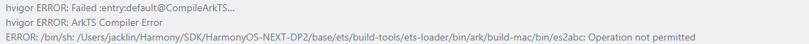

**问题描述**

DevEco Studio安装完成后一直报Operation not permitted无权限，具体报错如下所示：

**解决方案**

通过以下命令查看是否有com.example.myapplication标识

xattr -l /path/to/es2abc

用以下命令删除该标识

xattr -d com.example.myapplication/path/to/es2abc

根因：mac系统对文件访问有限制
