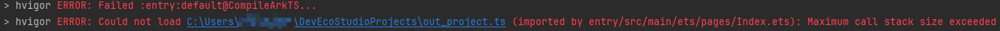
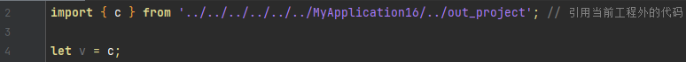

**问题现象**

Stage模板工程编译构建失败，提示 “ERROR: Could not load $\{file1\} (imported by $\{file2\}): Maximum call stack size exceeded”。

**解决措施**

问题源于file1位于当前工程外，步骤如下：

1. 在工程中右键选择New > Module...。
2. 选择Static Library模板。
3. 配置build-profile.json中的dependencies添加HAR引用。

