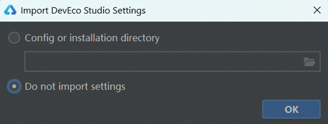
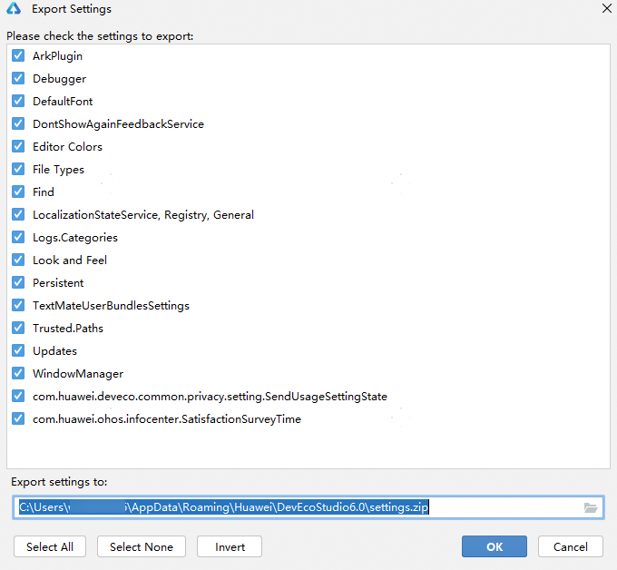

**问题现象**

问题出现包含两种场景：

场景一：首次运行DevEco Studio时，出现**Import DevEco Studio Settings**弹窗。

场景二：本地清理DevEco Studio缓存后再次下载安装运行时，可能出现**Import DevEco Studio Settings**弹窗。

**解决措施**

方案一：建议保持默认勾选项**Do not import settings**。

方案二：勾选**Config or installation directory**，上传配置项压缩包（settings.zip）。

* 点击**File** > **Manage IDE Settings** > **Export Settings**...将包含Ark插件等配置项导出，再次运行时可以将配置项直接导入。
* DevEco Studio版本不同，支持导出的配置项不同。可导出的配置项需以具体版本为准。

  
