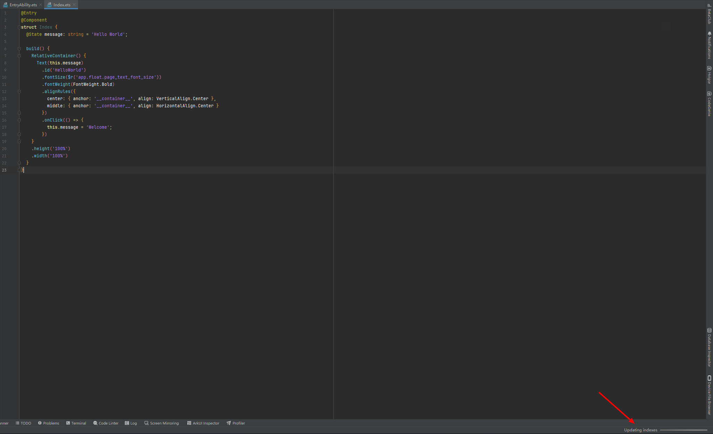

**问题现象**

在DevEco Studio 新建 / 打开工程，反复执行“Updating indexes”、“Indexing”。

**解决措施**

导致该问题的原因是缓存路径下的文件被加密，请联系企业内的IT，确认是否有加密软件在运作，将该目录内容加入白名单中。

* MAC的缓存路径为：~/Library/Caches/Huawei/DevEcoStudio<版本号> 和 ~/Library/Application Support/Huawei/DevEcoStudio<版本号>

  示例：~/Library/Caches/Huawei/DevEcoStudio6.1 和 ~/Library/Application Support/Huawei/DevEcoStudio6.1
* Windows的缓存路径为：%APPDATA%\Huawei\DevEcoStudio<版本号> 和 %LOCALAPPDATA%\Huawei/DevEcoStudio<版本号>

  示例：C:\Users\用户名\AppData\Roaming\Huawei\DevEcoStudio6.1 和 C:\Users\用户名\AppData\Local\Huawei\DevEcoStudio6.1
