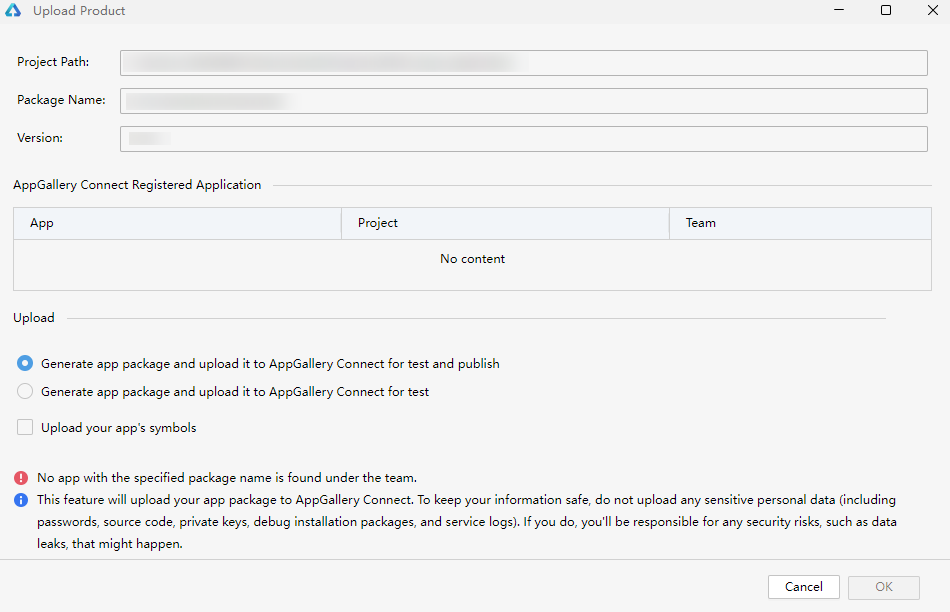

**问题现象**

打开上传软件包界面后，提示”No app with the specified package name is found under the team.”。

**解决措施**

因为当前账号在AppGallery Connect没有对应包名的应用，请在AppGallery Connect登录当前账号后[创建应用](https://developer.huawei.com/consumer/cn/doc/app/agc-help-createapp-0000001146718717)，再重新打开上传软件包界面。
