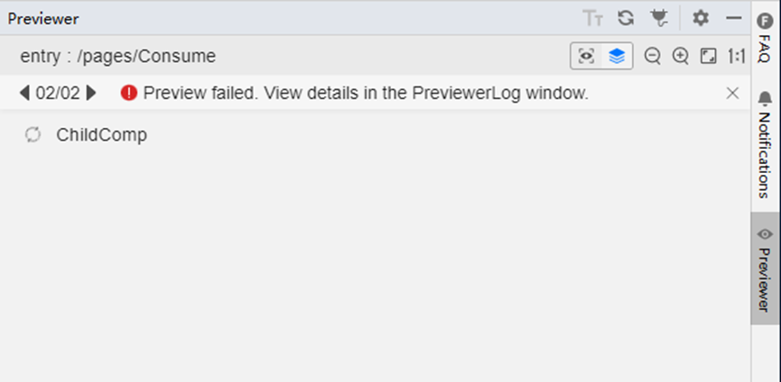
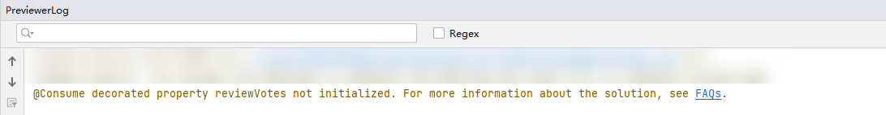

**问题现象**

启动预览后，预览窗口显示白屏，上方出现错误信息：“Preview failed. View details in the PreviewerLog window.”



此时，PreviewerLog 窗口显示如下告警信息：“@Consume/@Link 装饰的属性 \_<propertyName>\_未初始化。”



**解决措施**

由于@Consume/@Link装饰的成员需要与父组件建立绑定关系，单独预览时无法完成初始化，因此如果预览包含@Consume（或@Link）装饰的成员的页面或组件，就可能会出现空白屏幕。

建议不要直接预览含有@Consume或@Link装饰的子组件，而应通过预览父组件来查看子组件的预览效果。

示例代码：

```
// Suggest adding @ Preview on ParentComp to preview the preview effect of ChildComp
@Preview
@Component
struct ParentComp {
  // @Provide decoration is provided by the entrance component ParentComp as its descendant component
  @Provide reviewVotes: number = 10;

  build() {
    Column() {
      Button(`reviewVotes(${this.reviewVotes}), give +1`)
        .onClick(() => this.reviewVotes += 1)
      ChildComp()
    }
  }
}

// @Preview is not recommended to directly preview ChildComp
@Component
struct ChildComp {
  // The variable decorated with '@Consume' is bound to the variable decorated with '@Provide' in its ancestor component ParentComp using the same attribute name
  @Consume reviewVotes: number;
  build() {
    Column() {
      Text(`reviewVotes(${this.reviewVotes})`)
      Button(`reviewVotes(${this.reviewVotes}), give +1`)
        .onClick(() => this.reviewVotes += 1)
    }
    .width('50%')
  }
}
```
