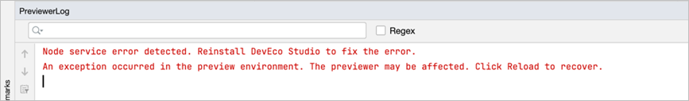
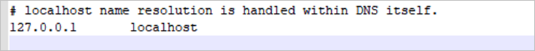

**问题现象**

预览启动失败，PreviewerLog窗口显示错误信息：“Node service error detected.Reinstall DevEco Studio to fix the error.”。



**解决措施**

* 方案一：DevEco Studio的内置文件已损坏，请重新安装DevEco Studio。
* 方案二：hosts中关于127.0.0.1的配置项有误，请检查hosts配置是否存在127.0.0.1 localhost的配置项。
  + Windows平台配置文件：C:\Windows\System32\drivers\etc\hosts。
  + Mac平台配置文件：/private/etc/hosts。

  
* 方案三：尝试重启winnat服务（Windows平台）。

  以管理员身份打开命令提示符或PowerShell，执行以下命令：

  1. 停止winnat。

     ```
     net stop winnat
     ```
  2. 启动winnat。

     ```
     net start winnat
     ```
