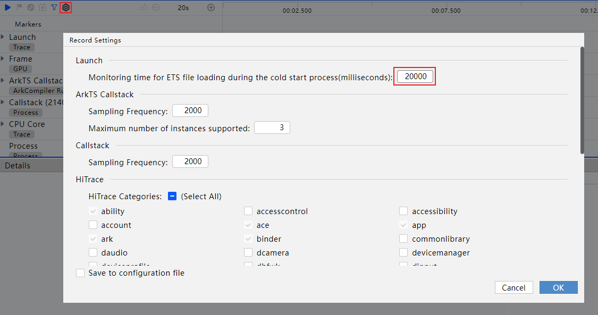
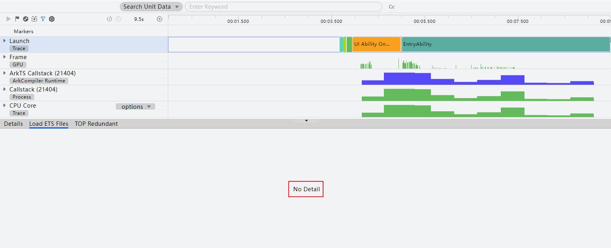

**问题现象**

Profiler录制Launch，将ETS文件监控时长配置为20000，录制成功后，详情中Load ETS Files和TOP Redundant页签无数据。

**问题原因**

ETS文件监控时长配置为20000，需要在拉起应用20000ms之后，才能生成对应的ETS冗余打点文件。

**解决措施**

将ETS文件监控时长配置为20000后，录制时长一定要大于配置时长。
