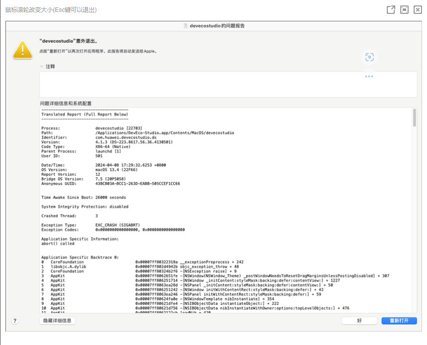

**问题描述**

Mac启动DevEco Studio时，“DevEco Studio”意外退出。

**解决方案**

问题根因：异常修改了JetBrains启动脚本中的环境变量，导致Java虚拟机无法启动，DevEco Studio无法打开，弹窗显示错误。

规避措施：删除启动脚本 /Users/\{USER\_NAME\}/Library/LaunchAgents/jetbrains.vmoptions.plist，然后重启 Mac。
