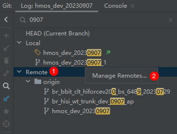
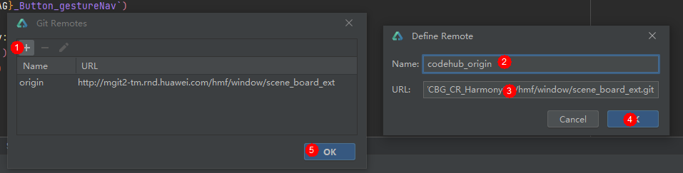
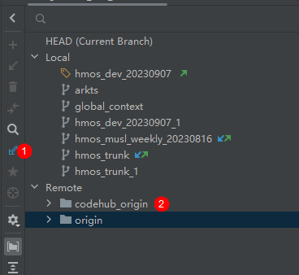
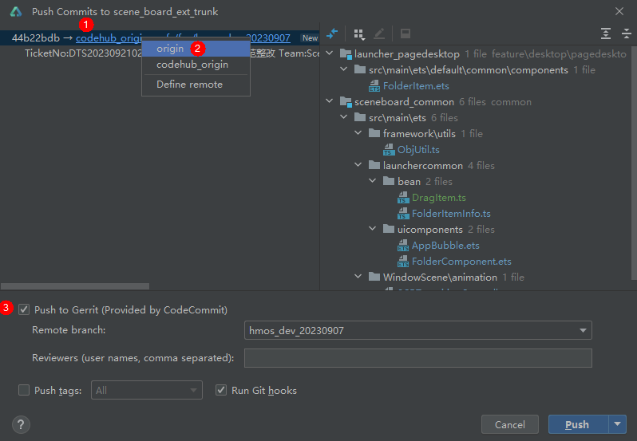

添加新的远程仓库：

1. 右击Remote以调出菜单。
2. 点击Manage Remotes，打开Git Remotes窗口。

   
3. 点击添加按钮。
4. 输入远程仓名称和URL，远程仓名称可自由命名。
5. 点击Define Remote窗口的OK按钮，在新弹出的窗口中输入域账号和密码。
6. 点击Git Remotes窗口的确定按钮。

   
7. 点击拉取远程记录，新添加的远程仓库将在Remote子菜单中显示。

   

Push提交：

Push提交和Push提交到远程仓库的过程相似。如需切换远程仓库，可单击下图中标记1的分支名；标记3表示以PR方式提交。



切换默认关联的远程仓库：

可以使用以下命令进行切换。

```
git branch hmos_dev_20230907 --set-upstream-to=codehub_origin/hmos_dev_20230907
```
