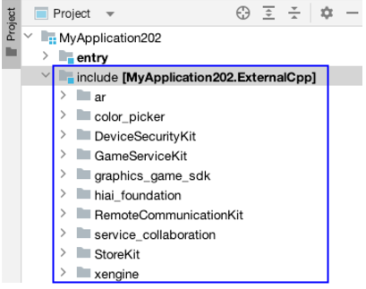

**问题现象**

ExternalCpp视图中显示SDK的系统API。

**可能原因**

在本地存在多个DevEco Studio（包括Command Line Tools）打开同一个工程，并且使用daemon模式构建该工程。

**解决措施**

关闭多余的DevEco Studio（包括Command Line Tools）或者使用--no-daemon模式构建工程。

**参考链接**

[守护进程](/docs/tools/coding-debug/ide-hvigor-daemon)
