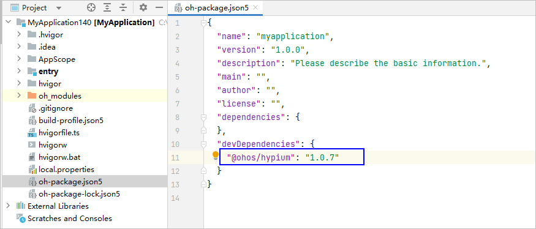
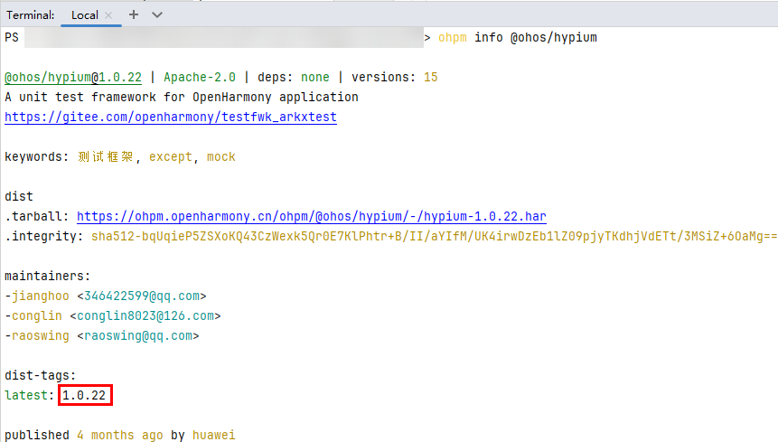

**问题现象**

在DevEco Studio打开历史工程，依赖安装不成功，报错信息为“Install failed FetchPackageInfo: hypium failed”。

**解决措施**

导致该问题的原因是包名使用错误。在工程级**oh-package.json5**中，将**devDependencies**字段下"hypium"修改为"@ohos/hypium"。

@ohos/hypium版本号可通过ohpm命令获取，在DevEco Studio中打开Terminal，输入**ohpm info @ohos/hypium**命令，输出结果中dist-tags下方即为版本号。

