使用代码模板可以提高开发效率。在DevEco Studio中，可以通过“File \> Settings \> Editor \> Live Templates”查看现有模板并新增自定义模板。

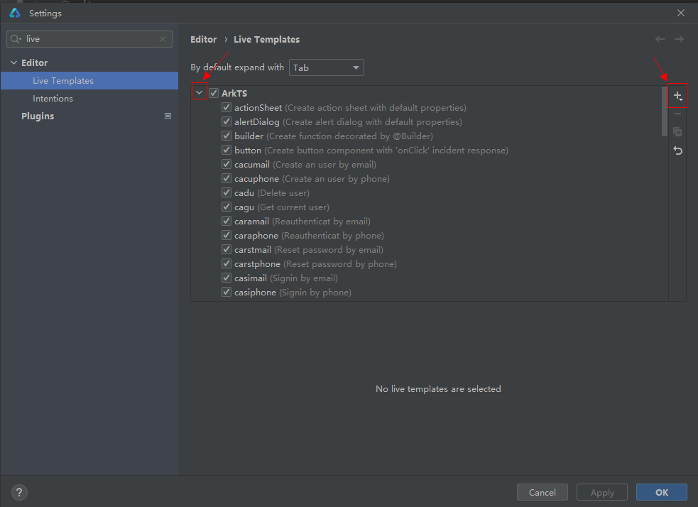

点击展开按钮查看现有模板详情，点击右上角加号新增自定义模板。

1. 使用现有代码模板可以提高开发效率。

   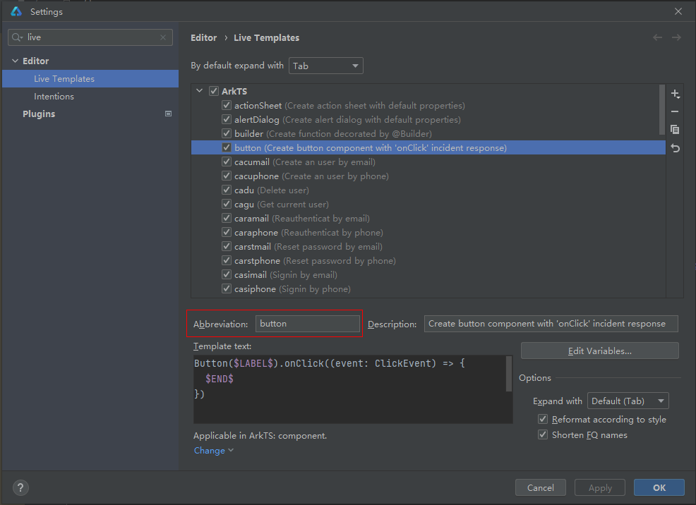

   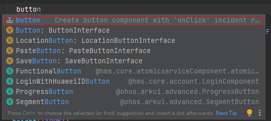

   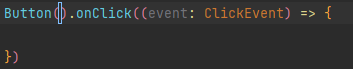

   输入button后，显示代码模板，双击自动补全。
2. 自定义代码模板。

   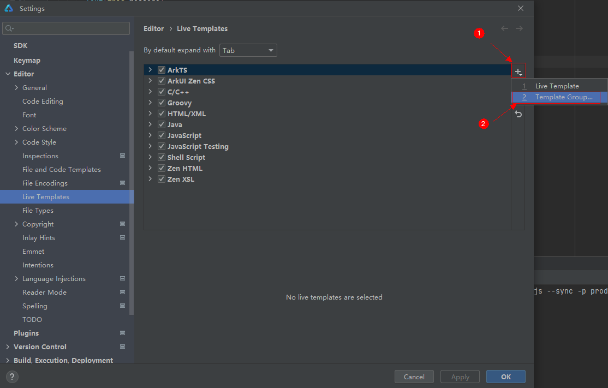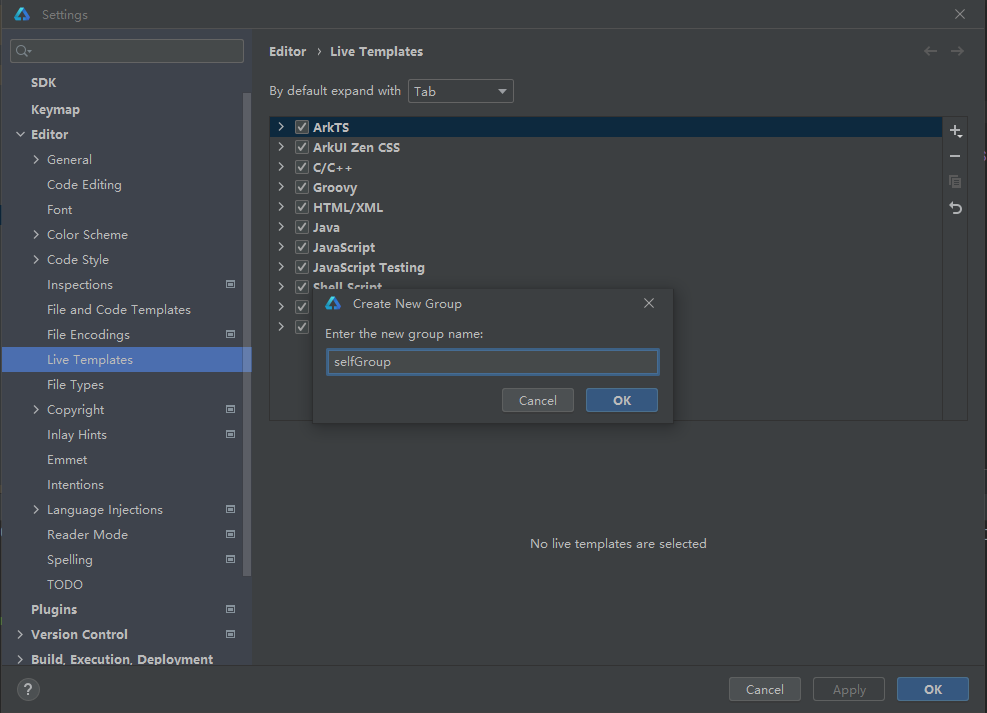

   选择“Template Group”，新增模板群组以表示自定义模板。

   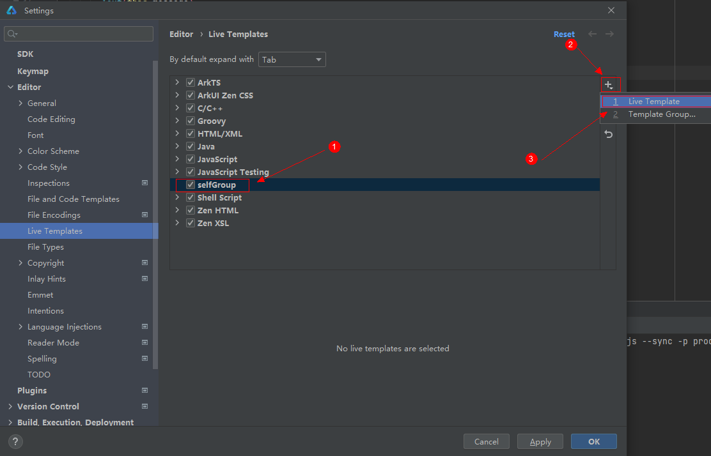

   选中自定义群组，点击+，新增模板。

   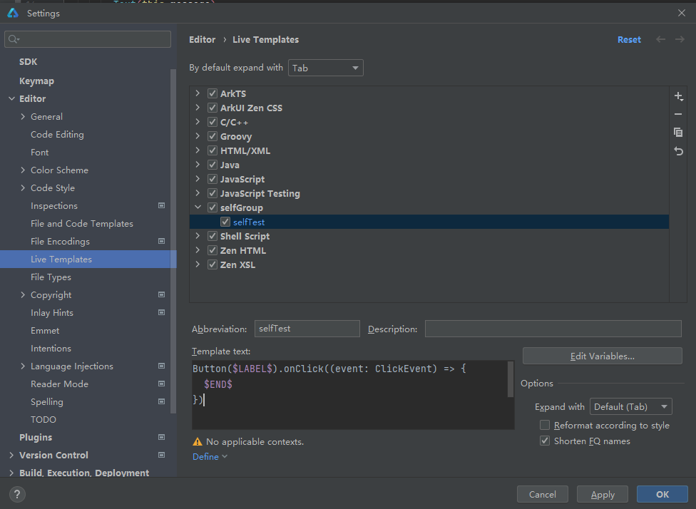

   以定义Component模板为例，在Abbreviation中输入模板名称，此名称作为代码模板的快捷键。在Template text中编辑模板样式，其中$符号标记用户需自行输入的部分。

   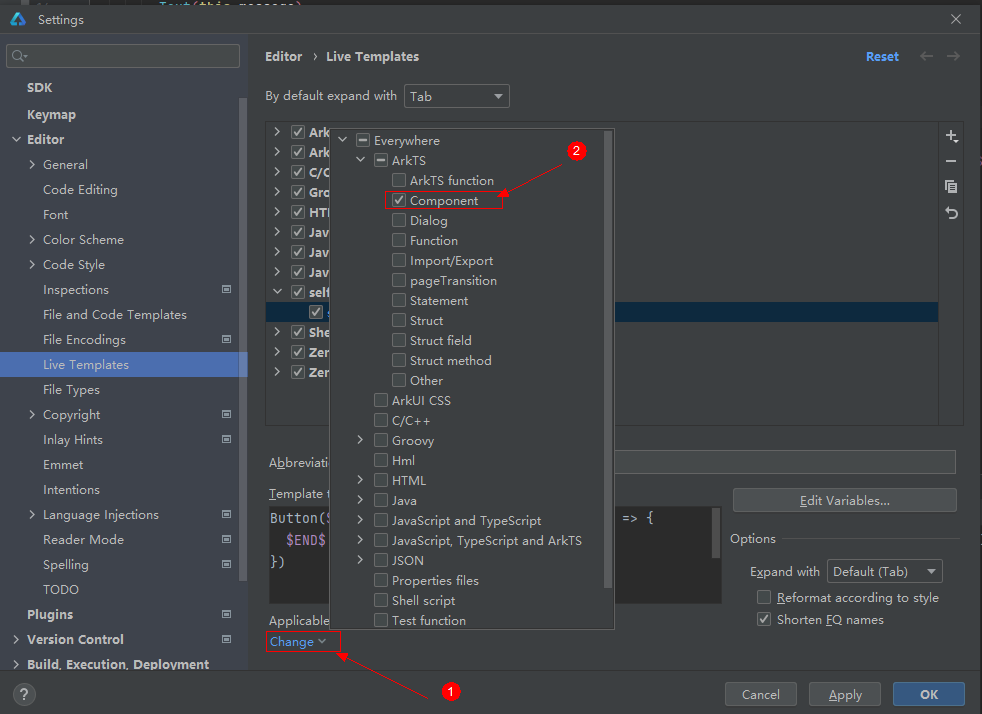

   点击上图的“Change”处，选择代码模板文件。

   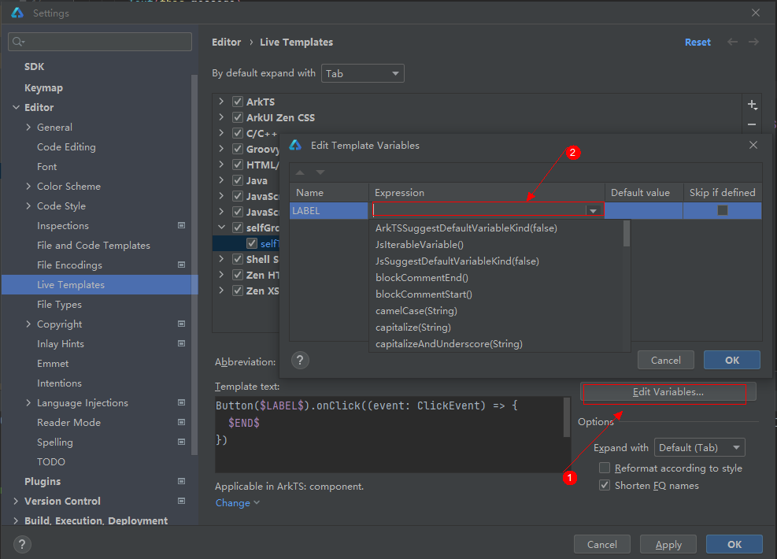

   点击Edit variables，在弹窗中设置LABEL值的自动获取方式。

   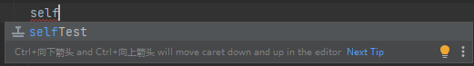

   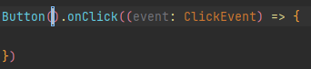

   自定义代码模板生效。
