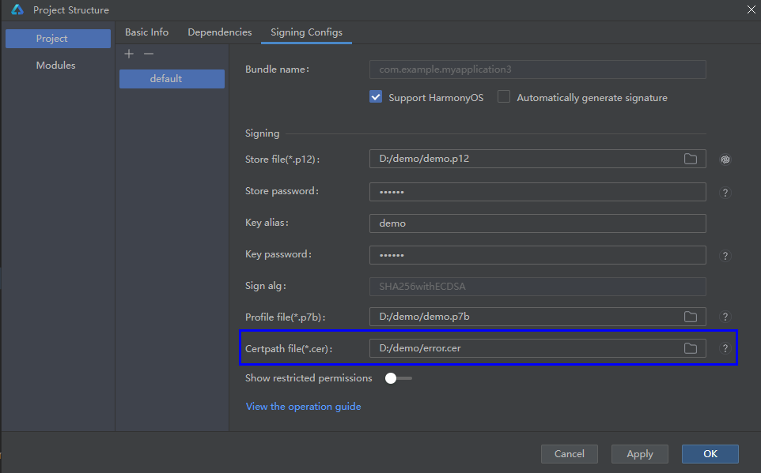
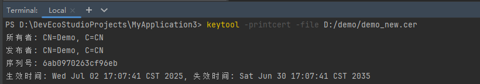
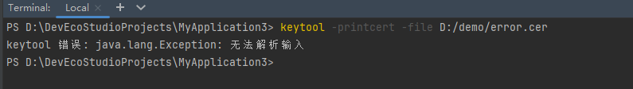

**问题现象**

打包签名提示“**DerValue.getOID, not an OID 49 Detail: Please check the message from tools**”错误。

**可能原因**

解析证书文件失败，一般情况是由于用户传入了非标准证书文件或证书文件损坏而导致。

**常见错误场景**

Certpath file配置了错误的证书文件。

**解决措施**

检查Certpath file配置的证书文件是否为标准证书文件，检查方式如下：

DevEco Studio Terminal窗口使用keytool命令查看配置的证书文件，示例：keytool -printcert -file ${Certpath file}。

* 格式正确的证书文件。

* 格式错误的证书文件。

