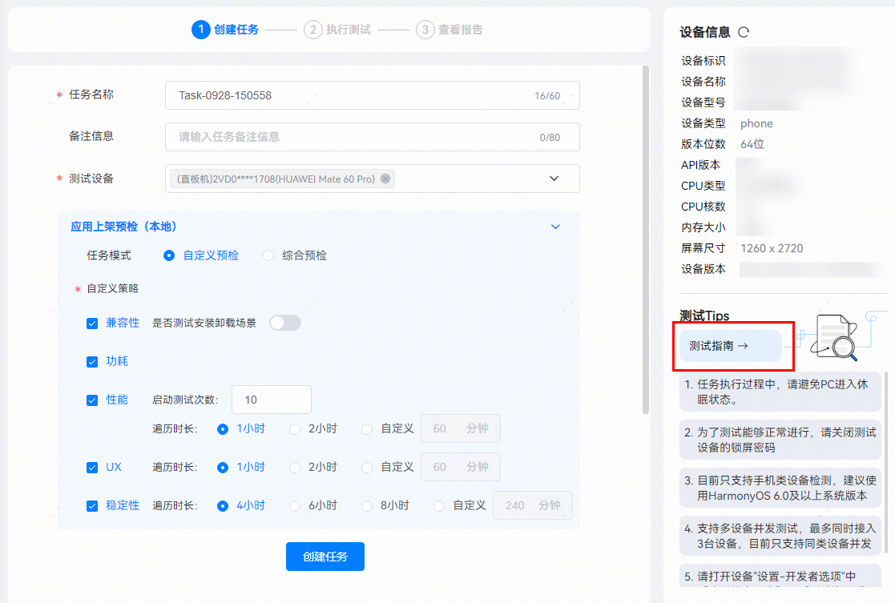

**DevEco Testing资料查询：**

方式1：访问DevEco Testing客户端的任务创建页面，在右下角查看各测试服务的使用指南。

方式2：访问华为开发者联盟官网，查看指南-应用测试-专项测试中的[DevEco Testing](/docs/dev/testing/deveco-testing)。

**DevEco Testing Hypium资料查询：**

访问华为开发者联盟官网，查看指南-应用测试-单元测试和UI测试中的[应用UI测试（基于Python）](/docs/dev/testing/ut/hypium-python-guidelines)。
