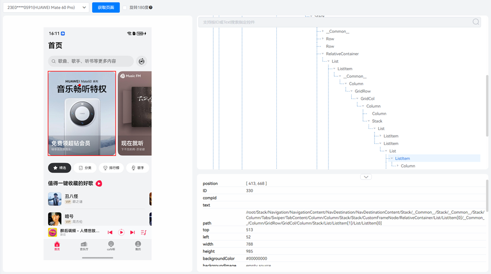
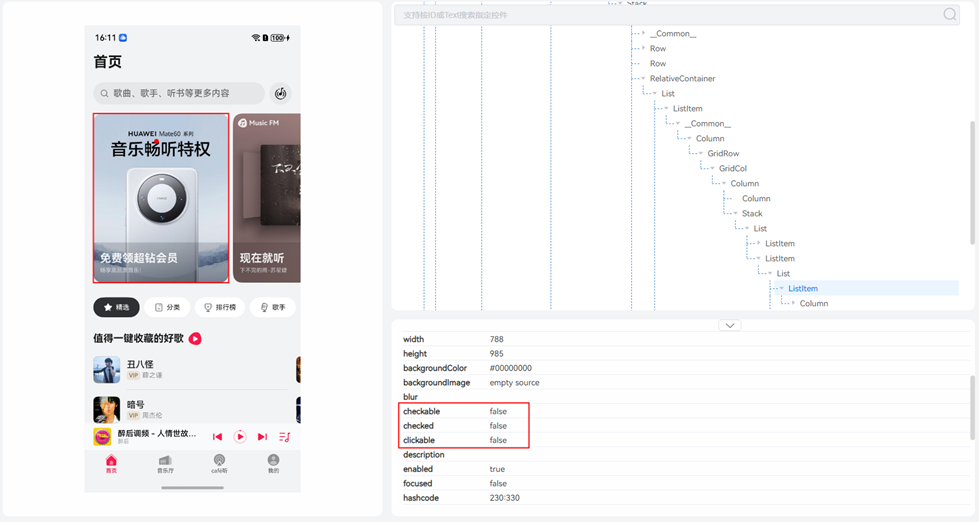

若发现应用界面控件无法点击，请使用 DevEco Testing 实用工具中的 UIViewer 打开该应用界面，逐层检查控件树以排查问题。

1. 查看页面控件树，如果仅存在一个节点且最底层组件为XComponent，则不支持进一步遍历。

   
2. 查看该页面的控件树。如果页面中大部分控件的clickable属性为false，则表示这些控件不支持点击或点击无效。

   
3. 当前页面的遍历层级限制为8层。如果测试场景的页面层级超过8层，将无法继续遍历。
