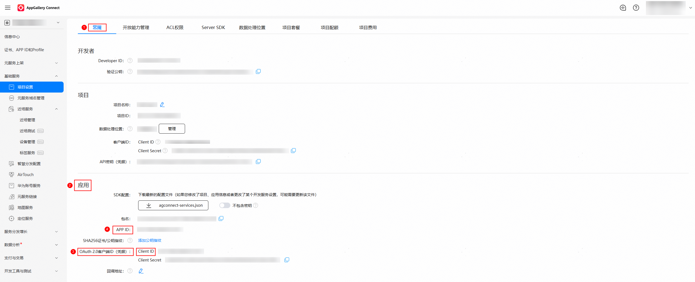

## 获取Client ID和App ID

在 AppGallery Connect（简称AGC）的[APP与元服务](https://developer.huawei.com/consumer/cn/service/josp/agc/index.html#/myApp)中，选择并点击需要申请对应权限的元服务，选择左侧导航栏的“基础服务 -&gt; 项目设置”，在“常规 &gt; 应用 ”下，找到元服务的Client ID和APP ID。



## 确认是否需要配置Client ID

如果上一步获取到的Client ID和APP ID相同，则无需配置Client ID，否则需要按下一步配置Client ID。

## 如何配置Client ID

在工程中**entry**模块的module.json5文件中，新增metadata，配置name为client\_id，value为上一步获取的Client ID的值，如下所示：


1.若工程中存在多个模块，需要在"type"为"entry"模块中的module.json5文件配置元服务的Client ID。

2.请确认获取的Client ID是**元服务**Client ID，错配成项目Client ID将导致接口调用报错。

```
"module": {
  "name": "<name>",
  "type": "entry",
  "description": "<description>",
  "mainElement": "<mainElement>",
  "deviceTypes": [],
  "pages": "<pages>",
  "abilities": [],
  "metadata": [ // 配置信息如下
    {
      "name": "client_id",
      "value": "xxxxx" // 将上一步获取到的Client ID赋值给value，请注意不要使用其他方式设置value值
    }
  ]
 }
```
