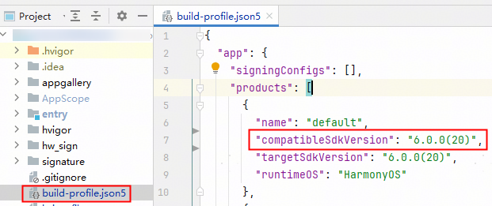

请先参考“ **[元服务开发准备](/docs/dev/atomic-dev/atomic-service-development/atomic-dev-preparation)** ”章节，完成以下操作步骤：

1. 创建元服务、使用DevEco Studio创建元服务工程（如已完成，请跳过此步骤）。
2. 配置签名信息 **（未成年人模式接口支持自动签名，其他接口仅支持手动签名方式）** 。
3. 添加公钥指纹。

   

   **发布阶段**，请参考[发布流程](/docs/tools/coding-debug/ide-publish-app#section6406135115814)章节，重新配置用于元服务发布的签名信息、添加公钥指纹（必选）。

   * 检查是否需要配置公钥指纹：元服务仅接入未成年人模式或compatibleSdkVersion&gt;=20不需要配置公钥指纹，其他场景均需配置。

     
   * 检查公钥指纹是否配置成功：请在[开发与服务](https://developer.huawei.com/consumer/cn/service/josp/agc/index.html#/myProject)中选择对应的项目和元服务，检查是否已成功配置该元服务的公钥指纹。

     
   * 公钥指纹最迟会在25小时后生效。

     **（可选）** 配置公钥指纹10分钟后，您可通过修改元服务工程 &gt; app.json5中的versionCode触发公钥指纹生效。

     **图1** 修改前

     

     **图2** 修改后

     
