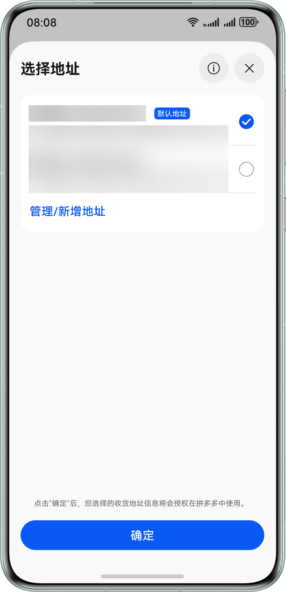
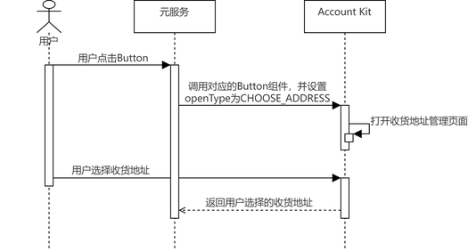

## 场景介绍

当元服务需要获取用户收货地址时，可使用[选择收货地址Button](/docs/dev/app-dev/application-services/scenario-fusion-kit-guide/scenario-fusion-button/scenario-fusion-button-ship-to)，引导用户添加或选择已有的收货地址，并最终获取用户的收货地址。

## 约束与限制

收货地址中的手机号信息仅支持输入中国境内（香港特别行政区、澳门特别行政区、中国台湾除外）手机号、地址信息只支持填写中国境内（香港特别行政区、澳门特别行政区、中国台湾除外）。

## 业务流程

流程说明：

1. 用户需要使用收货地址时，元服务通过调用Scenario Fusion Kit对应的Button组件并设置openType为CHOOSE\_ADDRESS，打开华为账号收货地址管理页面。
2. 用户可以在收货地址管理页面添加新的收货地址或者选择已有收货地址，点击确认后可将选择的收货地址返回给元服务。

## 开发前提

在进行代码开发前，请先确认以下准备工作是否完成：

1、是否完成[申请账号权限](/docs/dev/atomic-dev/account-guide-atomic-preparations/account-guide-atomic-permissions)，未申请通过调用获取收货地址API，将返回[1008100005 应用未申请对应permissions权限](https://developer.huawei.com/consumer/cn/doc/harmonyos-references/account-api-error-code#section1008100005-应用未申请对应permissions权限)错误码，无法获取收货地址。

如果在权限申请前已完成“配置签名和指纹”，则需要重新[申请调试Profile](/docs/distribute/agc/agc-help-profile-0000002270709473/agc-help-debug-profile-0000002248181278)，并重新[手动配置签名信息](/docs/tools/coding-debug/ide-signing#section297715173233)。

2、是否完成[配置签名和指纹](/docs/dev/atomic-dev/account-guide-atomic-preparations/account-atomic-sign-fingerprints)、[配置Client ID](/docs/dev/atomic-dev/account-guide-atomic-preparations/account-atomic-client-id)，未配置调用获取收货地址API，将返回[1008100004 应用指纹证书校验失败](https://developer.huawei.com/consumer/cn/doc/harmonyos-references/account-api-error-code#section1008100004-应用指纹证书校验失败)错误码，无法获取收货地址。

## 开发步骤

开发者可参考Scenario Fusion Kit的[选择收货地址Button](/docs/dev/app-dev/application-services/scenario-fusion-kit-guide/scenario-fusion-button/scenario-fusion-button-ship-to)开发指南完成代码开发。
