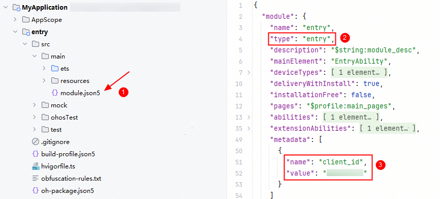
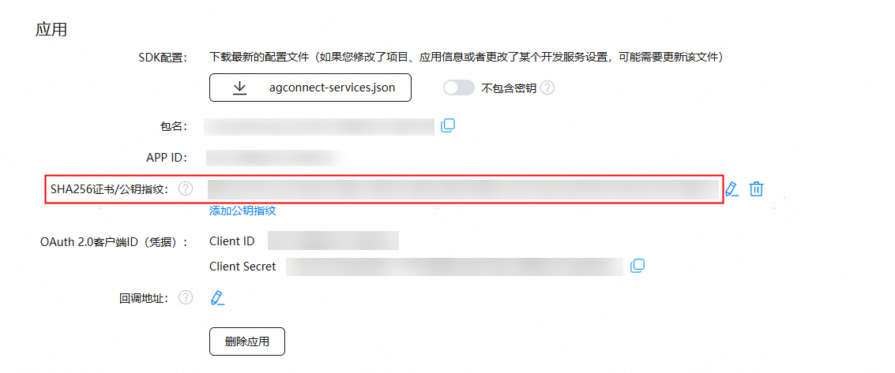
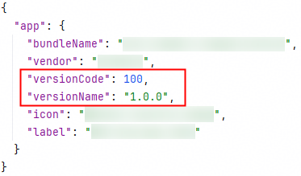
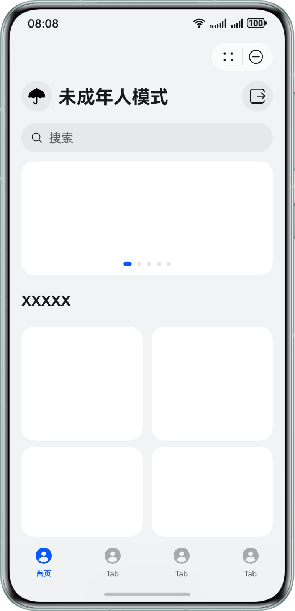

## 1001500001 应用指纹证书校验失败的可能原因和解决办法

**问题现象**

调用接口报错1001500001 应用指纹证书校验失败。

**可能原因**

1. client\_id配置错误（例如：错配成项目的Client ID）。
2. 元服务的指纹证书未配置或配置错误。
3. 更换证书后未重新配置证书指纹。
4. 指纹证书添加完成后，公钥指纹仍未生效。
5. 安装调试证书签名包后再安装相同版本的发布证书签名包，或安装发布证书签名包后再安装相同版本的调试证书签名包。
6. 使用自动签名方式签名，未使用手动签名。

**解决措施**

1. 检查module type为entry的模块下的module.json5配置文件中的Client ID是否正确，请参考[配置Client ID](/docs/dev/atomic-dev/account-guide-atomic-preparations/account-atomic-client-id)。

   
2. 检查AppGallery Connect上是否正确配置元服务的指纹证书，详情请见[添加公钥指纹](/docs/distribute/agc/agc-help-cert-0000002270829389/agc-help-cert-fingerprint-0000002278002933#section7398154810570)。

   
3. 证书更换后，重新配置更换后的证书指纹。
4. 配置公钥指纹10分钟后，您可通过修改元服务工程 &gt; app.json5中的versionCode触发公钥指纹生效。具体修改方法见下图所示。
5. 调试证书切换为发布证书或发布证书切换为调试证书，需要升级元服务的版本号（修改元服务工程 &gt; app.json5中的versionCode），具体修改方法见下图所示。

   **图1** 修改前

   

   **图2** 修改后

   
6. 请使用手动签名方式进行签名，详情请参考[配置签名和指纹](/docs/dev/atomic-dev/account-guide-atomic-preparations/account-atomic-sign-fingerprints)章节。

## 1001502014 应用未申请scopes或permissions权限的可能原因和解决方法

**问题现象**

调用接口报错1001502014 应用未申请scopes或permissions权限。

**可能原因**

1. 没有申请对应的账号权限。
2. 权限申请成功后，最迟会在25小时后生效。

**解决措施**

1. 申请对应权限，请见[申请账号权限](/docs/dev/atomic-dev/account-guide-atomic-preparations/account-guide-atomic-permissions)章节。
2. 权限申请通过后，您可通过修改元服务工程 &gt; app.json5中的versionCode触发权限生效。

   **图3** 修改前

   

   **图4** 修改后

   

## 401 应用未申请scopes或permissions权限的可能原因和解决方法

**问题现象**

调用接口报错401 参数检查失败。

**可能原因**

1. 必选参数没有传入。
2. 参数类型错误 (Type Error)。
3. 参数数量错误 (Argument Count Error)。
4. 空参数错误 (Null Argument Error)。
5. 参数格式错误 (Format Error)。
6. 参数值范围错误 (Value Range Error)。
7. client\_id配置错误。
8. 未使用手动签名。

**解决措施**

1. 请检查必选参数是否传入，传入的参数类型是否错误，以及传入的参数是否符合规格约束。
2. 检查module type为entry的模块下module.json5中的client\_id配置的值是否正确，请参考[配置Client ID](/docs/dev/atomic-dev/account-guide-atomic-preparations/account-atomic-client-id)。
3. 请使用手动签名方式配置签名，请参考[配置签名和指纹](/docs/dev/atomic-dev/account-guide-atomic-preparations/account-atomic-sign-fingerprints)。

## OpenID和UnionID的格式说明

**长度**

为减少开发者接入和迁移成本，Account Kit在2023年09月21日对OpenID、UnionID的长度做出了如下调整：

* OpenID

  + 元服务创建时间晚于（含）2023年09月21日 23:00:00，OpenID固定28位。
  + 元服务创建时间早于2023年09月21日 23:00:00，OpenID长度不固定，限制在1-256位。
* UnionID

  + 开发者账号注册时间晚于（含）2023年09月21日 23:00:00，UnionID固定29位。
  + 开发者账号注册时间早于2023年09月21日 23:00:00，UnionID长度不固定，限制在1-92位。

**唯一性标识**

1. 开发者账号下管理了多个元服务时，针对同一个华为账号，不同的元服务返回的OpenID值不同，但返回的UnionID相同。
2. 如果开发者账号下管理了多个元服务，并且这些元服务需要共享同一个华为账号的用户信息，可以使用UnionID作为用户标识。

**数据类型**

OpenID和UnionID均是字符串类型的数据。

**大小写敏感**

OpenID和UnionID严格区分大小写。

**实际应用中的注意事项**

在存储、查询、比较OpenID或UnionID时，请务必保持其原始的大小写格式。

## Access Token和Refresh Token的有效时长是多久

Access Token的有效时长是1个小时，Refresh Token的有效时长是180天。

## Access Token和Refresh Token长度限制要求

Access Token和Refresh Token的长度与其中编码的信息有关，目前来讲Access Token和Refresh Token的长度不会超过1024字符。

## 无法获取手机号或获取到的手机号为空如何解决

在手机号快速验证场景下，无法获取到明文手机号时，建议通过以下步骤排查解决：

1. 请先检查手机号快速验证权限是否成功申请，详情可参考[申请账号权限](/docs/dev/atomic-dev/account-guide-atomic-preparations/account-guide-atomic-permissions)。
2. 确认权限申请成功后，确认scope参数是否符合预期，手机号快速验证可参考快速验证[客户端开发](/docs/dev/atomic-dev/account-guide-atomic-get-phone/account-guide-atomic-get-phonenumber#客户端开发)。
3. 若调用接口还未获取到手机号，可将调试设备系统时间向后调整24小时。

## 未成年人模式开启后USB断连如何解决

开发者可以进入设置-系统-开发者选项，点击USB调试开关，会校验健康使用设备密码，校验成功后可解除开发者调试模式限制。

如开发者重新开启USB调试开关后，发现DevEco Studio工具上hilog日志未恢复到断连之前，请执行“hdc shell hilog -G 16M”来扩大hilog日志缓存区，若hilog日志仍无法完全展示，可取出hilog日志本地查看。更多命令请参见[hilog](/docs/dev/app-dev/system/hilog)。

## 订阅到系统未成年人模式开启了，这个时候元服务要怎么处理

如果元服务处于后台，可以在元服务切换至前台时进行页面内容的刷新。开发者可自行关注元服务后台行为是否需要中断，例如是否需要中断后台播放的音视频内容等，避免未成年人绕过限制，继续访问非适龄内容。

如果元服务处于前台（用户正在浏览内容或播放音视频等场景），可以在监听到状态变化后回到元服务的主页，并将主页内容刷新为当前模式下的适龄内容。如果未及时刷新，可能存在未成年用户浏览到非适龄内容绕过管控，或成年用户仍浏览未成年人模式下的内容，无法关闭未成年人模式的情况。刷新后的未成年人模式主页可参考如下设计：

## 不同开发者的元服务之间如何实现用户数据互通

不同开发者的元服务，可以使用GroupUnionID关联用户数据来实现数据互通。GroupUnionID是华为账号用户在关联主体账号组内的唯一标识，不同开发者账号加入同一关联主体账号组后，其组内所有开发者的元服务获取到用户的GroupUnionID相同。元服务获取GroupUnionID流程如下：

1. 开发者账号加入同一关联主体账号组。

   通过[创建账号组](https://developer.huawei.com/consumer/cn/doc/start/cag-0000001265390541)创建关联主体账号组，在关联主体账号组中[添加账号组成员](https://developer.huawei.com/consumer/cn/doc/start/aai-0000001265430513)。
2. 获取GroupUnionID。

   * 针对新用户，在登录时可以直接获取GroupUnionID，具体指导请参考：[通过Authorization Code获取GroupUnionID](https://developer.huawei.com/consumer/cn/doc/harmonyos-references/account-api-get-groupunionid-code)。
   * 针对已获取OpenID或UnionID的用户，可以批量获取GroupUnionID，具体指导请参考：[通过OpenID或UnionID获取GroupUnionID](https://developer.huawei.com/consumer/cn/doc/harmonyos-references/account-api-get-groupunionid)。

GroupUnionID是一个大小写敏感的字符串，最大长度为64字符，在存储、查询、比较GroupUnionID时，请务必保留其原始大小写。
