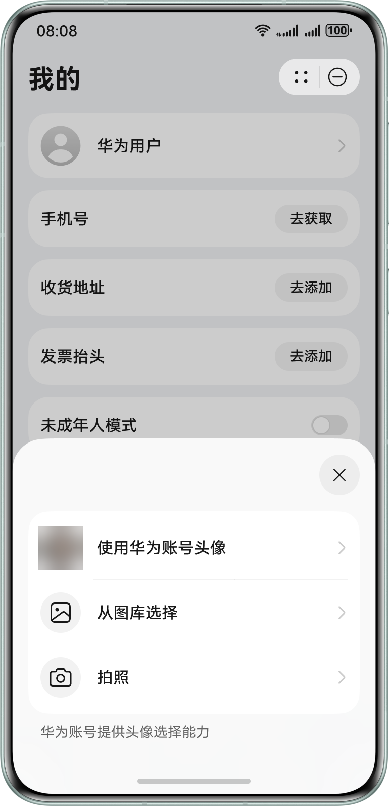

## 场景介绍

如元服务需要完善用户头像信息，可通过调用Scenario Fusion Kit提供的选择头像Button，拉起Account Kit头像选择页面，供用户完成华为账号头像或其他头像的选择，实现头像信息获取与展示。

## 业务流程

流程说明：

1. 元服务调用Scenario Fusion Kit对应的Button组件，选择CHOOSE\_AVATAR模式。
2. 用户点击Button，拉起头像选择页面。
3. 用户有三种获取头像的方式：使用华为账号头像、从图库选择、拍照，用户选择其中一种方式后，Account Kit返回头像uri给Button，元服务刷新Button并展示头像。

## 开发前提

在进行代码开发前，请确保已按照“开发准备”章节中的指导完成[配置签名和指纹](/docs/dev/atomic-dev/account-guide-atomic-preparations/account-atomic-sign-fingerprints)、[配置Client ID](/docs/dev/atomic-dev/account-guide-atomic-preparations/account-atomic-client-id)。该场景无需申请账号权限。

## 开发步骤

开发者可参考Scenario Fusion Kit的[选择头像Button](/docs/dev/app-dev/application-services/scenario-fusion-kit-guide/scenario-fusion-button/scenario-fusion-button-chooseavatar)开发指南完成代码开发。
