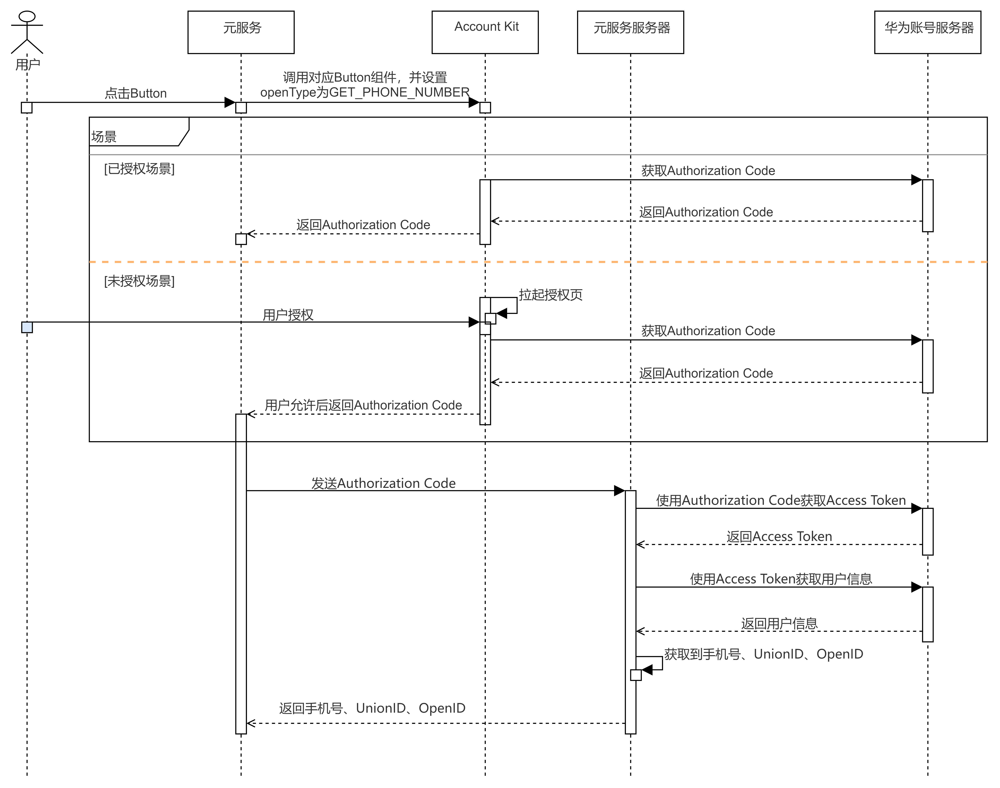

## 场景介绍

当元服务对获取的手机号时效性要求不高时，可调用Scenario Fusion Kit的[快速验证手机号Button](https://developer.huawei.com/consumer/cn/doc/harmonyos-guides/scenario-fusion-button-getphonenumber)，向用户发起手机号授权申请，Button组件实现了Account Kit手机号授权与快速验证功能。经用户同意后，元服务可获取手机号，为用户提供相应服务。

对用户选择的华为账号绑定的手机号或者新增的手机号进行验证，**不保证是实时的验证**，**仅首次需要用户授权**。

## 业务流程

流程说明：

1. 元服务通过调用Scenario Fusion Kit对应的Button组件并设置openType为GET\_PHONE\_NUMBER，如果已授权则直接返回临时登录凭证Authorization Code，如果没有授权则拉起授权页，在用户授权后，返回Authorization Code。
2. 将Authorization Code传给元服务服务器，使用Client ID、Client Secret、Authorization Code从华为服务器获取Access Token，再使用Access Token请求获取用户信息。
3. 从用户信息中获取到手机号、UnionID、OpenID。

## 开发前提

1、在进行代码开发前，请先确认您已完成[开发准备](https://developer.huawei.com/consumer/cn/doc/atomic-guides/account-guide-atomic-permissions)工作。

* 若未配置签名和指纹，将报错[1001500001 应用指纹证书校验失败](https://developer.huawei.com/consumer/cn/doc/atomic-guides/account-guide-atomic-faq#section1001500001-应用指纹证书校验失败的可能原因和解决办法)。
* 若未完成“获取您的手机号”权限申请，将报错[1001502014 应用未申请scopes或permissions权限](https://developer.huawei.com/consumer/cn/doc/atomic-guides/account-guide-atomic-faq#section1001502014-应用未申请scopes或permissions权限的可能原因和解决方法)。

2、设备需要登录华为账号，若未登录则拉起登录页面。

## 开发步骤

### 客户端开发

客户端开发参见Scenario Fusion Kit的[快速验证手机号Button](https://developer.huawei.com/consumer/cn/doc/harmonyos-guides/scenario-fusion-button-getphonenumber)。

### 服务端开发

1. 元服务服务器使用Client ID、Client Secret、Authorization Code调用[获取用户级凭证接口](https://developer.huawei.com/consumer/cn/doc/harmonyos-references/account-api-obtain-user-token#接口原型)向华为账号服务器请求获取Access Token、Refresh Token。

   

   Client Secret、Access Token、Refresh Token需要存储在元服务服务器，不要存储在客户端，存储在客户端存在数据泄露等安全风险。
2. 使用Access Token调用[获取用户信息接口](https://developer.huawei.com/consumer/cn/doc/harmonyos-references/account-api-get-user-info-get-phone#接口原型)获取用户信息，从用户信息中获取用户手机号、UnionID、OpenID。

   **Access Token过期处理**

   由于Access Token的有效期仅为60分钟，当Access Token失效或者即将失效时（可通过[REST API错误码](https://developer.huawei.com/consumer/cn/doc/harmonyos-references/account-api-get-user-info-get-phone#错误码)判断），可以使用Refresh Token（有效期180天）通过[刷新用户级凭证接口](https://developer.huawei.com/consumer/cn/doc/harmonyos-references/account-api-obtain-refresh-token#接口原型)向华为账号服务器请求获取新的Access Token。

   

   1. 当Access Token失效时，若您不使用Refresh Token向账号服务器请求获取新的Access Token，账号的授权信息将会失效，导致使用Access Token的功能都会失败。
   2. 当Access Token非正常失效（如修改密码、退出账号、删除设备）时，业务可重新登录授权获取Authorization Code，向账号服务器请求获取新的Access Token。

   **Refresh Token过期处理**

   由于Refresh Token的有效期为180天，当Refresh Token失效后（可通过[REST API错误码](https://developer.huawei.com/consumer/cn/doc/harmonyos-references/account-api-obtain-refresh-token#错误码)判断），元服务服务端需要通知客户端，重新调用授权接口，请求用户重新授权。
