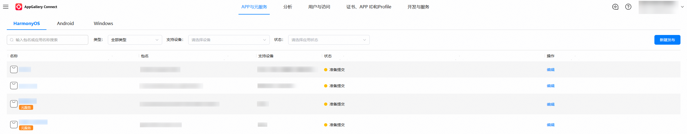
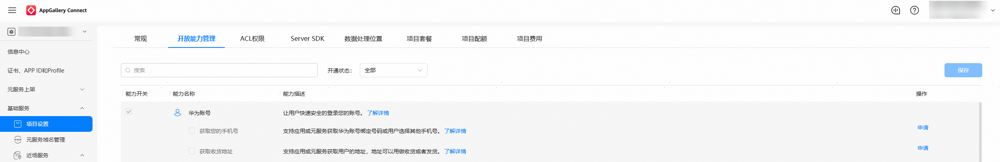
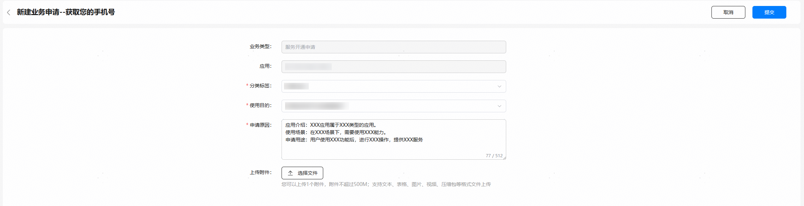

请参考“ **[元服务开发准备](/docs/dev/atomic-dev/atomic-service-development/atomic-dev-preparation)** ”章节，创建元服务、使用DevEco Studio创建元服务工程。

如需申请获取您的手机号、获取收货地址权限，则需按照以下步骤完成权限申请，否则可跳过本章节。

## 申请前自检

申请权限前请参考**表1**，了解账号权限支持的能力和使用条件，并根据**表2**、**表3**完成自检，确认您的**设备类型、开发者类型等**是否符合申请条件，不符合条件的申请将被驳回。

获取您的手机号、获取收货地址权限，仅支持企业开发者申请，不支持个人开发者申请。

**表1** 账号权限说明

| 权限名称 | 权限描述 | 支持的开发者类型 | 支持的设备类型 |
| --- | --- | --- | --- |
| 获取您的手机号 | 支持元服务获取华为账号绑定的**手机号**或用户选择的**其他手机号**。 | 企业开发者 | Phone、Tablet、PC/2in1 |
| 获取收货地址 | 支持元服务获取用户的**地址**，地址可以用做收货或者发货。 | 企业开发者 | Phone、Tablet、PC/2in1 |

**表2** 获取您的手机号权限申请自检表

| 序号 | 自检项内容 |
| --- | --- |
| 1 | 开发者必须为企业开发者。 |
| 2 | 元服务是否上架应用市场，如不上架需要说明原因。 |
| 3 | 若元服务近期存在违规记录，则不予审批或有权收回权限。 |
| 4 | 若用户举报或发现开发者不合理的使用，华为有权收回权限。 |

**表3** 获取收货地址权限申请自检表

| 序号 | 自检项内容 |
| --- | --- |
| 1 | 开发者必须为企业开发者。 |
| 2 | 元服务是否上架应用市场，如不上架需要说明原因。 |
| 3 | 若元服务近期存在违规记录，则不予审批或有权收回权限。 |
| 4 | 若用户举报或发现开发者不合理的使用，华为有权收回权限。 |

## 申请步骤

1. 在 AppGallery Connect（简称AGC）的[APP与元服务](https://developer.huawei.com/consumer/cn/service/josp/agc/index.html#/myApp)中，选择并点击需要申请对应权限的元服务。

   
2. 选择左侧导航栏的“基础服务 -&gt; 项目设置”，在“开放能力管理”中，选择想要申请的账号权限，并点击“申请”。

   

   权限申请入口目前仅对企业开发者开放，个人开发者不可见。

   图示仅为示例，请以实际页面显示为准。

   
3. 点击申请后，请根据元服务实际情况填写“申请原因”。

   

   

   申请原因填写模板：

   * **应用介绍**：说明元服务类型，例如XXX元服务属于XXX类型的元服务。
   * **使用场景**：说明权限使用场景，例如在XXX场景下，需要使用XX能力。使用场景参见表4 使用场景类型，若为其他场景，请按实际类型填写。
   * **申请用途**：描述该权限的用途，例如用户使用XXX功能后，进行XXX操作，提供XXX服务。

   **表4** 使用场景类型

   | **使用场景类型** | **业务场景描述** |
   | --- | --- |
   | 网络约车类 | 基本功能服务为“网络预约出租汽车服务、巡游出租汽车电召服务”。 |
   | 即时通信类 | 基本功能服务为“提供文字、图片、语音、视频等网络即时通信服务”。 |
   | 网络社区类 | 基本功能服务为“博客、论坛、社区等话题讨论、信息分享和关注互动”。 |
   | 网络支付类 | 基本功能服务为“网络支付、提现、转账等功能” 。 |
   | 网上购物类 | 基本功能服务为“购买商品”。 |
   | 餐饮外卖类 | 基本功能服务为“餐饮购买及外送”。 |
   | 邮件快件寄递类 | 基本功能服务为“信件、包裹、印刷品等物品寄递服务”。 |
   | 交通票务类 | 基本功能服务为“交通相关的票务服务及行程管理（如票务购买、改签、退票、行程管理等）”。 |
   | 婚恋相亲类 | 基本功能服务为“婚恋相亲”。 |
   | 求职招聘类 | 基本功能服务为“求职招聘信息交换”。 |
   | 网络借贷类 | 基本功能服务为“通过互联网平台实现的用于消费、日常生产经营周转等的个人申贷服务”。 |
   | 房屋租售类 | 基本功能服务为“个人房源信息发布、房屋出租或买卖”。 |
   | 二手车交易类 | 基本功能服务为“二手车买卖信息交换”。 |
   | 问诊挂号类 | 基本功能服务为“在线咨询问诊、预约挂号”。 |
   | 旅游服务类 | 基本功能服务为“旅游服务产品信息的发布与订购”。 |
   | 酒店服务类 | 基本功能服务为“酒店预订”。 |
   | 学习教育类 | 基本功能服务为“在线辅导、网络课堂等”。 |
   | 本地生活类 | 基本功能服务为“家政维修、家居装修、二手闲置物品交易等日常生活服务”。 |
   | 用车服务类 | 基本功能服务为“共享单车、共享汽车、租赁汽车等服务”。 |
   | 投资理财类 | 基本功能服务为“股票、期货、基金、债券等相关投资理财服务”。 |
   | 手机银行类 | 基本功能服务为“通过手机等移动智能终端设备进行银行账户管理、信息查询、转账汇款等服务”。 |
   | 邮箱云盘类 | 基本功能服务为“邮箱、云盘等”。 |
   | 远程会议类 | 基本功能服务为“通过网络提供音频或视频会议”。 |
   | 演出票务类 | 基本功能服务为“演出购票”。 |
4. 提交申请成功后，自动跳转到互动中心，提示等待审核。

   

   3个工作日内审核结果会通过站内消息的形式发送到[互动中心](https://developer.huawei.com/consumer/cn/service/josp/agc/index.html#/interactive)，请注意查收。
5. 权限申请通过后最迟在25小时后生效。

   **（可选）** 您可通过修改元服务工程 &gt; app.json5中的versionCode触发权限生效。

   **图1** 修改前

   

   **图2** 修改后

   
