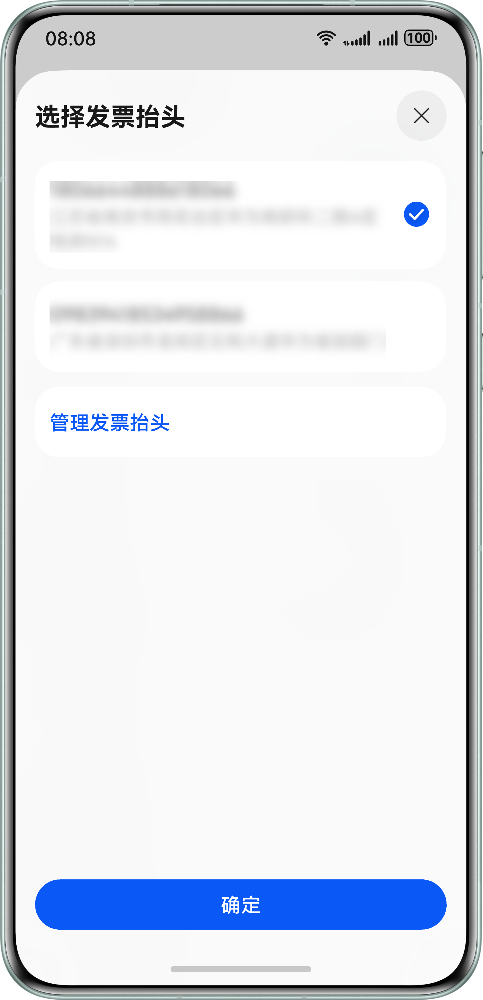
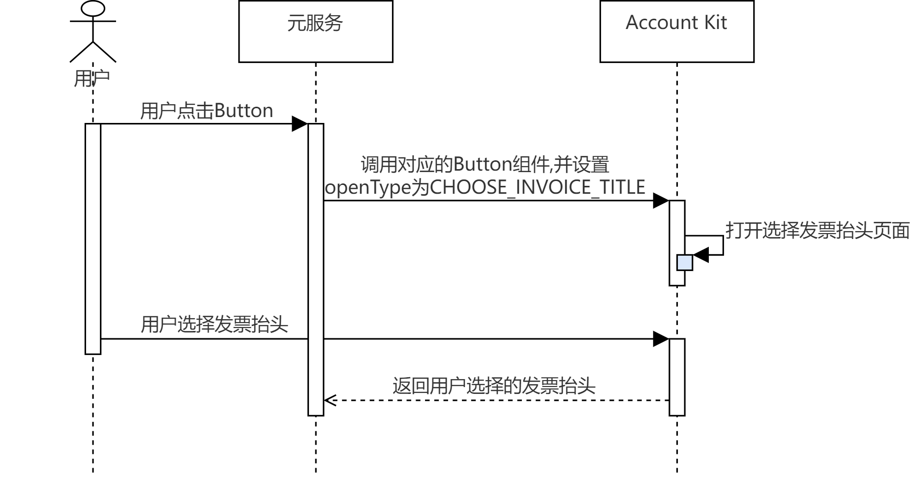

## 场景介绍

当元服务需要获取用户发票抬头时，可使用[选择发票抬头Button](/docs/dev/app-dev/application-services/scenario-fusion-kit-guide/scenario-fusion-button/scenario-fusion-button-invoice-title)，帮助用户打开发票抬头选择页面进行选择或管理发票抬头。

## 业务流程

流程说明：

1. 用户需要使用发票抬头时，元服务通过调用Scenario Fusion Kit对应的Button组件并设置openType为CHOOSE\_INVOICE\_TITLE，打开华为账号发票抬头选择页。
2. 用户可以在发票抬头选择页选择已有发票抬头或者跳转到发票抬头管理页进行增加，用户点击确认后将关闭发票抬头选择页面，并返回用户选择的发票抬头。

## 开发前提

在进行代码开发前，请确保已按照“开发准备”章节中的指导完成[配置签名和指纹](/docs/dev/atomic-dev/account-guide-atomic-preparations/account-atomic-sign-fingerprints)、[配置Client ID](/docs/dev/atomic-dev/account-guide-atomic-preparations/account-atomic-client-id)。该场景无需申请账号权限。

## 开发步骤

开发者可参考Scenario Fusion Kit的[选择发票抬头Button](/docs/dev/app-dev/application-services/scenario-fusion-kit-guide/scenario-fusion-button/scenario-fusion-button-invoice-title)开发指南完成代码开发。
