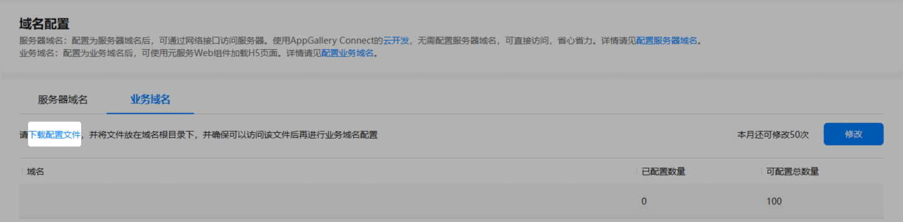
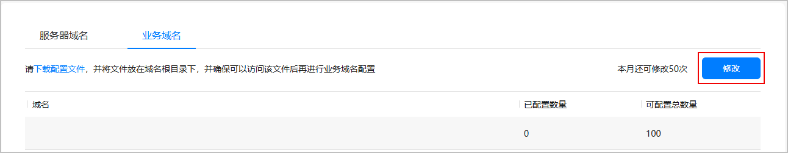
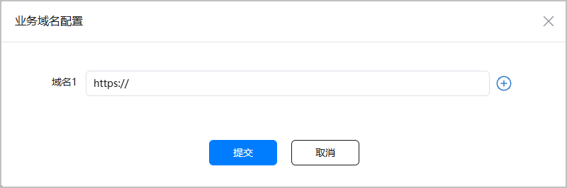
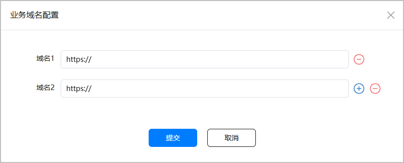
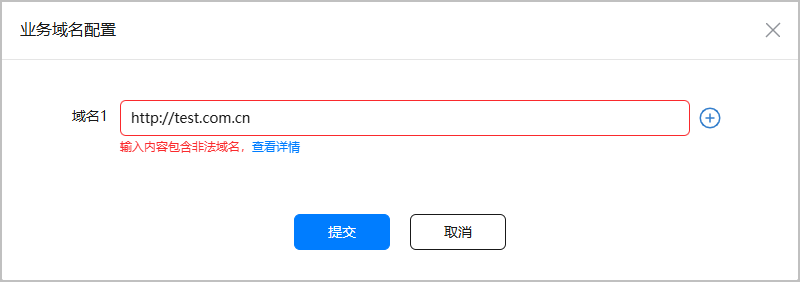
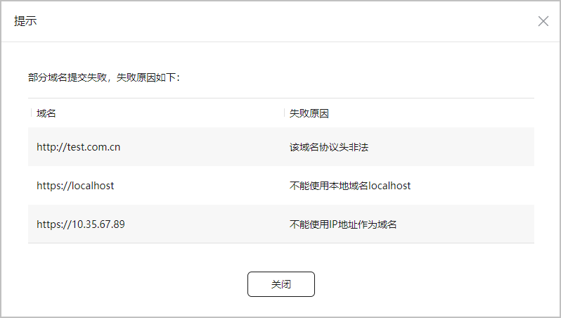
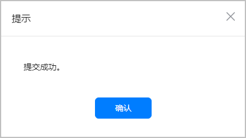
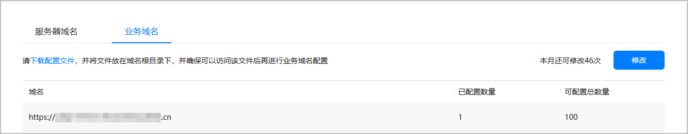

为维护元服务生态，保证元服务合规经营，提升元服务上架审核效率，助力平台商业闭环，支持开发者在元服务上架前配置webview业务域名，助力开发者灵活开发。后续当用户使用元服务时，将根据该元服务的业务域名配置实现业务跳转，为用户提供安全可靠的网络环境，从而提升用户信任度和满意度。

* 域名管控能力会随ROM升级逐步落地，为了不影响使用已发布的元服务，建议开发者到[AppGallery Connect](https://developer.huawei.com/consumer/cn/service/josp/agc/index.html)完成业务域名相关配置。如未通过AGC配置相关域名，元服务发起的网络请求将会被域名管控拦截，影响用户使用。

* 如果开发者已将元服务授权给服务商，那么开发者将无法自行修改元服务的业务域名，此操作需由服务商在第三方平台完成。具体修改方法，请参考[服务商配置业务域名](https://developer.huawei.com/consumer/cn/doc/SPPartnerCenter-develop-Guides/fa_sp_template-manage_platform_domain-0000002259983312#section1239355251617)。

## 前提条件

* 开发者账号为已完成[实名认证](https://developer.huawei.com/consumer/cn/doc/start/ht-edrna-0000001154848578)的非个人开发者，且归属地为中国大陆地区。
* 当前业务域名配置仅支持API ≥ 11的元服务使用。

## 配额限制

同一个元服务每个自然月业务域名修改次数，默认为50次。每修改一次域名，剩余修改次数减一。

若修改次数不能满足您的需求，您可发送邮件向华为运营人员申请放宽限制。在收到您的申请后，华为运营人员将在1-3个工作日内为您安排对接人员。申请方法如下：

* 申请邮箱地址：atomicservice@huawei.com。
* 邮件标题：[业务域名配置]-[元服务名称]-[APP ID]-[Developer ID]，APP ID等查询方法可参见[查看应用信息](https://developer.huawei.com/consumer/cn/doc/app/agc-help-view-app-info-0000002282674569)。
* 邮件正文：请说明申请放宽修改次数原因。

## 下载配置文件

1. 登录[AppGallery Connect](https://developer.huawei.com/consumer/cn/service/josp/agc/index.html)，点击“快速开始”中的“元服务一站式平台”卡片。

   
2. 在左上角的下拉列表中选择需要配置业务域名的元服务。

   
3. 在左侧导航栏选择“基础服务 &gt; 元服务域名管理”，进入域名配置主界面。
4. 选择“业务域名”页签，点击“下载配置文件”。

   配置文件以“APPID.txt”格式命名，例如您的元服务APPID为XXX，则下载的配置文件名称为“XXX.txt”。

   
5. 将下载到本地的配置文件放置到域名根目录下，例如“test.com.cn/XXX.txt”，并须确保可以成功访问该配置文件。

## 配置业务域名

1. 在域名配置主界面，选择“业务域名”页签，点击“修改”。

   

   如果“修改”按钮置灰不可点击，表示已将此元服务授权给服务商，请联系授权的服务商操作。具体修改方法，请参考[服务商配置业务域名](https://developer.huawei.com/consumer/cn/doc/SPPartnerCenter-develop-Guides/fa_sp_template-manage_platform_domain-0000002259983312#section1239355251617)。

   
2. 在“业务域名配置”弹框中配置业务域名，每个域名行只可配置一个域名。

   业务域名须以“https://”开头，仅支持英文大小写字母、数字以及符号“-”“.”，且单个域名长度不能超过128个字符。

   

   * 同一个APPID下，最多支持配置100个业务域名；同一个业务域名最多可配置100个APPID。
   * 域名只支持HTTPS协议。
   * 域名不支持使用IP地址或localhost。
   * 网页内iframe的域名也需要配置。
   * 业务域名配置主域名后，可直接访问子域名。

   
3. 点击行尾的可新增1个域名，最多支持100个域名。点击行尾的可删除某个域名。

   
4. 配置域名过程中，若界面提示“输入内容包含非法域名”，可点击提示信息旁边的“查看详情”查看详细的错误提示信息。

   
5. 根据提示框信息，对报错域名进行修改。

   可能出现的域名配置错误有以下几种情况：

   | 失败原因 | 解决方法 |
   | --- | --- |
   | 该域名未把配置文件放在域名根目录下 | 将下载的配置文件放置到域名根目录下，并确保可成功访问该配置文件。 |
   | 该域名协议头非法 | 域名以“https://”开头。 |
   | 不能使用IP地址作为域名 | 设置为合法域名。 |
   | 不能使用本地域名localhost | 设置为合法域名。 |
   | 域名格式只支持英文大小写字母、数字及符号“- ” “.” | 去除域名中包含的非法字符。 |
   | 域名长度超过128 | 单个域名长度不超过128个字符。 |
   | 为保障安全不可使用此域名地址 | 配置的域名存在于域名禁止清单内，已被全局禁用，需替换为合法域名。 |

   
6. 域名正确配置完成后，点击“提交”将新增域名提交审核。当弹出如下提示框时，表示新增域名成功，点击“确认”将返回业务域名列表。

   
7. 在业务域名列表，您可看到已配置的域名、已配置的域名数量、可配置的域名总数量信息。

   后续若您需要修改或删除已添加的域名，可点击“修改”进行刷新。

   

## 跳过域名校验

在元服务开发过程中，您可以在HarmonyOS设备端临时开启“**开发中元服务豁免管控**”选项，跳过webview业务域名的校验。操作方法如下：

1. 打开“设置 &gt; 关于本机”，多次点击版本号，打开开发者模式。
2. 打开“设置 &gt; 系统”，在下方找到“开发人员选项”并点击进入。
3. 在下方“应用”区域，打开“开发中元服务豁免管控”开关。

选项开启后在设备上运行非正式版本的元服务时，将不再进行业务域名的校验。

业务域名配置成功后，建议您关闭此选项进行开发，并在各平台下进行测试，以确认业务域名配置正确。
