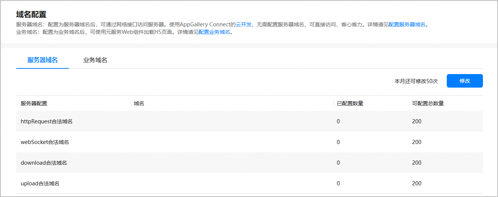
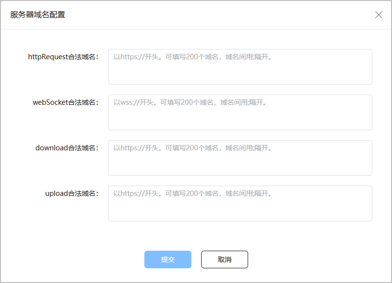
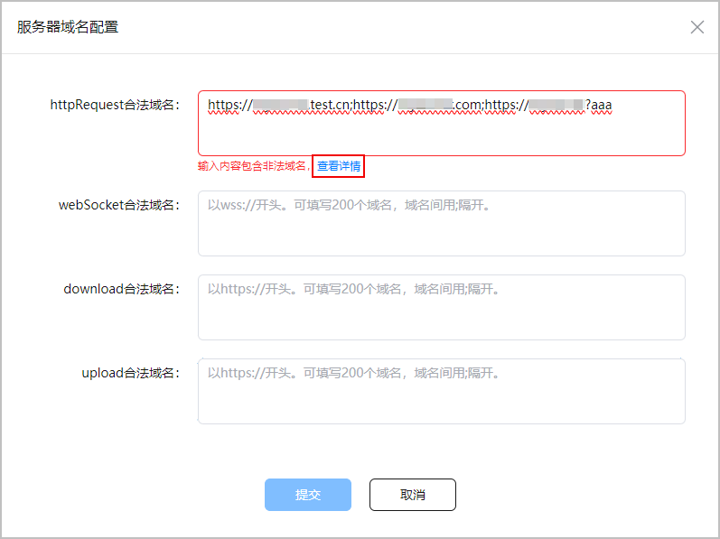
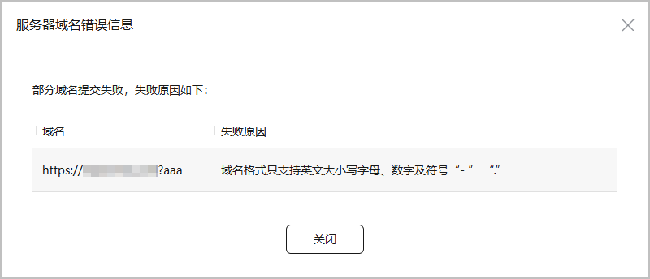
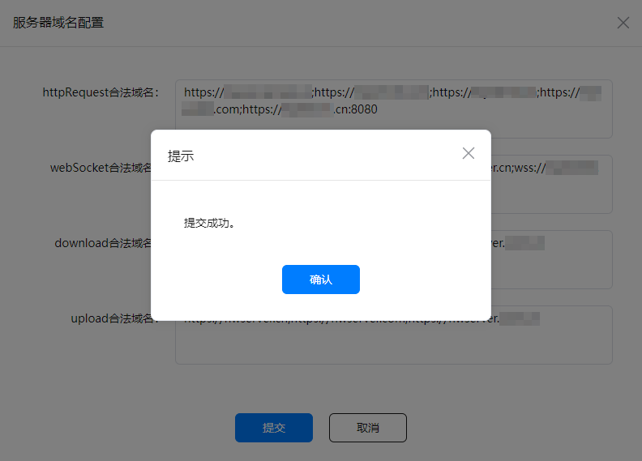
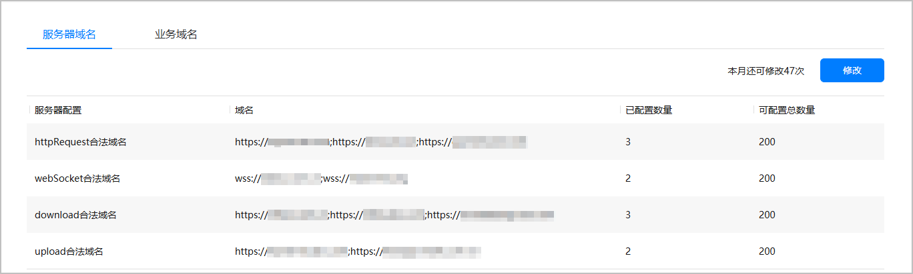

为规范元服务请求域名范围，提升元服务上架审核效率和平台合规经营安全性，支持开发者在元服务上架前申请开放使用的服务器域名。后续当用户使用元服务时，将根据该元服务的域名配置进行域名访问，为用户提供安全可靠的网络环境，从而提升用户信任度和满意度。并且域名管控支持定期自动导入全局禁止清单内的域名，实现域名数据的自动化更新，时刻确保网络的正常运行和信息的安全传输。

* 域名管控能力会随ROM升级逐步落地，为了不影响使用已发布的元服务，建议开发者到[AppGallery Connect](https://developer.huawei.com/consumer/cn/service/josp/agc/index.html)完成服务器域名相关配置。如未通过AGC配置相关域名，元服务发起的网络请求将会被域名管控拦截，影响用户使用。

* 如果开发者已将元服务授权给服务商，那么开发者将无法自行修改元服务的服务器域名，此操作需由服务商在第三方平台完成。具体修改方法，请参考[服务商配置服务器域名](https://developer.huawei.com/consumer/cn/doc/SPPartnerCenter-develop-Guides/fa_sp_template-manage_platform_domain-0000002259983312#section55611956141417)。

## 前提条件

* 开发者账号已完成[实名认证](https://developer.huawei.com/consumer/cn/doc/start/itrna-0000001076878172)，且归属地为中国大陆地区。
* 当前服务器域名配置仅支持API ≥ 11的元服务使用。

## 配额限制

同一个元服务每个自然月服务器域名修改次数，默认为50次。每修改一次域名，剩余修改次数减一。

若修改次数不能满足您的需求，您可发送邮件向华为运营人员申请放宽限制。在收到您的申请后，华为运营人员将在1-3个工作日内为您安排对接人员。申请方法如下：

* 申请邮箱地址：atomicservice@huawei.com。
* 邮件标题：[服务器域名配置]-[元服务名称]-[APP ID]-[Developer ID]，APP ID等查询方法可参见[查看应用信息](/docs/distribute/agc/agc-help-app-0000002235710234/agc-help-view-app-info-0000002282674569)。
* 邮件正文：请说明申请放宽修改次数原因。

## 配置服务器域名

1. 登录[AppGallery Connect](https://developer.huawei.com/consumer/cn/service/josp/agc/index.html)，点击“快速开始”中的“元服务一站式平台”卡片。

   
2. 在左上角的下拉列表中选择需要配置服务器域名的元服务。

   
3. 在左侧导航栏选择“ 基础服务&gt; 元服务域名管理”，进入域名配置主界面。
4. 选择“服务器域名”页签，当前支持配置httpRequest、webSocket、download、upload四种服务器类型的域名，点击“修改”。

   

   如果“修改”按钮置灰不可点击，表示已将此元服务授权给服务商，请联系授权的服务商操作。具体修改方法，请参考[服务商配置服务器域名](https://developer.huawei.com/consumer/cn/doc/SPPartnerCenter-develop-Guides/fa_sp_template-manage_platform_domain-0000002259983312#section55611956141417)。

   
5. 在“服务器域名配置”弹框中，根据您的服务器类型，在对应服务器域名输入框中输入要新增的域名。

   域名仅支持英文大小写字母、数字以及符号“-”“.”，且单个域名长度不能超过128个字符，不同域名之间以英文";"分隔。

   

   * 域名只支持HTTPS和WSS协议。
   * 域名不能使用IP地址或localhost。
   * 不可配置全局禁止清单内的域名。
   * 单项服务器域名配置数量最多不超过200个。

   | 配置项 | 说明 |
   | --- | --- |
   | httpRequest合法域名 | httpRequest服务器域名，以“https://”开头，支持两种配置方法：  * 配置端口 例如域名配置为https://myserver.com:8080 ，后续只能向 https://myserver.com:8080 发起请求。如果向 https://myserver.com、https://myserver.com:9091 等URL发起请求则会失败。 * 不配置端口 例如域名配置为https://myserver.com，后续请求的URL中将不能包含端口，即使是向默认的443端口（https://myserver.com:443）发起请求也会失败。 |
   | webSocket合法域名 | webSocket服务器域名，以“wss://”开头，不需要配置端口，默认允许请求该域名下所有端口。 |
   | download合法域名 | download服务器域名，以“https://”开头，支持两种配置方法：  * 配置端口 例如域名配置为https://myserver.org:8080 ，后续只能向 https://myserver.org:8080 发起请求。如果向https://myserver.org、https://myserver.download:9091等URL发起请求则会失败。 * 不配置端口 例如域名配置为https://myserver.org，后续请求的URL中将不能包含端口，即使是向默认的443端口（https://myserver.org:443）发起请求也会失败。 |
   | upload合法域名 | upload服务器域名，以“https://”开头，支持两种配置方法：  * 配置端口 例如域名配置为https://myserver.net:8080 ，后续只能向 https://myserver.net:8080 发起请求。如果向https://myserver.net、https://myserver.net:9091等URL发起请求则会失败。 * 不配置端口 例如域名配置为https://myserver.net，后续请求的URL中将不能包含端口，即使是向默认的443端口（https://myserver.net:443）发起请求也会失败。 |

   
6. 配置域名过程中，若提示“输入内容包含非法域名”，可点击提示信息旁边的“查看详情”查看具体的错误信息。

   
7. 根据“服务器域名错误信息”弹框提示信息，对报错域名进行修改。

   可能出现的域名配置错误有以下几种情况：

   | 失败原因 | 解决方法 |
   | --- | --- |
   | 该域名协议头非法 | 按照服务器域名类型修改为合法协议头。  * httpRequest/download/upload服务器域名以“https://”开头。 * webSocket服务器域名以“wss://”开头。 |
   | 不能使用IP地址作为域名 | 设置为合法域名。 |
   | 不能使用本地域名localhost | 设置为合法域名。 |
   | 域名格式只支持英文大小写字母、数字及符号“-”“.” | 去除域名中包含的非法字符。 |
   | webSocket域名不能包含端口号 | webSocket服务器类型的域名不需要配置端口，默认允许请求该域名下所有端口，去除域名中包含的端口。 |
   | 域名长度超过128 | 单个域名长度不超过128个字符。 |
   | 为保障安全不可使用此域名地址 | 配置的域名存在于域名禁止清单内，已被全局禁用，需替换为合法域名。 |

   
8. 域名正确配置完成后，点击“提交”将新增域名提交审核。当弹出提示框显示“提交成功”时，表示新增域名成功，点击“确认”将返回服务器域名列表。

   
9. 在服务器域名列表，您可看到不同服务器下已配置的域名、已配置的域名数量、可配置的域名总数量信息。

   后续若您需要修改或删除已添加的域名，可点击“修改”进行刷新。

   

   新增或更新的域名，将于24小时后生效。

   

## 跳过域名校验

在元服务开发过程中，您可以在HarmonyOS设备端临时开启“**开发中元服务豁免管控**”选项，跳过服务器域名的校验。操作方法如下：

1. 打开“设置 &gt; 关于本机”，多次点击版本号，打开开发者模式。
2. 打开“设置 &gt; 系统”，在下方找到“开发人员选项”并点击进入。
3. 在下方“应用”区域，打开“开发中元服务豁免管控”开关。

选项开启后在设备上运行非正式版本的元服务时，将不再进行服务器域名的校验。

服务器域名配置成功后，建议您关闭此选项进行开发，并在各平台下进行测试，以确认服务器域名配置正确。
