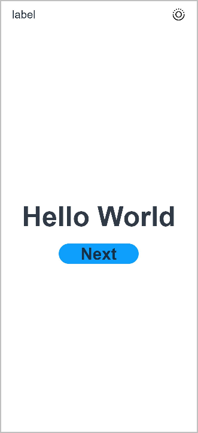
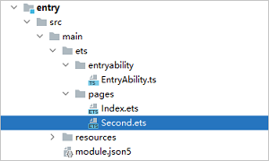

下面我们将构建元服务的两个页面，并按预定的业务逻辑，实现页面间跳转。

## 构建元服务的第一个页面

1. 使用文本组件。

   工程同步完成后，在“**Project**”窗口，单击“**entry &gt; src &gt; main &gt; ets &gt; pages**”，打开“**Index.ets**”文件，可以看到页面由Text组件组成。

   针对本文中使用文本/按钮来实现页面跳转/返回的应用场景，页面均使用[Row](https://developer.huawei.com/consumer/cn/doc/harmonyos-references/ts-container-row)和[Column](https://developer.huawei.com/consumer/cn/doc/harmonyos-references/ts-container-column)组件来构建布局。对于更多复杂元素对齐的场景，可选择使用[RelativeContainer](https://developer.huawei.com/consumer/cn/doc/harmonyos-references/ts-container-relativecontainer)组件进行布局。
2. 创建导航首页。

   使用Navigation创建导航主页，并创建导航控制器NavPathStack以此来实现不同页面之间的跳转。

   “**Index.ets**”文件的示例如下：

   ```
   import { authentication } from '@kit.AccountKit';
   import { BusinessError } from '@kit.BasicServicesKit';
   import { hilog } from '@kit.PerformanceAnalysisKit';

   @Entry
   @Component
   struct NavigationDemo {
     @Provide('pathInfos') pathInfos: NavPathStack = new NavPathStack();
     @State message: string = 'Hello World'

     build() {
       Column() {
         Navigation(this.pathInfos) {
           Column() {
             Text(this.message)
               .fontSize(50)
               .fontWeight(FontWeight.Bold)
           }
           .width('100%')
           .height('100%')
           .justifyContent(FlexAlign.Center)
           .alignItems(HorizontalAlign.Center)
         }
         .width('100%')
         .mode(NavigationMode.Auto)
       }
       .size({ width: '100%', height: '100%' })
       .backgroundColor(0xf4f4f5)
     }

     aboutToAppear() {
       hilog.info(0x0000, 'testTag', '%{public}s', 'Ability onCreate');
       this.loginWithHuaweiID();
     }

     /**
      * Sample code for using HUAWEI ID to log in to atomic service.
      * According to the Atomic Service Review Guide, when an atomic service has an account system,
      * the option to log in with a HUAWEI ID must be provided.
      * The following presets the atomic service to use the HUAWEI ID silent login function.
      * To enable the atomic service to log in successfully using the HUAWEI ID, please refer
      * to the HarmonyOS HUAWEI ID Access Guide to configure the client ID and fingerprint certificate.
      */
     private loginWithHuaweiID() {
       // Create a login request and set parameters
       let loginRequest = new authentication.HuaweiIDProvider().createLoginWithHuaweiIDRequest();
       // Whether to forcibly launch the HUAWEI ID login page when the user is not logged in with the HUAWEI ID
       loginRequest.forceLogin = false;
       // Execute login request
       let controller = new authentication.AuthenticationController();
       controller.executeRequest(loginRequest).then((data) => {
         let loginWithHuaweiIDResponse = data as authentication.LoginWithHuaweiIDResponse;
         let authCode = loginWithHuaweiIDResponse.data?.authorizationCode;
         // Send authCode to the backend in exchange for unionID, session

       }).catch((error: BusinessError) => {
         hilog.error(0x0000, 'testTag', 'error: %{public}s', JSON.stringify(error));
         if (error.code == authentication.AuthenticationErrorCode.ACCOUNT_NOT_LOGGED_IN) {
           // HUAWEI ID is not logged in, it is recommended to jump to the login guide page

         }
       });
     }
   }
   ```
3. 添加按钮。

   在默认页面基础上，我们添加一个Button组件。“**Index.ets**”文件的示例如下：

   ```
   import { authentication } from '@kit.AccountKit';
   import { BusinessError } from '@kit.BasicServicesKit';
   import { hilog } from '@kit.PerformanceAnalysisKit';

   @Entry
   @Component
   struct NavigationDemo {
     @Provide('pathInfos') pathInfos: NavPathStack = new NavPathStack();
     @State message: string = 'Hello World'

     build() {
       Column() {
         Navigation(this.pathInfos) {
           Column() {
             Text(this.message)
               .fontSize(50)
               .fontWeight(FontWeight.Bold)
             // 添加按钮，以响应用户点击
             Button() {
               Text('Next')
                 .fontSize(30)
                 .fontWeight(FontWeight.Bold)
             }
             .type(ButtonType.Capsule)
             .margin({ top: 20 })
             .backgroundColor('#0D9FFB')
             .width('40%')
             .height('5%')
           }
           .width('100%')
           .height('100%')
           .justifyContent(FlexAlign.Center)
           .alignItems(HorizontalAlign.Center)
         }
         .width('100%')
         .mode(NavigationMode.Auto)
       }
       .size({ width: '100%', height: '100%' })
       .backgroundColor(0xf4f4f5)
     }

     aboutToAppear() {
       hilog.info(0x0000, 'testTag', '%{public}s', 'Ability onCreate');
       this.loginWithHuaweiID();
     }

     /**
      * Sample code for using HUAWEI ID to log in to atomic service.
      * According to the Atomic Service Review Guide, when an atomic service has an account system,
      * the option to log in with a HUAWEI ID must be provided.
      * The following presets the atomic service to use the HUAWEI ID silent login function.
      * To enable the atomic service to log in successfully using the HUAWEI ID, please refer
      * to the HarmonyOS HUAWEI ID Access Guide to configure the client ID and fingerprint certificate.
      */
     private loginWithHuaweiID() {
       // Create a login request and set parameters
       let loginRequest = new authentication.HuaweiIDProvider().createLoginWithHuaweiIDRequest();
       // Whether to forcibly launch the HUAWEI ID login page when the user is not logged in with the HUAWEI ID
       loginRequest.forceLogin = false;
       // Execute login request
       let controller = new authentication.AuthenticationController();
       controller.executeRequest(loginRequest).then((data) => {
         let loginWithHuaweiIDResponse = data as authentication.LoginWithHuaweiIDResponse;
         let authCode = loginWithHuaweiIDResponse.data?.authorizationCode;
         // Send authCode to the backend in exchange for unionID, session

       }).catch((error: BusinessError) => {
         hilog.error(0x0000, 'testTag', 'error: %{public}s', JSON.stringify(error));
         if (error.code == authentication.AuthenticationErrorCode.ACCOUNT_NOT_LOGGED_IN) {
           // HUAWEI ID is not logged in, it is recommended to jump to the login guide page

         }
       });
     }
   }
   ```
4. 将真机与电脑连接。具体指导及要求，请参见[运行应用/服务](https://developer.huawei.com/consumer/cn/doc/harmonyos-guides/ide-run-device)，第一个页面效果如下图所示。

   

## 构建元服务的第二个页面

1. 创建第二个页面。

   * 新建第二个页面文件。在“**Project**”窗口，打开“**entry &gt; src &gt; main &gt; ets**”，右键单击“**pages**”文件夹，选择“**New &gt; ArkTS File**”，命名为“**Second**”，回车。可以看到文件目录结构如下所示。

     
   * 配置第二个页面的路由。在“**Project**”窗口，打开“**entry &gt; src &gt; main &gt; resources &gt; base &gt; profile**”，新增router\_map.json文件对"routerMap"进行配置，示例如下：

     ```
     {
       "routerMap" : [
         {
           "name" : "second",
           "pageSourceFile"  : "src/main/ets/pages/Second.ets",
           "buildFunction" : "PageSecondBuilder"
         }
       ]
     }
     ```

     在module.json5文件中新增"routerMap"配置，并将其地址配置为路由表位置。

     ```
     "routerMap": "$profile:router_map"
     ```
2. 添加文本及按钮。

   参照第一个页面，在第二个页面添加Text组件、Button组件等，并设置其样式。

   使用NavDestination创建导航子页。创建导航控制器NavPathStack并在onReady时进行初始化，获取当前所在的导航控制器，以此来实现不同页面之间的跳转。

   “**Second.ets**”文件的示例如下：

   ```
   // Second.ets
   @Builder
   export function PageSecondBuilder() {
     PageSecond();
   }

   @Component
   export struct PageSecond {
     pathInfos: NavPathStack = new NavPathStack();
     @State message: string = 'Hi there';

     build() {
       Row() {
         NavDestination() {
           Column() {
             Text(this.message)
               .fontSize(50)
               .fontWeight(FontWeight.Bold)

             Button() {
               Text('Back')
                 .fontSize(30)
                 .fontWeight(FontWeight.Bold)
             }
             .type(ButtonType.Capsule)
             .margin({ top: 20 })
             .backgroundColor('#0D9FFB')
             .width('40%')
             .height('7%')
           }
           .width('100%')
           .height('75%')
           .justifyContent(FlexAlign.Center)
           .alignItems(HorizontalAlign.Center)
         }
         .width('100%')
         .onReady((ctx: NavDestinationContext) => {
           this.pathInfos = ctx.pathStack;
         });
       }
       .size({ width: '100%', height: '100%' })
       .backgroundColor(0xf4f4f5)
     }
   }
   ```

## 实现页面间的跳转

页面间的导航可以通过[组件导航（Navigation）](/docs/dev/app-dev/application-framework/arkui/arkts-ui-development/arkts-set-navigation-routing/arkts-navigation-navigation)来实现。推荐使用[NavPathStack](https://developer.huawei.com/consumer/cn/doc/harmonyos-references/ts-basic-components-navigation#navpathstack10)实现页面路由跳转。

对Button组件添加onClick方法，并在其中使用导航控制器NavPathStack的pushPathByName方法，使组件可以在点击之后从当前页面跳转到输入参数name在路由表内对应的页面。

1. 第一个页面跳转到第二个页面。

   在第一个页面中，跳转按钮绑定onClick事件，点击按钮时跳转到第二页。“**Index.ets**”文件的示例如下：

   ```
   import { authentication } from '@kit.AccountKit';
   import { BusinessError } from '@kit.BasicServicesKit';
   import { hilog } from '@kit.PerformanceAnalysisKit';

   @Entry
   @Component
   struct NavigationDemo {
     @Provide('pathInfos') pathInfos: NavPathStack = new NavPathStack();
     @State message: string = 'Hello World'

     build() {
       Column() {
         Navigation(this.pathInfos) {
           Column() {
             Text(this.message)
               .fontSize(50)
               .fontWeight(FontWeight.Bold)
             // 添加按钮，以响应用户点击
             Button() {
               Text('Next')
                 .fontSize(30)
                 .fontWeight(FontWeight.Bold)
             }
             .type(ButtonType.Capsule)
             .margin({ top: 20 })
             .backgroundColor('#0D9FFB')
             .width('40%')
             .height('5%')
             .onClick(() => {
               this.pathInfos.pushPathByName('second', 'custom_param');
             })
           }
           .width('100%')
           .height('100%')
           .justifyContent(FlexAlign.Center)
           .alignItems(HorizontalAlign.Center)
         }
         .width('100%')
         .mode(NavigationMode.Auto)
       }
       .size({ width: '100%', height: '100%' })
       .backgroundColor(0xf4f4f5)
     }

     aboutToAppear() {
       hilog.info(0x0000, 'testTag', '%{public}s', 'Ability onCreate');
       this.loginWithHuaweiID();
     }

     /**
      * Sample code for using HUAWEI ID to log in to atomic service.
      * According to the Atomic Service Review Guide, when an atomic service has an account system,
      * the option to log in with a HUAWEI ID must be provided.
      * The following presets the atomic service to use the HUAWEI ID silent login function.
      * To enable the atomic service to log in successfully using the HUAWEI ID, please refer
      * to the HarmonyOS HUAWEI ID Access Guide to configure the client ID and fingerprint certificate.
      */
     private loginWithHuaweiID() {
       // Create a login request and set parameters
       let loginRequest = new authentication.HuaweiIDProvider().createLoginWithHuaweiIDRequest();
       // Whether to forcibly launch the HUAWEI ID login page when the user is not logged in with the HUAWEI ID
       loginRequest.forceLogin = false;
       // Execute login request
       let controller = new authentication.AuthenticationController();
       controller.executeRequest(loginRequest).then((data) => {
         let loginWithHuaweiIDResponse = data as authentication.LoginWithHuaweiIDResponse;
         let authCode = loginWithHuaweiIDResponse.data?.authorizationCode;
         // Send authCode to the backend in exchange for unionID, session

       }).catch((error: BusinessError) => {
         hilog.error(0x0000, 'testTag', 'error: %{public}s', JSON.stringify(error));
         if (error.code == authentication.AuthenticationErrorCode.ACCOUNT_NOT_LOGGED_IN) {
           // HUAWEI ID is not logged in, it is recommended to jump to the login guide page

         }
       });
     }
   }
   ```
2. 第二个页面返回到第一个页面。

   在第二个页面中，返回按钮绑定onClick事件，并在其中使用导航控制器NavPathStack的pop方法，使组件可以在点击之后弹出路由栈栈顶元素实现页面的返回。点击按钮时返回到第一页。

   “**Second.ets**”文件的示例如下：

   ```
   // Second.ets
   @Builder
   export function PageSecondBuilder() {
     PageSecond();
   }

   @Component
   export struct PageSecond {
     pathInfos: NavPathStack = new NavPathStack();
     @State message: string = 'Hi there';

     build() {
       Row() {
         NavDestination() {
           Column() {
             Text(this.message)
               .fontSize(50)
               .fontWeight(FontWeight.Bold)

             Button() {
               Text('Back')
                 .fontSize(30)
                 .fontWeight(FontWeight.Bold)
             }
             .type(ButtonType.Capsule)
             .margin({ top: 20 })
             .backgroundColor('#0D9FFB')
             .width('40%')
             .height('7%')
             .onClick(() => {
               this.pathInfos.pop();   // 返回上一页
             })
           }
           .width('100%')
           .height('75%')
           .justifyContent(FlexAlign.Center)
           .alignItems(HorizontalAlign.Center)
         }
         .width('100%')
         .onReady((ctx: NavDestinationContext) => {
           this.pathInfos = ctx.pathStack;
         });
       }
       .size({ width: '100%', height: '100%' })
       .backgroundColor(0xf4f4f5)
     }
   }
   ```
3. 效果如下图所示：

   
