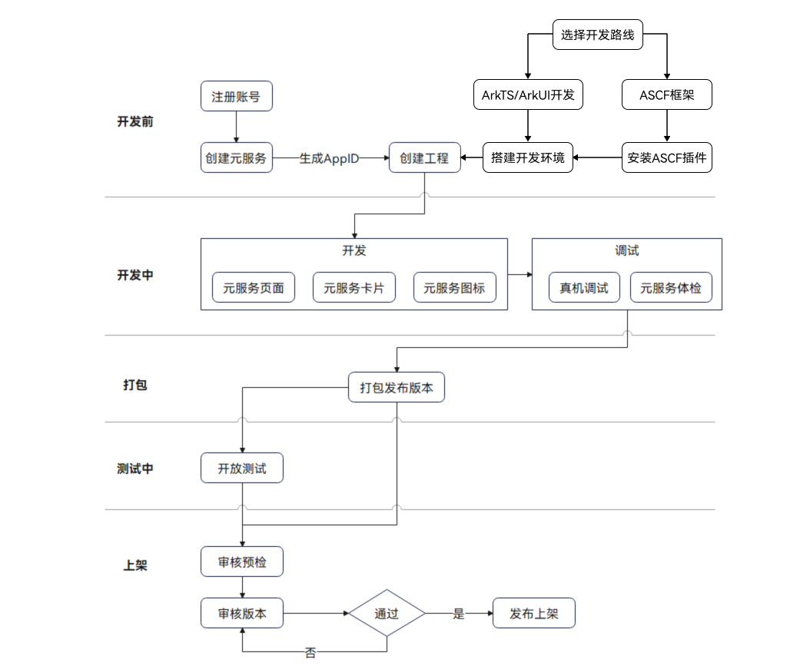

元服务的开发旅程如下图所示。

**图1** 元服务开发旅程

元服务开发主要包括以下环节。

* **开发前**

  创建元服务项目前，需要[注册华为开发者账号](https://developer.huawei.com/consumer/cn/doc/start/registration-and-verification-0000001053628148)并[创建您的元服务](https://developer.huawei.com/consumer/cn/doc/app/agc-help-create-atomic-service-0000002247795706)；选择元服务开发技术路线，然后[搭建开发环境](https://developer.huawei.com/consumer/cn/doc/atomic-guides/atomic-service-start-overview#工具准备)，通过DevEco Studio[创建元服务工程](https://developer.huawei.com/consumer/cn/doc/atomic-guides/atomic-service-create-project)。

  

  + 元服务包名命名格式需要使用com.atomicservice.[appid]，请先在网站创建元服务，获取AppID后再创建工程。
  + 在[AppGallery Connect](https://developer.huawei.com/consumer/cn/service/josp/agc/index.html)上，点击“开发与服务”，在项目列表中找到您的项目，点击待查看的元服务，进入“项目设置 &gt; 常规”页面可查询元服务的appid。
  + 元服务为小程序生态定制的一套解决方案，能够使用类似于小程序的开发技术，高效开发元服务，详细请参考[ASCF框架](https://developer.huawei.com/consumer/cn/doc/atomic-ascf/ascf-overview)。
  + 使用ASCF框架开发元服务与使用ArkTS/ArkUI方式开发存在技术路线上的不同，无法进行混合开发，ASCF框架能力请参考[ASCF元服务开发指南](https://developer.huawei.com/consumer/cn/doc/atomic-ascf/ascf-development-guide)。
* **开发中**

  元服务包含页面、卡片、图标三个部分，请分别参考[UI开发](https://developer.huawei.com/consumer/cn/doc/atomic-guides/atomic-ui-development)、[服务卡片开发](https://developer.huawei.com/consumer/cn/doc/atomic-guides/atomic-widget-development)、[生成元服务图标](https://developer.huawei.com/consumer/cn/doc/atomic-guides/atomic-service-icon-generation)。

  DevEco Studio提供以下能力，帮助开发者提升开发过程中的体验。

  + [元服务图标生成工具](https://developer.huawei.com/consumer/cn/doc/atomic-guides/atomic-service-icon-generation)：开发者可以通过上传指定尺寸和格式的图片，快速生成元服务图标。
  + [真机调试](https://developer.huawei.com/consumer/cn/doc/atomic-guides/atomic-running-debugging)：开发者可快速通过真机运行调试查看运行效果。
  + [元服务体检工具](https://developer.huawei.com/consumer/cn/doc/atomic-guides/atomic-service-appanalyzer)：开发者可以对元服务的质量和体验进行快速评分和优化。
  + **打包**

    可通过DevEco Studio快速[打包生成发布版本](https://developer.huawei.com/consumer/cn/doc/harmonyos-guides/ide-publish-app)，使用此版本，可以用于进行邀请测试和公开测试或直接提交上架审核。
  + **测试**

    在正式发布元服务前，您可以发布邀请测试，邀请部分用户提前体验新版本，或者面向AppGallery用户发布[公开测试](https://developer.huawei.com/consumer/cn/doc/app/agc-help-public-test-0000002287814841)版本，并收集用户的反馈，以便提前发现问题进行改进，从而保证全网版本的质量，提升用户体验。您可以根据下表对照选择合适的测试方式。

    | 测试阶段 | 邀请测试 | 公开测试 |
    | --- | --- | --- |
    | 面向对象 | 可邀请友好、信任的小范围用户 | 面向全网所有用户公开招募测试 |
    | 邀请人数 | 上限10000人 | 下载安装次数上限1000万次 |
    | 支持同时测试的版本数 | 100个 | 1个 |
    | 发布AppGallery测试专区 | 必须 | 可选 |
    | 是否支持分享链接 | 支持 | 支持 |
* **上架**

  在正式提交上架前，建议通过AGC云测试服务，进行[上架审核预检](https://developer.huawei.com/consumer/cn/doc/atomic-guides/atomic-service-check)。

  当元服务经过全面测试，确保版本没有问题，即可[发布正式版本](https://developer.huawei.com/consumer/cn/doc/app/agc-help-release-atomic-0000002327731065)。
