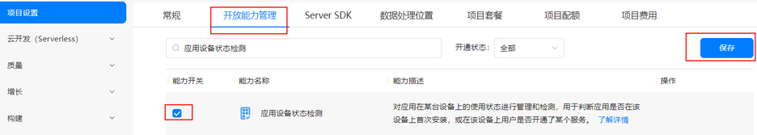

在开通Device Security服务前，请先参考“[应用开发准备](https://developer.huawei.com/consumer/cn/doc/harmonyos-guides/application-dev-overview)”完成基本准备工作，再继续进行以下开发活动。

1. 登录[AppGallery Connect](https://developer.huawei.com/consumer/cn/service/josp/agc/index.html)网站，选择开发与服务。

   
2. 在项目列表中找到需要开通Device Security服务的项目。

   
3. 选择“开放能力管理”Tab页，找到需要使用的功能，点击左侧的按钮，开通相应的功能。

   * **应用设备状态检测**：勾选“应用设备状态检测”并点击“保存”，接入“应用设备状态检测”。

     
   * **安全检测**：勾选“安全检测服务”并点击“保存”，接入“安全检测服务”。

     
   * **可信应用服务**：勾选“可信应用服务”并点击“保存”，接入“可信应用服务”。

     

     开通“可信应用服务”需要先申请进入允许清单，请将Developer ID、公司名称、应用名称、申请使用的服务和使用该服务的场景，发送到agconnect@huawei.com。AGC运营将审核相关材料，通过后将为您配置受限开放服务使用的名单，审核周期为1-3个工作日，请耐心等待。

     
4. 申请Profile（.p7b）文件，具体操作请参见[申请调试Profile](https://developer.huawei.com/consumer/cn/doc/app/agc-help-add-debugprofile-0000001914423102)。

   

   在开通服务后，需要重新申请Profile（.p7b）文件。
