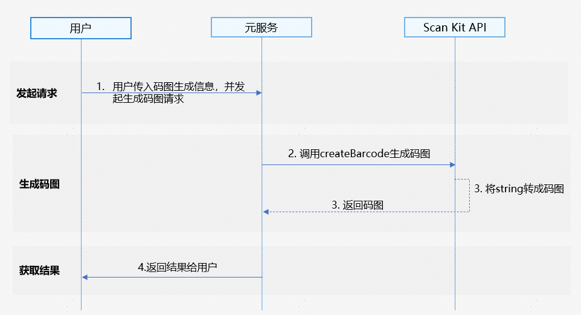

## 基本概念

码图生成能力支持将字符串转换为自定义格式的码图。

## 场景介绍

码图生成能力支持将字符串转换为自定义格式的码图，包含条形码、二维码生成。

可以将字符串转成联系人码图，手机克隆码图，例如将"HUAWEI"字符串生成码图使用。

## 约束与限制

码图生成能力支持Phone、Tablet、Wearable、2in1、TV（从5.1.0(18)版本开始支持Wearable、从5.1.1(19)版本开始支持2in1、TV）。

## 业务流程



1. 用户向元服务发起生成码图请求后，输入需要生成的码图信息，包括码图的类型、宽高等。
2. 元服务通过调用Scan Kit的createBarcode接口启动码图生成能力。
3. Scan Kit通过将字符串转换为所需格式的码图并返回给元服务。
4. 元服务向用户返回生成码图结果。

## 接口说明

接口返回值有两种返回形式：Callback和Promise回调。Callback和Promise只是返回值方式不一样，功能相同。具体API说明详见[接口文档](https://developer.huawei.com/consumer/cn/doc/harmonyos-references/scan-generatebarcode)。

| 接口名 | 接口描述 |
| --- | --- |
| [createBarcode](https://developer.huawei.com/consumer/cn/doc/harmonyos-references/scan-generatebarcode#generatebarcodecreatebarcode)(content: string, options: [CreateOptions](https://developer.huawei.com/consumer/cn/doc/harmonyos-references/scan-generatebarcode#createoptions)): Promise\&lt;image.[PixelMap](https://developer.huawei.com/consumer/cn/doc/harmonyos-references/arkts-apis-image-pixelmap)\&gt; | 码图生成接口，返回生成的码图，类型为image.PixelMap，可以使用Image组件渲染成图片。使用Promise异步回调。 |
| [createBarcode](https://developer.huawei.com/consumer/cn/doc/harmonyos-references/scan-generatebarcode#generatebarcodecreatebarcode-1)(content: string, options: CreateOptions, callback: AsyncCallback\&lt;image.PixelMap\&gt;): void | 码图生成接口，返回生成的码图，类型为image.PixelMap，可以使用Image组件渲染成图片。使用callback异步回调。 |

## 开发步骤

码图生成根据传参内容直接生成所需码图，需要传入固定参数和可选参数。

以下示例为调用码图生成能力的createBarcode接口实现码图生成。

1. 导入码图生成接口模块，该模块提供了码图生成的参数和方法，导入方法如下。

   ```
   // 导入码图生成需要的图片模块、错误码模块
   import { scanCore, generateBarcode } from '@kit.ScanKit';
   import { BusinessError } from '@kit.BasicServicesKit';
   import { image } from '@kit.ImageKit';
   import { hilog } from '@kit.PerformanceAnalysisKit';
   ```
2. 调用码图生成能力的createBarcode接口实现码图生成。

   * 通过Promise方式回调，获取生成的码图。

     ```
     @Entry
     @Component
     struct Index {
       @State pixelMap: image.PixelMap | undefined = undefined;

       build() {
         Flex({ direction: FlexDirection.Column, alignItems: ItemAlign.Center, justifyContent: FlexAlign.Center }) {
           Button('generateBarcode Promise').onClick(() => {
             // 以QR码为例，码图生成参数
             this.pixelMap = undefined;
             let content: string = 'huawei';
             let options: generateBarcode.CreateOptions = {
               scanType: scanCore.ScanType.QR_CODE,
               height: 400,
               width: 400
             };
             try {
               // 码图生成接口，成功返回PixelMap格式图片
               generateBarcode.createBarcode(content, options).then((pixelMap: image.PixelMap) => {
                 this.pixelMap = pixelMap;
               }).catch((err: BusinessError) => {
                 hilog.error(0x0001, '[generateBarcode]',
                   `Failed to get pixelMap by promise with options. Code: ${err.code}, message: ${err.message}`);
               });
             } catch (err) {
               hilog.error(0x0001, '[generateBarcode]',
                 `Failed to createBarcode by promise with options. Code: ${err.code}, message: ${err.message}`);
             }
           })
           // 获取生成码图后显示
           if (this.pixelMap) {
             Image(this.pixelMap).width(300).height(300).objectFit(ImageFit.Contain)
           }
         }
         .width('100%')
         .height('100%')
       }
     }
     ```
   * 通过Callback方式回调，获取生成的码图。

     ```
     @Entry
     @Component
     struct Index {
       @State pixelMap: image.PixelMap | undefined = undefined;

       build() {
         Flex({ direction: FlexDirection.Column, alignItems: ItemAlign.Center, justifyContent: FlexAlign.Center }) {
           Button('generateBarcode Callback').onClick(() => {
             // 以QR码为例，码图生成参数
             let content = 'huawei';
             let options: generateBarcode.CreateOptions = {
               scanType: scanCore.ScanType.QR_CODE,
               height: 400,
               width: 400
             };
             try {
               // 码图生成接口，成功返回PixelMap格式图片
               generateBarcode.createBarcode(content, options, (err: BusinessError, pixelMap: image.PixelMap) => {
                 if (err) {
                   hilog.error(0x0001, '[generateBarcode]',
                     `Failed to get pixelMap by callback with options. Code: ${err.code}, message: ${err.message}`);
                   return;
                 }
                 this.pixelMap = pixelMap;
               });
             } catch (err) {
               hilog.error(0x0001, '[generateBarcode]',
                 `Failed to createBarcode by callback with options. Code: ${err.code}, message: ${err.message}`);
             }
           })
           // 获取生成码图后显示
           if (this.pixelMap) {
             Image(this.pixelMap).width(300).height(300).objectFit(ImageFit.Contain)
           }
         }
         .width('100%')
         .height('100%')
       }
     }
     ```

## 模拟器开发

暂不支持模拟器开发，调用接口会返回错误信息“Emulator is not supported.”
