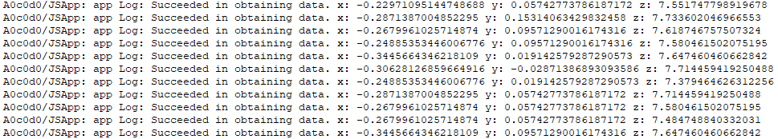

## 场景介绍

当设备需要获取传感器数据时，可以使用sensor模块，例如：通过订阅方向传感器数据感知用户设备当前的朝向。

详细的接口介绍请参考[Sensor接口](https://developer.huawei.com/consumer/cn/doc/harmonyos-references/js-apis-sensor)。

## 接口说明

| 模块 | 接口名 | 描述 |
| --- | --- | --- |
| ohos.sensor | sensor.on(sensorId, callback:AsyncCallback\&lt;Response\&gt;): void | 持续监听传感器数据变化。 |
| ohos.sensor | sensor.off(sensorId, callback?:AsyncCallback\&lt;void\&gt;): void | 注销传感器数据的监听。 |

## 开发步骤

开发步骤以加速度传感器ACCELEROMETER为例。

1. 导入模块。

   ```
   import sensor from '@ohos.sensor';
   ```
2. 检查是否已经配置相应权限。
3. 注册监听。通过on()接口，实现对传感器的持续监听，将传感器上报频率等级设为”game“。

   ```
   sensor.on(sensor.SensorId.ACCELEROMETER, (data: sensor.AccelerometerResponse) => {
       console.info("Succeeded in obtaining data. x: " + data.x + " y: " + data.y + " z: " + data.z);
   }, { interval: 'game' });
   ```

   
4. 取消持续监听。

   ```
   sensor.off(sensor.SensorId.ACCELEROMETER);
   ```
