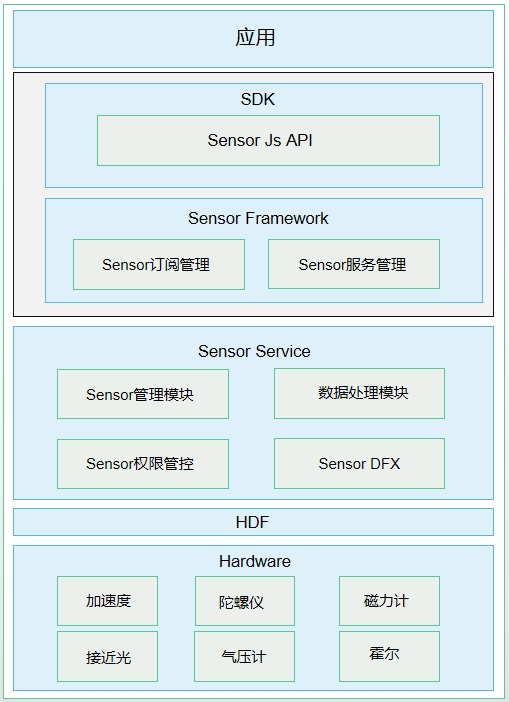

## 传感器类型

系统传感器是应用访问底层硬件传感器的一种设备抽象概念。开发者根据传感器提供的[Sensor接口](https://developer.huawei.com/consumer/cn/doc/harmonyos-references/js-apis-sensor)，订阅传感器数据，并根据传感器数据定制相应的算法开发各类应用，比如指南针、运动健康、游戏等。

| 传感器类型 | 描述 | 说明 | 主要用途 |
| --- | --- | --- | --- |
| ACCELEROMETER | 加速度传感器 | 测量三个物理轴（x、y 和 z）上，施加在设备上的加速度（包括重力加速度），单位 : m/s²。 | 检测设备运动的加速度。 |
| GYROSCOPE | 陀螺仪传感器 | 测量三个物理轴（x、y 和 z）上，设备的旋转角速度，单位 : rad/s。 | 测量旋转的角速度。 |
| ORIENTATION | 方向传感器 | 测量设备围绕三个物理轴（z、x 和 y）旋转的角度值，单位：rad。 | 用于测量屏幕旋转的3个角度值。 |

## 运作机制

HarmonyOS传感器包含如下四个模块：Sensor API、Sensor Framework、Sensor Service和HDF层。

**图1** HarmonyOS传感器

1. Sensor API：提供传感器的基础API，主要包含查询传感器列表，订阅/取消传感器的数据、执行控制命令等，简化应用开发。
2. Sensor Framework：主要实现传感器的订阅管理，数据通道的创建、销毁、订阅与取消订阅，实现与SensorService的通信。
3. Sensor Service：主要实现HD\_IDL层数据接收、解析、分发，前后台的策略管控，对该设备Sensor的管理，Sensor权限管控等。
4. HDF层：对不同的FIFO、频率进行策略选择，以及适配不同设备。

## 约束与限制

1. 针对下面所列传感器，开发者需要请求相应的权限，才能获取到相应传感器的数据。

   | 传感器 | 权限名 | 敏感级别 | 权限描述 |
   | --- | --- | --- | --- |
   | 加速度传感器，加速度未校准传感器，线性加速度传感器 | ohos.permission.ACCELEROMETER | system\_grant | 允许应用读取加速度传感器的数据，包括：加速度传感器、加速度未校准传感器、线性加速度传感器。 |
   | 陀螺仪传感器，陀螺仪未校准传感器 | ohos.permission.GYROSCOPE | system\_grant | 允许应用读取陀螺仪传感器的数据，包括：陀螺仪传感器、陀螺仪未校准传感器。 |
2. 传感器数据订阅和取消订阅接口成对调用，当不再需要订阅传感器数据时，开发者需要调用取消订阅接口停止数据上报。
