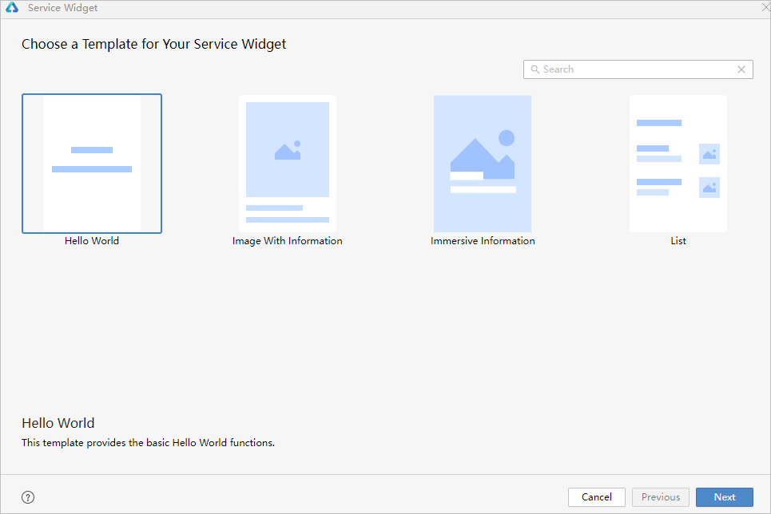
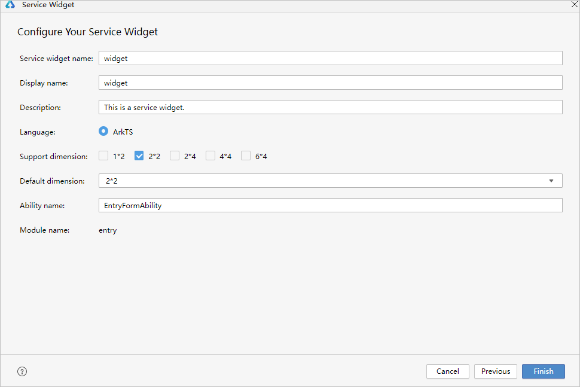
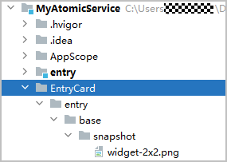

1. 在元服务中新建一张卡片。
   * 在“**Project**”窗口，在“**entry**”模块目录右键选择“**New &gt; Service Widget &gt; Dynamic Widget**”，进入卡片模板选择界面，如下图所示：

     
   * 选择“**Hello World**”卡片模板，点击“**Next**”，进入卡片配置页面：

     

     + **Service widget name**：卡片的名称，在同一个应用/服务中，卡片名称不能重复，且只能包含大小写字母、数字和下划线。
     + **Display name**：卡片预览面板上显示的卡片名称。仅API 11 及以上Stage工程支持配置该字段。
     + **Description**：卡片的描述信息。
     + **Language**：界面开发语言，可选择创建ArkTS/JS卡片。

       

       元服务只支持ArkTS卡片，不支持JS卡片。
     + **Support dimension**：选择卡片的规格。部分卡片支持同时设置多种规格。首次创建服务卡片时，将默认生成一个EntryCard目录，用于存放卡片快照。
     + **Default dimension**：在下拉框中可选择默认的卡片。
     + **Ability name**：选择一个挂靠服务卡片的Form Ability，或者创建一个新的Form Ability。
     + **Module name**：卡片所属的模块。
   * 卡片配置信息保持默认设置即可，点击“**Finish**”完成元服务默认卡片的新建。
2. 在默认卡片的UI页面中添加按钮，并为按钮添加动画效果。

   删除“**WidgetCard.ets**”文件中默认生成的卡片代码，新增如下示例代码：

   ```
   @Entry
   @Component
   struct WidgetCard {
     @State x: number = 1
     @State y: number = 1

     build() {
       Column() {
         Button('Click to enlarge')
           .onClick(() => {
             this.x = 1.1
             this.y = 1.1
           })
           .scale({ x: this.x, y: this.y })
           .animation({
             curve: Curve.EaseOut,
             playMode: PlayMode.AlternateReverse,
             duration: 200,
             onFinish: () => {
               this.x = 1
               this.y = 1
             }
           })
       }
       .padding('10vp')
       .width('100%')
       .height('100%')
       .justifyContent(FlexAlign.Center)
     }
   }
   ```
3. 卡片动画效果预览。

   打开WidgetCard.ets文件，单击预览器中的按钮进行刷新。效果如下图所示：

   **图1** 卡片按钮点击动画效果
   
4. 实现点击卡片跳转到首页，从而进入元服务。在卡片中添加如下示例代码，实现点击卡片空白处即可进入元服务。

   ```
   @Entry
   @Component
   struct WidgetCard {
     @State x: number = 1
     @State y: number = 1

     build() {
       Column() {
         Button('Click to enlarge')
           .onClick(() => {
             this.x = 1.1
             this.y = 1.1
           })
           .scale({ x: this.x, y: this.y })
           .animation({
             curve: Curve.EaseOut,
             playMode: PlayMode.AlternateReverse,
             duration: 200,
             onFinish: () => {
               this.x = 1
               this.y = 1
             }
           })
       }
       .padding('10vp')
       .width('100%')
       .height('100%')
       .justifyContent(FlexAlign.Center)
       .onClick(() => {
         postCardAction(this, {
           "action": 'router',
           "abilityName": 'EntryAbility',
           "params": {
             "message": 'router test'
           }
         });
       })
     }
   }
   ```
5. 当需要替换元服务卡片的快照图片时，将“**EntryCard &gt; entry &gt; base &gt; snapshot &gt; widget-2x2.png**”替换成自定义的卡片快照效果图片：

   
