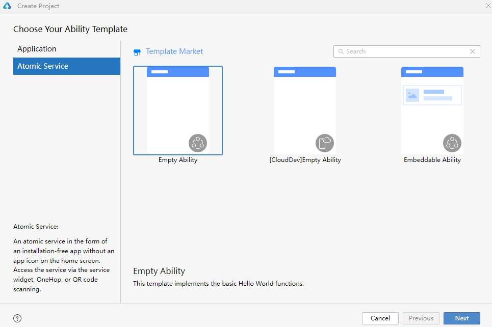
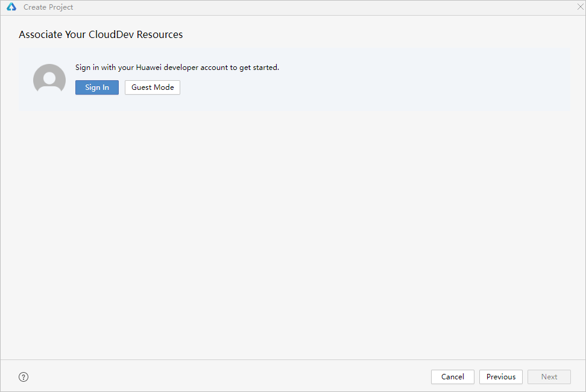
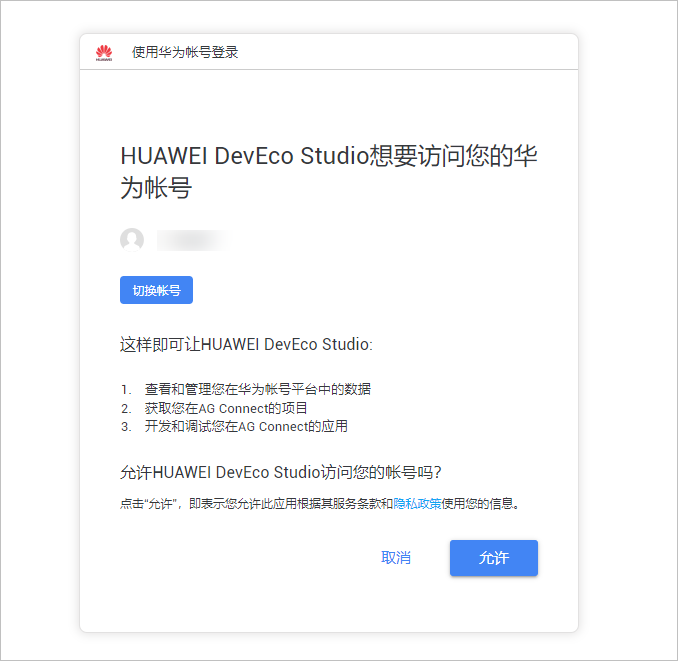
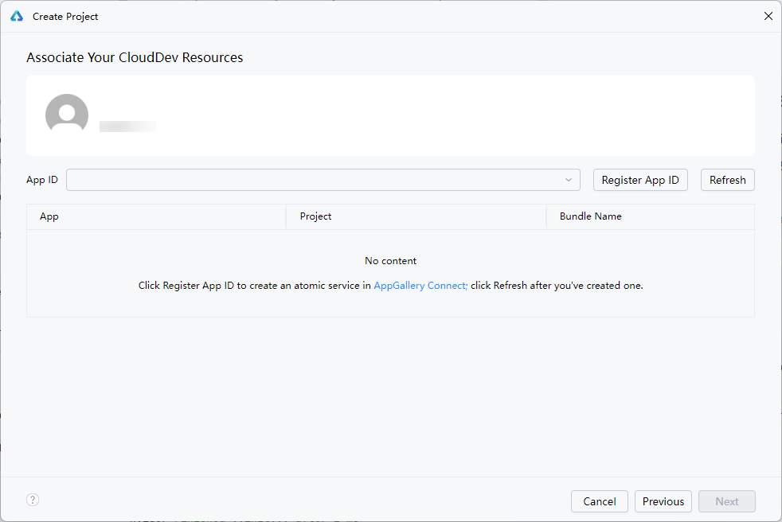
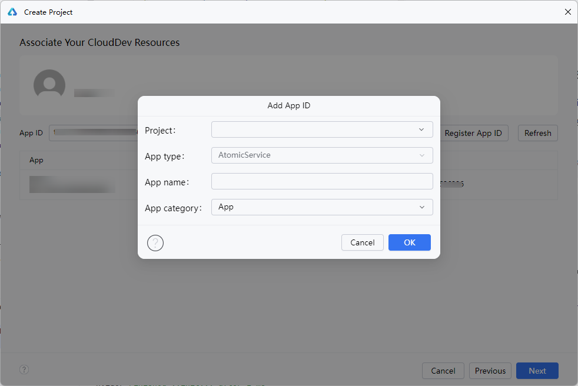
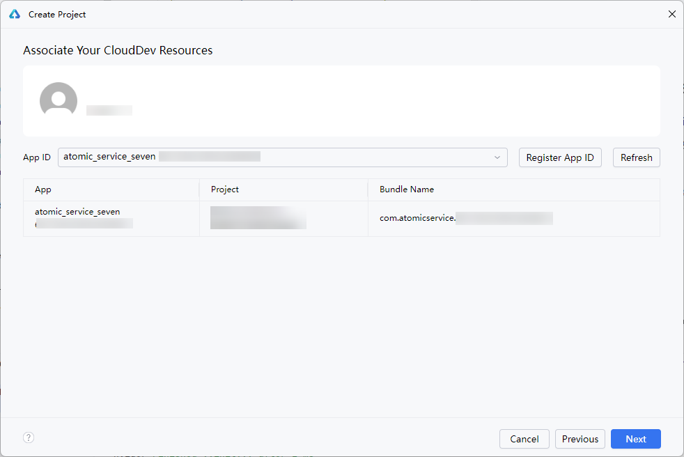
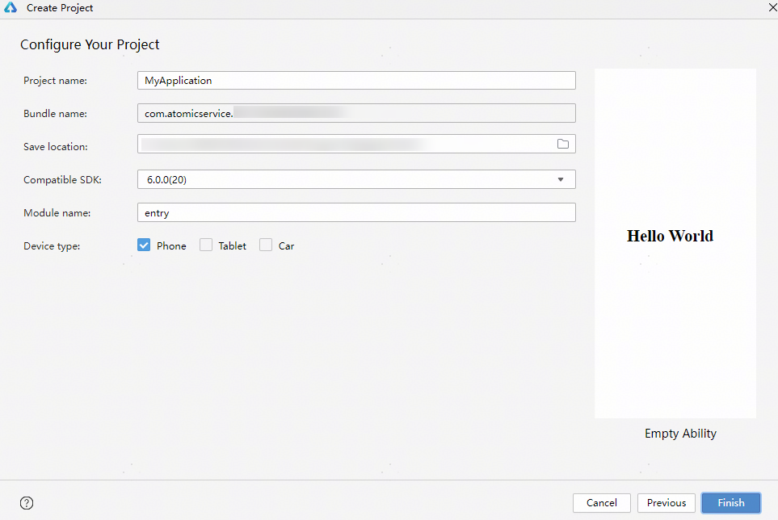
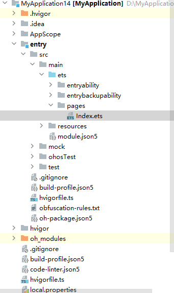

1. 若首次打开**DevEco Studio**，请选择**Create Project**开始创建一个新工程。如果已经打开了一个工程，请在菜单栏选择**File** &gt; **New** &gt; **Create Project**来创建一个新工程。选择**Atomic Service**元服务开发，选择模板，单击**Next**进行下一步配置。

   当前元服务支持的模板类型：

   * Empty Ability：用于Phone、Tablet、Car设备的模板，展示基础的Hello World功能。
   * [CloudDev]Empty Ability：端云一体化开发通用模板。更多信息请参见[端云一体化开发](https://developer.huawei.com/consumer/cn/doc/harmonyos-guides/agc-harmonyos-create-faproject)。
   * Embeddable Ability：用于开发支持被其他应用嵌入式运行的元服务的工程模板。

   

   

   元服务不支持native开发方式，无法选择native工程模板开发元服务。
2. 点击Sign In登录华为开发者账号进行开发，或选择访客模式体验。访客模式无需登录华为账号。

   

   访客模式仅用于体验元服务开发功能。如需将访客模式下开发的元服务工程或历史元服务工程在真机上运行并安装，需在**AppScope &gt; app.json5**文件中补充当前开发者账号下已在AppGallery注册且真实存在的包名。

   
3. 在弹出的网页界面中点击**允许**，完成访问账号授权。

   
4. 选择已登录账号下的APP ID。如您未在AppGallery中注册元服务应用，点击**Register APP ID**注册新的APP ID。

   

   仅元服务应用的APP ID将在当前界面展示。

   
5. 点击**Register APP ID**，在弹窗中填写元服务的基本信息后点击**OK**。
   * **Project**：项目名称。可以输入一个新项目名称，或在下拉框中选择已有项目。
   * **App type**：应用类型为AtomicService元服务。此处不支持修改。
   * **App name**：元服务在华为应用市场详情页展示的名称。关于元服务名称要求请参考[为元服务创建APP ID](https://developer.huawei.com/consumer/cn/doc/app/agc-help-create-atomic-service-0000002247795706#section16423184171915)。
   * **App category**：应用分类。

   
6. 完成注册后，回到DevEco Studio界面，将自动选择新生成的APP ID，点击**Next**。

   

   

   元服务的Bundle name采用固定前缀和appid组合方式（com.atomicservice.[appid]）命名，**Bundle name**为自动生成，开发者无法手动修改。不符合命名规范的包名无法在APP ID下拉列表中展示。
7. 进入配置工程界面，填写**Project name**，其他参数保持默认设置即可。从DevEco Studio 6.0.0 Beta5版本开始支持Car设备。

   
8. 单击**Finish**，工具会自动生成示例代码和相关资源，等待工程创建完成。

   元服务工程目录结构如下。

   

* **AppScope &gt; app.json5**：元服务的全局配置信息。
* **entry**：HarmonyOS工程模块，编译构建生成一个HAP。
  + **src &gt; main &gt; ets**：用于存放ArkTS源码。
  + **src &gt; main &gt; ets &gt; entryability**：元服务的入口。
  + **src &gt; main &gt; ets &gt; pages**：元服务包含的页面。
  + **src &gt; main &gt; resources**：用于存放元服务所用到的资源文件，如图形、多媒体、字符串、布局文件等。关于资源文件，详见[资源分类与访问](https://developer.huawei.com/consumer/cn/doc/harmonyos-guides/resource-categories-and-access)。
  + **src &gt; main &gt; module.json5**：模块配置文件。主要包含HAP的配置信息、元服务在具体设备上的配置信息以及元服务的全局配置信息。具体的配置文件说明，详见[module.json5](https://developer.huawei.com/consumer/cn/doc/harmonyos-guides/module-configuration-file)。
  + **build-profile.json5**：当前的模块信息 、编译信息配置项，包括buildOption、targets配置等。
  + **hvigorfile.ts**：模块级编译构建任务脚本，开发者可以自定义相关任务和代码实现。
* **oh\_modules**：用于存放三方库依赖包信息。
* **build-profile.json5**：元服务级配置信息，包括签名signingConfigs、产品配置products等。
* **hvigorfile.ts**：元服务级编译构建任务脚本。
