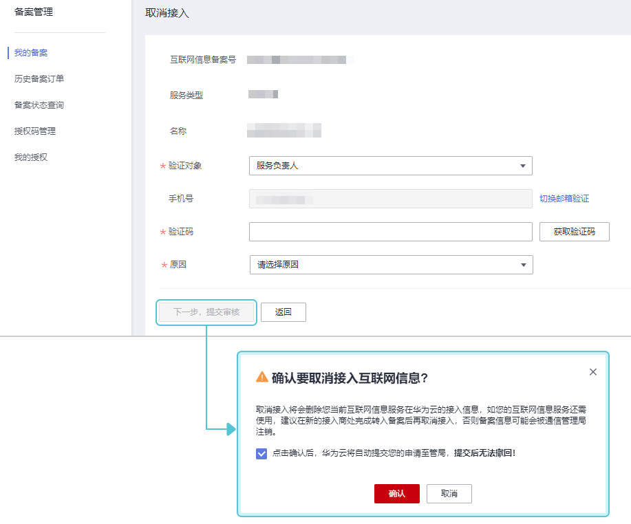
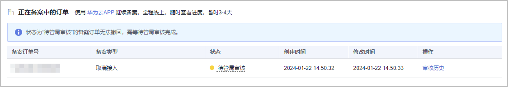

取消接入将在工信部删除元服务在华为接入商的核准（备案）信息，若元服务还需使用，建议在新的接入商完成核准（备案）后再取消接入，否则元服务可能会被通管局清理。操作步骤如下：

1. 登录[华为云核准（备案）系统](https://beian.huaweicloud.com/?utm_source=HUAWEI%2BDeveloper&utm_adplace=AdPlace099034)，左侧菜单栏点击“我的核准（备案）”，右侧页面选择“更多 &gt; 取消接入”。

   
2. 在“取消接入”页面验证负责人的手机/邮箱，选择注销原因后点击“下一步，提交审核”，在弹出的“确认要取消接入互联网信息”窗口点击“确认”。

   
3. 提交申请后，华为平台将自动审核您的申请。您需耐心等待通管局的审核。

   
