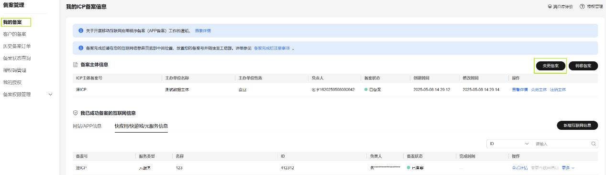
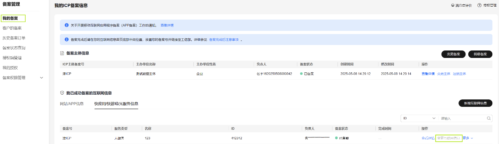

在华为云核准（备案）系统中可以同时修改主体信息和元服务信息。操作步骤如下：

1. 登录[华为云核准（备案）系统](https://beian.huaweicloud.com/?utm_source=HUAWEI%2BDeveloper&utm_adplace=AdPlace099034)，左侧菜单栏点击“我的核准（备案）”，右侧页面点击“变更核准（备案）”。

   
2. 在“主体信息”页面修改主办单位信息、负责人信息，完成后点击“下一步，填写互联网信息”。
3. 在“互联网信息”页面勾选并修改元服务信息，完成后点击“下一步，上传资料” ；请确保“服务内容”所选内容与联盟上类目/标签信息一致（路径：[我的元服务](https://developer.huawei.com/consumer/cn/service/josp/agc/index.html#/myApp)-进入相应元服务-应用信息-应用分类）。
4. 在“上传资料”页面根据提示补充附件材料，完成后点击“下一步，真实性核验”。
5. 在“真实性核验”页面由互联网信息负责人进行人脸视频认证，完成后提交初审；其中“免下载App核验”方式可通过浏览器等扫码工具扫描核验二维码进行验证。
6. 华为工作人员将在3~5个工作日内进行审核，将以短信或邮件形式通知审核结果，请耐心等待，且保持手机畅通。若需要修改核准（备案）信息，将以邮件形式通知。
7. 华为平台人工初审通过后，请前往工信部网站核验短信验证码，详情请参见[工信部核验核准（备案）短信](/docs/dev/atomic-dev/atomic-service-filing/atomic-service-filing-sms)。

## 变更主体

在华为云核准（备案）系统中修改主体信息。操作步骤如下：

1. 登录[华为云核准（备案）系统](https://beian.huaweicloud.com/?utm_source=HUAWEI%2BDeveloper&utm_adplace=AdPlace099034)，左侧菜单栏选择“我的核准（备案）”，右侧页面点击“变更主体”。

   
2. 在“主体信息”页面修改主办单位、主办单位负责人的信息，完成后点击“下一步，上传资料” ；请确保“服务内容”所选内容与联盟上类目/标签信息一致（路径：[我的元服务](https://developer.huawei.com/consumer/cn/service/josp/agc/index.html#/myApp)-进入相应元服务-应用信息-应用分类）。
3. 在“上传资料”页面重新提交附件材料，完成后提交初审；其中“免下载App核验”方式可通过浏览器等扫码工具扫描核验二维码进行验证。
4. 华为工作人员将在3~5个工作日内进行审核，将以短信或邮件形式通知审核结果，请耐心等待，且保持手机畅通。若需要修改核准（备案）信息，将以邮件形式通知。
5. 华为平台人工初审通过后，请前往工信部网站核验短信验证码，详情请参见[工信部核验核准（备案）短信](/docs/dev/atomic-dev/atomic-service-filing/atomic-service-filing-sms)。

## 变更互联网信息

在华为云核准（备案）系统中修改元服务信息。操作步骤如下：

1. 登录[华为云核准（备案）系统](https://beian.huaweicloud.com/?utm_source=HUAWEI%2BDeveloper&utm_adplace=AdPlace099034)，左侧菜单栏选择“我的核准（备案）”，右侧页面选择“元服务信息”，点击“变更互联网信息”。

   
2. 在“互联网信息”页面修改元服务、元服务负责人的信息，完成后点击“下一步，上传资料” ；请确保“服务内容”所选内容与联盟上类目/标签信息一致（路径：[我的元服务](https://developer.huawei.com/consumer/cn/service/josp/agc/index.html#/myApp)-进入相应元服务-应用信息-应用分类）。
3. 在“上传资料”页面根据提示重新提交附件材料，完成后点击“下一步，真实性验证”。
4. 在“真实性核验”页面由元服务负责人进行人脸视频认证，完成后提交初审；其中“免下载App核验”方式可通过浏览器等扫码工具扫描核验二维码进行验证。
5. 华为工作人员将在3~5个工作日内进行审核，将以短信或邮件形式通知审核结果，请耐心等待，且保持手机畅通。若需要修改核准（备案）信息，将以邮件形式通知。
6. 华为平台人工初审通过后，请前往工信部网站核验短信验证码，详情请参见[工信部核验核准（备案）短信](/docs/dev/atomic-dev/atomic-service-filing/atomic-service-filing-sms)。
