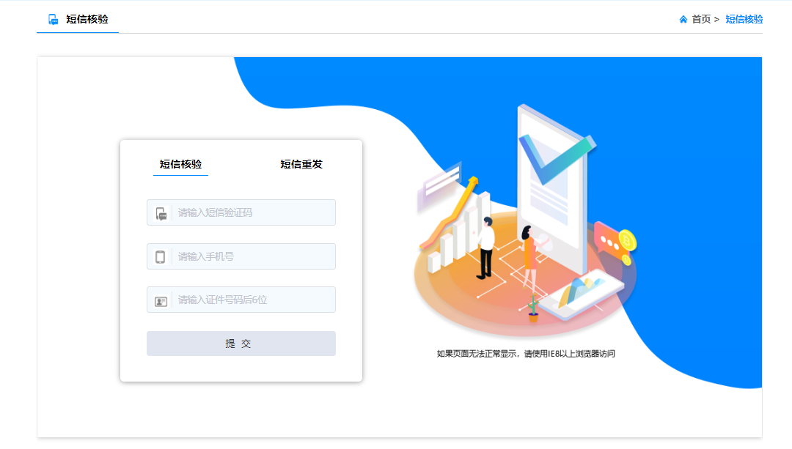
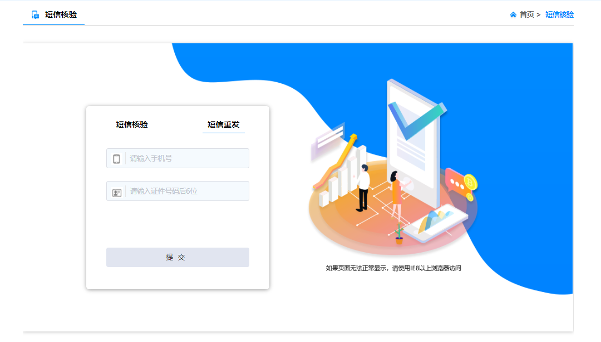

核准（备案）材料经华为初审通过后，华为工作人员将核准（备案）申请转交至管局处做最终的管局审核。转交后，主体负责人将先后收到华为的通知短信和工信部的短信验证码，**通知短信**是告知核准（备案）信息已提交至管局，**短信验证码**需要核准（备案）负责人前往工信部网站完成短信核验，只有完成短信核验，核准（备案）申请才能正式进入通管局进行终审。请核准（备案）负责人在24小时内前往工信部网站完成短信核验。

## 短信核验

### 短信核验规则

不同的核准（备案）需要核验不同负责人的验证码。

| **备案类型** | **短信核验对象** | **备注** |
| --- | --- | --- |
| 首次核准（备案） | * 同时核验主体负责人和元服务负责人的手机号。 | 若主体负责人与元服务负责人为同一人，仅发送一个短信验证码。 |
| 新增互联网信息 | - | 主体已完成核准（备案），且在新增元服务时未变更主体信息。 |
| 变更核准（备案） | * 元服务负责人。 * 仅变更主体信息时，核验主体负责人手机号。 * 仅变更互联网信息时，核验元服务负责人手机号。 * 同时变更主体和互联网信息时，核验主体负责人和元服务负责人的手机号。 | 若接入元服务时变更主体信息， 还需验证主体负责人手机号。  若变更核准（备案）时变更了手机号，需同时向核准（备案）系统提交新的手机号码信息，通管局审核通过后再进行短信核验工作。 |
| 注销核准（备案） | * 注销主体时，核验主体负责人手机号。 * 注销互联网信息时，核验元服务负责人手机号。 | - |

### 短信核验步骤

1. 打开[工信部核准（备案）管理系统](https://beian.miit.gov.cn/#/Integrated/ComplaintA)，在“短信核验”页签下如实填写**短信验证码**、**手机号**、**证件号码后6位**后，点击“提交” 。

   

   * 若**主体负责人**和**元服务****负责人**不是同一人，需核验2次。
   * 一次核验过程中若连续5次输入错误验证码，系统将自动退回您的核准（备案）申请。退回后您需前往华为云核准（备案）系统重新提交核准（备案）申请。

   
2. 短信核验通过后，核准（备案）申请将流转至通管局进行终审，审核时间为2~20个工作日，请耐心等待通管局的审核结果，最终的审核结果会发送至您的手机或邮箱。

## 短信重发

若负责人未收到短信验证码，您可以在“短信重发”页签下如实填写**手机号**、**证件号码后6位**后，点击“提交”。负责人收到短信验证码后，请及时进行[短信核验](#section4239128163111)。

短信重发的次数限制为**2**次，请谨慎操作，尽量减少误操作。

