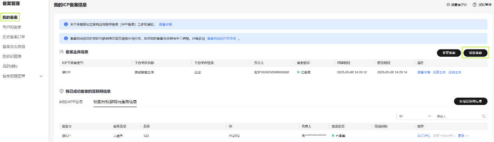
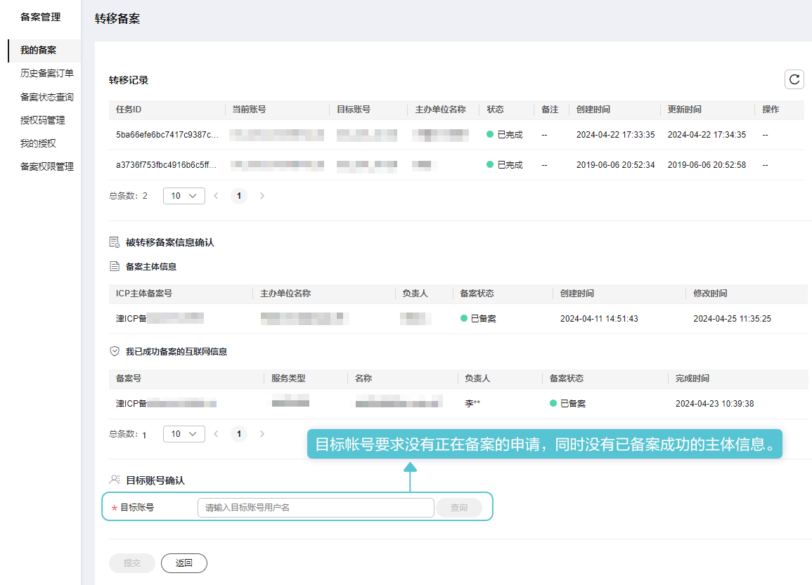

在华为云核准（备案系）统中将主体及主体下的互联网信息全部转移到目标账号下。操作步骤如下：

1. 登录[华为云核准（备案）系统](https://beian.huaweicloud.com/?utm_source=HUAWEI%2BDeveloper&utm_adplace=AdPlace099034)，左侧菜单栏点击“我的核准（备案）”，右侧页面点击“转移核准（备案）”。

   
2. 在“转移核准（备案）”填写目标账号后，点击“提交”。

   

提交转移申请后需要几分钟才能转移成功，请耐心等待。
