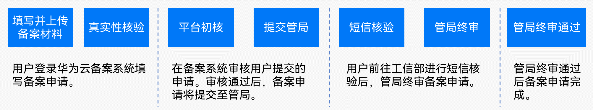

本指导文档是基于华为云核准（备案）平台上特为元服务提供的核准（备案）通道编制而成，请基于此指导前往[华为云核准（备案）平台](https://beian.huaweicloud.com/?utm_source=HUAWEI%2BDeveloper&utm_adplace=AdPlace099034)开展元服务核准（备案）。

## 核准（备案）流程

元服务核准（备案）的整体流程如下：

您需要做的元服务核准（备案）步骤如下：

| **序号** | **步骤** | **说明** |
| --- | --- | --- |
| 1 | [核准（备案）准备](https://developer.huawei.com/consumer/cn/doc/atomic-guides/atomic-service-filing-preparation) | 正式提交元服务核准（备案）前，您需要先完成核准（备案）准备工作。 |
| 2 | 提交核准（备案）申请 | 支持在华为云核准（备案）系统提交核准（备案）申请，具体操作流程请参考[在华为云核准（备案）系统备案](https://developer.huawei.com/consumer/cn/doc/atomic-guides/atomic-service-cloud)。 |
| 3 | [工信部核验核准（备案）短信](https://developer.huawei.com/consumer/cn/doc/atomic-guides/atomic-service-filing-sms) | 除了转移核准（备案）、取消接入，其它核准（备案）类型请前往工信部网站进行短信核验。 |

## 相关概念

| **常用名称** | **说明** |
| --- | --- |
| 核准（备案） | 核准（备案）是中国大陆的一项法规，提供互联网信息服务的元服务需要依法履行核准（备案）手续。 |
| 通管局 | 通信管理局。按照核准（备案）法律法规，互联网信息服务提供者需要向属地通信管理局履行核准（备案）手续。 |
| 接入商 | 接入商是提供互联网信息服务、协助办理元服务核准（备案）的公司或组织。 |
| 主体名称 | 核准（备案）的单位名称/个人姓名。核准（备案）主体与元服务内容必须对应一致，即个人的元服务，核准（备案）主体是个人，若超出个人范围的元服务内容，核准（备案）主体应为企业/团体组织/单位等。 |
| 主体负责人 | 核准（备案）系统中主体信息中的负责人。企业/团体组织/单位核准（备案）要求主体负责人必须是法定代表人，个人核准（备案）必须为核准（备案）主体本人。 |
| 主体核准（备案）号 | 元服务首次核准（备案）成功后，工信部会为主体下发一个核准（备案）号，格式为“省简称+ICP核（备）\*\*\*\*\*\*\*\*号”，例如粤ICP核（备）00000000号。 |
| 核准（备案）号 | 核准（备案）号用以区分主体下不同的元服务，格式是主体核准（备案）号后带序号。例如粤ICP核（备）00000000号-1K。 |

* **[核准（备案）准备](https://developer.huawei.com/consumer/cn/doc/atomic-guides/atomic-service-filing-preparation)**
* **[在华为云核准（备案）系统备案](https://developer.huawei.com/consumer/cn/doc/atomic-guides/atomic-service-cloud)**
* **[工信部核验核准（备案）短信](https://developer.huawei.com/consumer/cn/doc/atomic-guides/atomic-service-filing-sms)**
