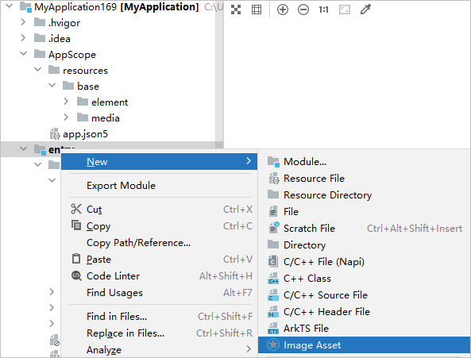
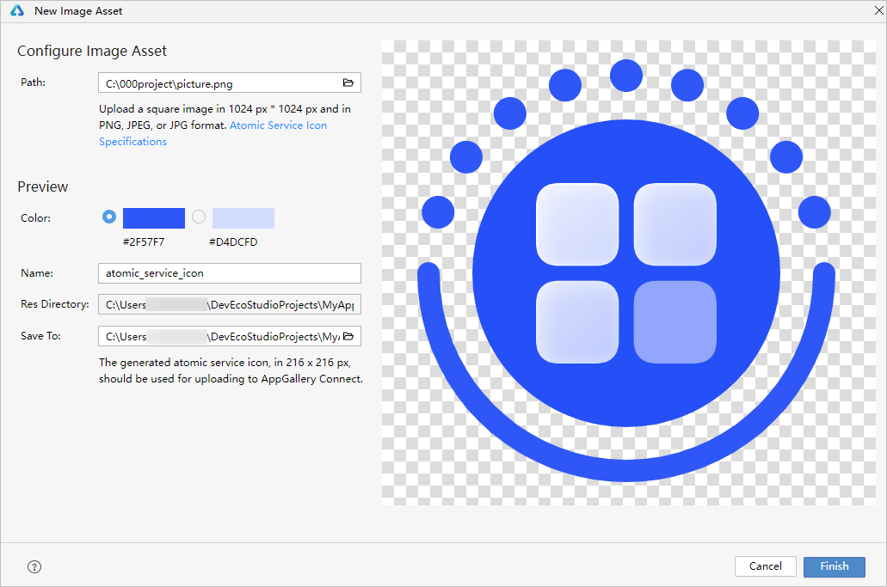

DevEco Studio支持Image Asset功能，帮助开发者生成统一的元服务图标样式。

DevEco Studio 5.0.3.800及以上版本支持使用元服务图标生成能力。

1. 在工程中选中模块或文件，右键单击**New &gt; Image Asset**，进入图标配置页面。

   
2. 在Path中选择本地图片路径。图片尺寸及要求如下：

   

   * 图标格式：.png、.jpeg、.jpg格式的静态图片资源；
   * 图标尺寸：1024 x 1024 px （正方形）；
   * 图标背景：不透明；
   * 质量要求：图标内容需清晰可辨，避免存在模糊、锯齿、拉伸等问题。详见[元服务图标设计规范](https://developer.huawei.com/consumer/cn/doc/design-guides/ux-guidelines-overview-0000001900384976)。
3. 在预览界面可以配置图标颜色、名称、保存路径等。
   * **Color**：推荐使用的图标颜色。选择不同颜色，右边图标预览区域可查看相应的效果。
   * **Name**：生成的图标名称。
   * **Res Directory**：生成的512px\*512px尺寸图标在工程中的保存位置。
   * **Save to**：生成的216px\*216px尺寸图标需要指定本地文件夹的保存位置。后续在AppGallery Connect上架元服务时，需使用该图标。

   
4. 点击Finish，保存配置并在相应模块目录**src &gt; main &gt; resources &gt; base &gt; media**路径下生成元服务图标。可在模块级module.json5中的icon字段中配置元服务图标。
