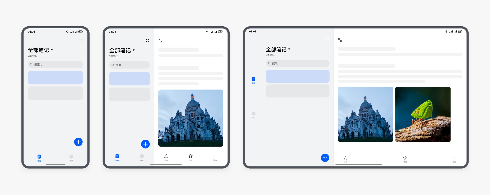
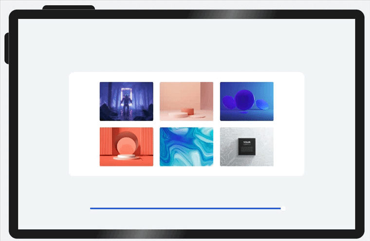
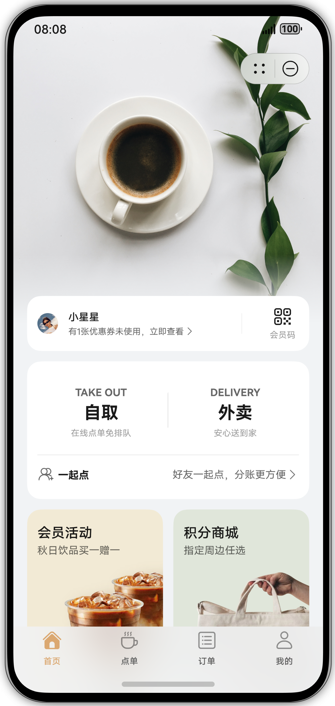
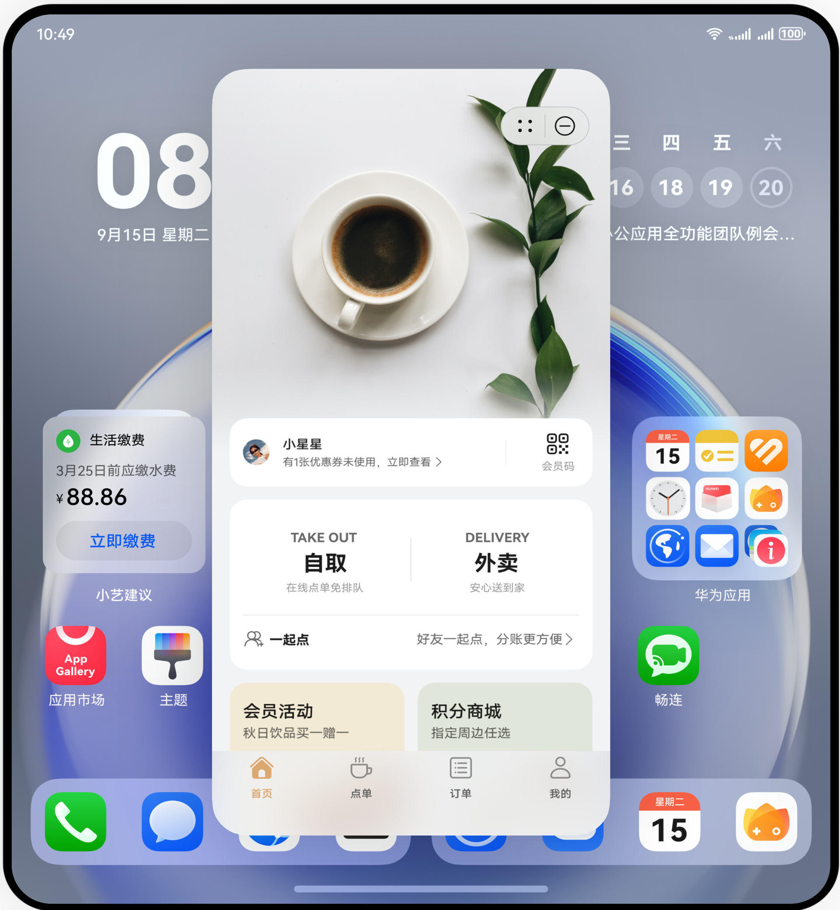
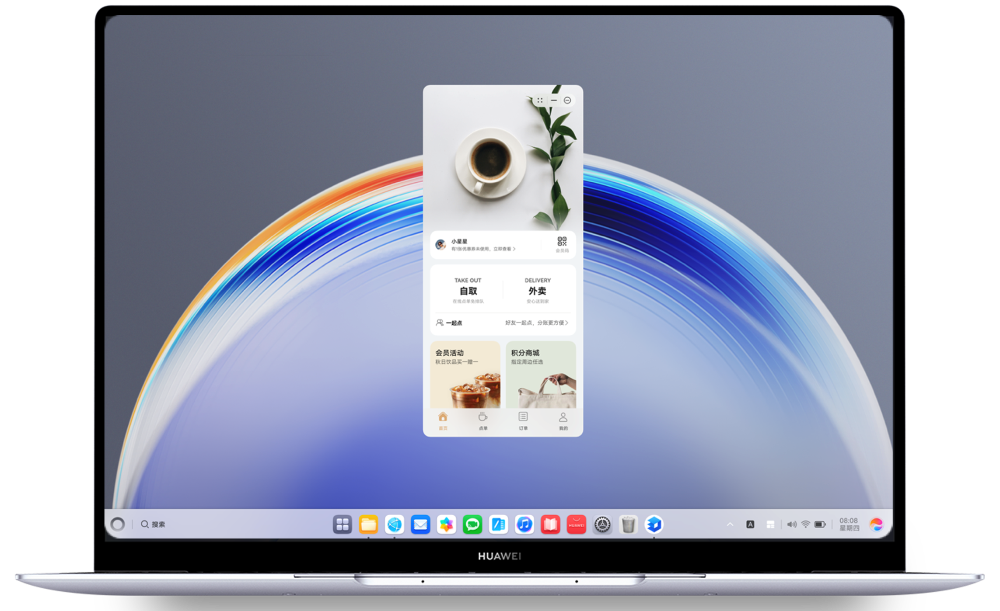
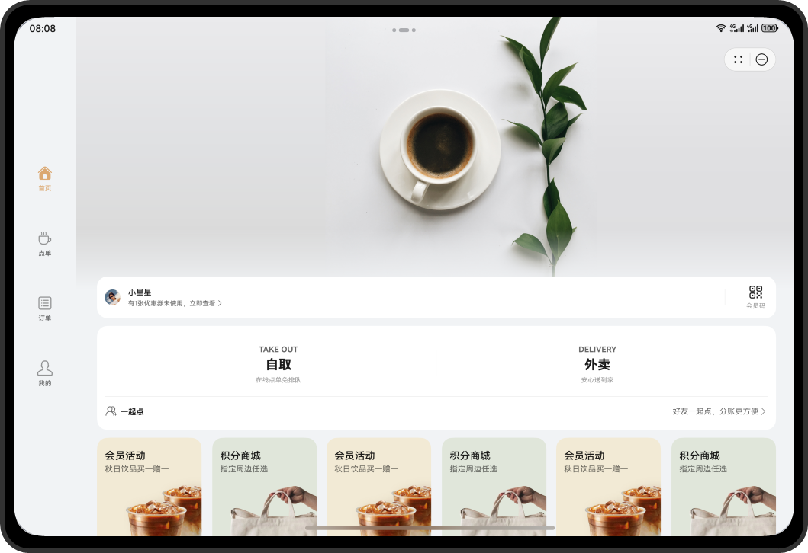
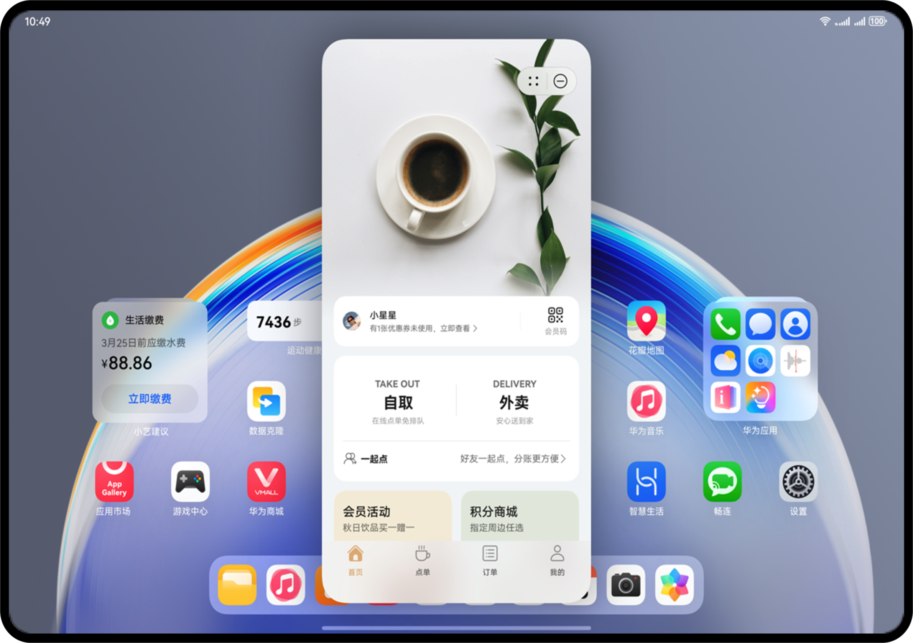
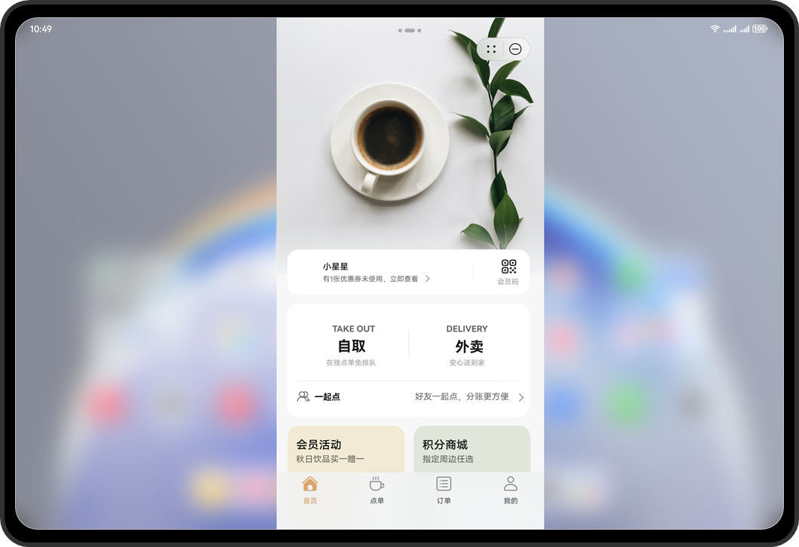

为保证用户在大尺寸屏幕设备（如折叠屏、平板、PC）使用元服务也有流畅友好的体验，本指南将提供大屏设备适配的相关建议，开发者可主动适配，也可采用默认方案适配，实现一次开发，覆盖多端设备。

## 大屏设备主动适配

### 为什么做主动适配

由于用户可在大屏设备上使用元服务，且有可能在不同尺寸视图下进行切换。为了保证元服务在不同尺寸屏幕下的体验流畅友好，建议开发者根据用户使用设备和场景，自行对元服务进行主动适配。

屏幕变大后，大屏可显示更多内容，提高显示和操作的效率，用户体验在某些方面有增值。

### 如何适配布局

建议在产品设计的早期阶段就纳入多设备适配的考量，通过统一规划实现跨终端的功能布局与用户体验一致性。推荐采用响应式布局和自适应布局实现页面动态布局，如下图以手机设备为参照，体现在大屏设备适配后的布局效果。详细内容参考[多设备界面开发](https://developer.huawei.com/consumer/cn/doc/best-practices/bpta-multi-device-page)和[大屏应用UX体验标准](https://developer.huawei.com/consumer/cn/doc/design-guides/ux-guidelines-large-screen-0000001807707561)中的关于布局的开发设计指南。

**图1 响应式布局示意图**

**图2 自适应布局示意图**

## 未适配元服务在大屏设备上的默认体验

### 不同设备默认体验效果

未进行适配的元服务，将采用如下默认体验效果在不同设备上展示运行元服务。简化开发者适配成本，保障多设备适配体验。如下图以手机为参照，体现不同大屏设备的默认体验效果。

| **直板机** | **大折叠-展开态** | **平板** | **PC** |
| --- | --- | --- | --- |
|  |  |  |  |

### 设置默认体验的操作指导

从API 20及以上版本支持，由开发者自主控制，通过3个字段管理元服务在不同设备的展示效果。

1. 设备类型**deviceType**：软件包声明平板、PC/2in1等设备类型，元服务才能在对应设备上发布上架。
2. 窗口大小自适应能力**resizable：**

   * 当值为true时，表示适配了[如何适配布局](#如何适配布局)章节的动态布局，支持在宽屏设备上全屏展示效果，如下图全屏动态布局；
   * 当值为false时，表示未适配宽屏设备，将以竖版默认兜底效果展示运行元服务，如下图悬浮窗和全屏兼容模式效果。
3. 支持悬浮窗**supportwindowmode**：

   * 当适配了悬浮窗，则以悬浮窗效果展示元服务；更推荐这种效果，体验出元服务的轻量极简体验；
   * 未适配悬浮窗时，则以全屏兼容模式展示元服务。

   | 全屏动态布局 | 悬浮窗 | 全屏兼容模式 |
   | --- | --- | --- |
   |  |  |  |
