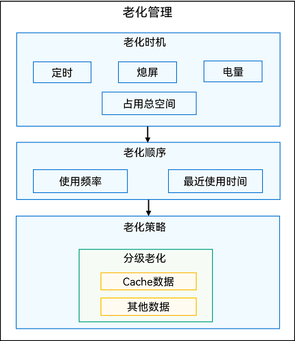

元服务的程序包结构与传统[应用程序包](/docs/dev/app-dev/getting-started/dev-fundamentals/application-package-structure-stage)相同，也是以App Pack（.app）形式发布到应用市场。

但元服务相对于需要安装的应用形态更加轻量、便捷，其程序包也具备一些独有特征，如免安装、分包、预加载、老化。

## 免安装

免安装是指无需用户通过应用市场显式安装，用户点击元服务后，由系统程序框架后台安装后即可使用。

元服务中所有包HAP（Harmony Ability Package）、HSP（Harmony Shared Package）均需支持免安装**。**

## 分包

HarmonyOS每个应用程序包（.app）可以包含多个包文件（以.hap为后缀的HAP或以.hsp为后缀的HSP）。元服务在此基础上，进一步限制每个HAP或HSP（含其依赖的所有共享包）的大小，以实现快速启动体验，元服务的这种多包开发方案称为“分包”。具体可参考[分包](/docs/dev/atomic-dev/atomic-subpackage-loading/atomic-subcontract)。

## 预加载

开发者可以通过配置预加载，由系统自动下载和安装可能需要的分包模块，从而提升进入后续模块的速度。

对于配置了预加载的分包模块，当点击进入该模块并完成页面加载后，将触发关联模块的预加载。具体可参考[预加载](/docs/dev/atomic-dev/atomic-subpackage-loading/atomic-preparing-for-loading)。

## 老化

系统会按照一定策略清理不活跃的元服务，释放空间，这个过程称为老化。具体老化机制如下。

* 老化时机：由系统定时器触发老化，当系统中所有元服务占用总空间大于既定阈值时，将启动老化，同时要求设备处于熄屏状态，且剩余电量不低于10%。
* 老化顺序：优先老化长时间未使用及使用频率较低且未添加桌面卡片的元服务。
* 分级老化：根据数据重要性排序，分级老化。当系统满足老化时机的要求时，按照老化顺序优先清理元服务的Cache目录数据，再按照老化顺序清理元服务的其他目录数据，直到系统中所有元服务占用总空间小于既定阈值的80%。因此，开发者应合理规划数据存放目录，仅将非重要数据（例如网络缓存图片等）存放到Cache目录，避免重要数据被频繁老化清理。

**图1** 元服务老化示意图

## 元服务程序包更新机制

开发者发布新版本的元服务之后，系统将提供多个时机检查是否有新版本要更新，不同时机触发的升级机制不同，请参考[元服务更新](/docs/dev/atomic-dev/atomic-service-framework-development/atomic-service-update)。
