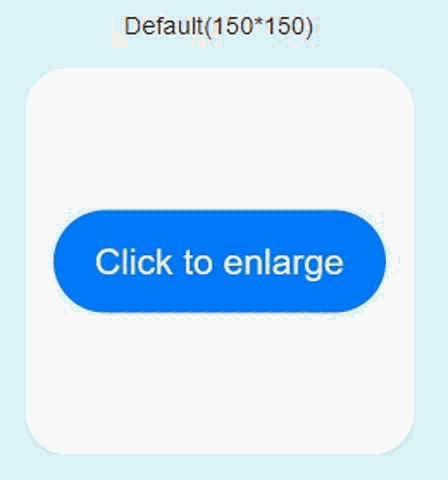

本文档适用于HarmonyOS元服务开发的初学者。

为了帮助您快速了解元服务工程目录的构成，并熟悉元服务开发流程，我们将构建一个简单的元服务：

* 带有一张2\*2的具备简单动画效果的服务卡片，图标采用工程默认，作为元服务入口。

  如果不创建元服务卡片，可通过负一屏的元服务图标作为元服务入口。图片样式规范请参考[元服务设计基础信息-图标](/docs/design/atomic-service-design/basic-elements/basic-info#section158386422413)。

  卡片效果如下图所示。

  **图1** 元服务卡片按钮点击动画效果
  

  

  API 11 Stage模型及以上，创建元服务工程或在元服务工程中创建模块时，不再默认创建服务卡片和EntryCard。

  当前示例将单独新建一个元服务卡片。
* 元服务首页具有页面跳转/返回功能，如下图所示。

  **图2** 元服务的页面跳转效果
  

## 工具准备

安装最新版[DevEco Studio](https://developer.huawei.com/consumer/cn/download/)。

本文以DevEco Studio 5.0.3.403 Windows版本为例。

完成上述操作后，可参照以下任一章节进行下一步体验和学习。
