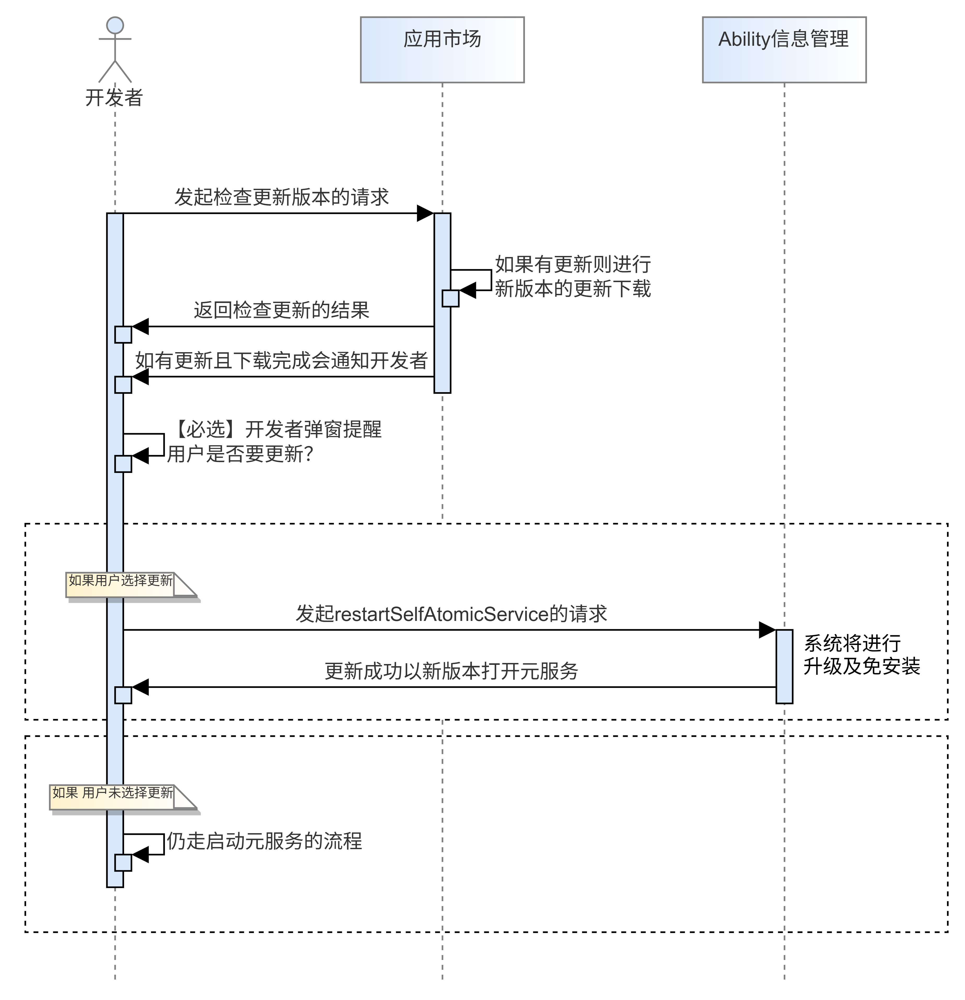
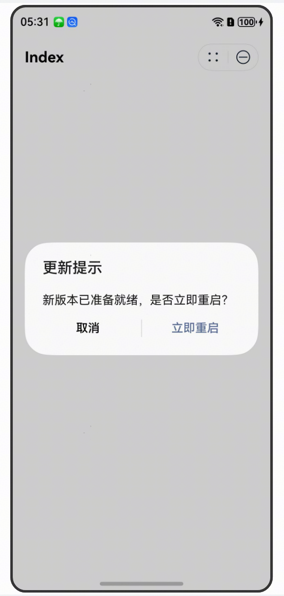

在上传发布新版本的元服务后，系统将会在不同时机采用不同的方式去检查用户安装的元服务是否有可用的最新版本，并尝试下载更新最新的元服务包。


因元服务更新机制限制，用户设备上运行的未必一定是最新版本的元服务，可使用[阻断式更新](#section1727611651818)的方式引导用户将元服务更新为最新版本。

## 静默更新

应用市场提供自动更新元服务功能。打开“应用市场 &gt; 选择下方“我的”选项页 &gt; 打开“设置”&gt; 应用网络设置”，以开启自动更新服务。可以引导用户在应用市场中开启自动更新功能。设置后，每当有新版本可用时，应用市场将会闲时在后台自动下载并更新新版本的元服务，无需用户手动操作。

## 异步更新

如果用户长时间未更新元服务，当用户打开此元服务时，在启动时，系统会异步检查是否存在更新版本。如果有，将会异步下载元服务包体，待用户再次打开此元服务时更新使用。


该方式无法保证用户设备上的元服务时刻为最新的元服务，可能存在用户当前设备上使用旧版本元服务包体，需等待下次冷启动才可正常更新使用更新的元服务。

## 阻断式更新

如果希望在用户使用元服务过程中立刻进行版本更新，可以使用阻断式更新的方式进行更新。使用[监听元服务更新检查接口](https://developer.huawei.com/consumer/cn/doc/harmonyos-references/store-updatemanager#section10594172619239)，检查到有更新后，通过调用[重启元服务接口](https://developer.huawei.com/consumer/cn/doc/harmonyos-references/js-apis-app-ability-abilitymanager#abilitymanagerrestartselfatomicservice20)的方式触发更新。


从HarmonyOS 6.0.0(20)开始，阻断式更新的接口支持在元服务中使用。



1. 开发者通过[updateManager.on('updateChange')](https://developer.huawei.com/consumer/cn/doc/harmonyos-references/store-updatemanager#section10594172619239)接口检查元服务是否有可用更新。
2. 如果元服务有可用更新，应用市场将会回调通知给开发者，并尝试下载最新的元服务包体。
3. 开发者收到有可用更新后，需要实现弹窗明确提醒用户是否要进行升级。
4. 如果用户在弹窗中选择升级，开发者可以调用[abilityManager.restartSelfAtomicService](https://developer.huawei.com/consumer/cn/doc/harmonyos-references/js-apis-app-ability-abilitymanager#abilitymanagerrestartselfatomicservice20)方法重启元服务。系统将对元服务进行免安装更新，并在更新成功后以新版本打开元服务。

   如果用户在弹窗中选择不升级，则该次启动元服务仍然以旧版本元服务包体启动。


* 在调用检查更新接口后，确认有可用更新的版本时，需要开发者自行进行弹窗，提示用户选择是否进行更新。如未实现弹窗，将影响元服务正常运行状态。
* 弹窗内容标题需要为“更新提示”。
* 只有用户在更新弹窗中选择确认更新，才可以进行更新操作。



```
import { updateManager } from '@kit.AppGalleryKit';
import { abilityManager, common } from '@kit.AbilityKit';
import { hilog } from '@kit.PerformanceAnalysisKit';

@Entry
@Component
struct Index {
  @State message: string = 'CheckUpdate'

  build() {
    Row() {
      Column() {
        Text(this.message)
          .fontSize(50)
          .fontWeight(FontWeight.Bold)
          .onClick(() => this.callOn)
      }
      .width('100%')
    }
    .height('100%')
  }

  private callOn() {
    let callback = (state: updateManager.UpdateSessionState) => {
      if (state.code === updateManager.RequestErrorCode.NO_UPGRADE) {
        hilog.info (0, 'TAG', `on success, no need update`);
        updateManager.off('updateChange');
      } else if (state.code === updateManager.RequestErrorCode.NEED_UPGRADE) {
        hilog.info (0, 'TAG', `on success, need update`);
      } else if (state.code === updateManager.RequestErrorCode.DOWNLOADED) {
        hilog.info (0, 'TAG', `on success, need update and download success`);
        updateManager.off('updateChange');
        abilityManager.restartSelfAtomicService(this.getUIContext().getHostContext() as common.Context);
      }
    };
    try {
      updateManager.on('updateChange', callback, 20);
    } catch (error) {
      hilog.error(0, 'TAG', `on Error.code is ${error.code}, message is ${error.message}`);
    }
  }
}
```


* 使用阻断式更新需要先实现明示用户是否选择更新的弹窗，依据用户选择进行强制更新。
* 监听元服务更新接口同一元服务的调用次数不超过6次/天、每30分钟调用次数不超过1次。
* 请及时调用取消监听元服务更新检查接口，如果超过系统允许的监听时长，这次监听将被取消。
* 两次调用重启元服务接口的调用时间间隔不能低于3秒。
