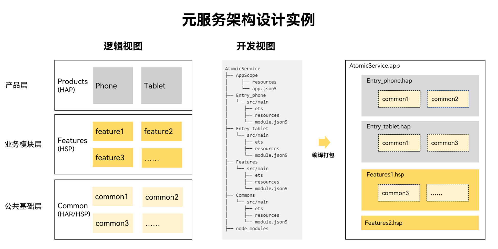
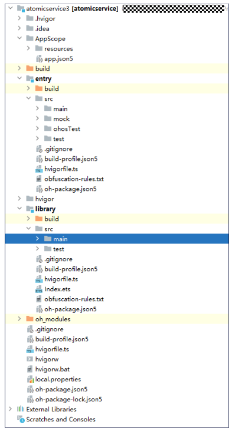

HarmonyOS应用程序包支持多模块开发，生成的应用程序包（.app）可以包含多个HAP或HSP。元服务为了实现快速启动效果，对HAP和HSP文件大小做了限制，同时优化了元服务启动机制。元服务的这种多模块开发方式称为“分包”。

元服务通过分包页面路由跳转时，系统将动态加载分包，加载完成后启动对应页面。若开发者希望优化分包加载速度，可参照[预加载](/docs/dev/atomic-dev/atomic-subpackage-loading/atomic-preparing-for-loading)进行配置。

## 分包的规则和约束

* 首包：将EntryHAP作为首包，包含元服务首次启动时会打开的页面（即首页）代码和资源。
* 分包：将其他包含功能页的模块以及HSP动态共享模块作为分包，包含功能页和元服务页的代码和资源。
* 单个包文件（加上其依赖的所有共享包），大小不能超过2MB，超过限制DevEco Studio会打包失败。
* 同一个元服务下所有包文件（加上其依赖的所有共享包）的大小总和不能超过10MB，超过限制会上架应用市场失败。如因业务需要，可向平台申请总包大小放宽至20M。

这样，启动元服务时，只需下载和安装首包，即可立即启动元服务，大大缩短元服务启动时间。


1. 元服务仅支持单个Ability，分包模块类型需要使用shared （HSP）。元服务不支持feature类型模块。
2. 如业务需要调整总包大小至20MB，请通过邮件方式进行申请，我们会在7个工作日内以邮件形式回复申请结果。请在邮件中提供申请权限名称、元服务名称及Appid信息，并说明申请原因，同时抄送给华为接口人。
3. 申请邮箱：atomicservice@huawei.com

**图1** 元服务架构设计示例图



设计原则：

1. 产品定制层Products：不同设备形态的个性化业务。包含UI、资源和相关配置。各个产品之间不可以直接依赖，向下依赖业务模块层和公共基础层。
2. 业务模块层Features：可以被产品定制层不同设备形态的HAP所依赖，但是不能反向依赖产品层，也可以向下依赖公共基础层。
3. 公共能力层Commons：基础能力集，各个业务模块层包含的公共业务，都可以下沉到公共基础层。只可以被产品层和业务模块层依赖，不可以反向依赖。

## 分包流程

1. 创建Stage模型的元服务：详情请见[元服务工程](/docs/dev/atomic-dev/develop-first-atomic-service/atomic-service-create-project)。
2. 创建HSP模块：详情请见[创建HSP模块](https://developer.huawei.com/consumer/cn/doc/harmonyos-guides/ide-hsp)。

   **图2** 元服务分包的工程目录结构图

   

   * 其中entry模块为元服务的“首包”，type字段为entry，以下是entry模块的module.json5文件：

     ```
     {
       "module": {
         "name": "entry",
         "type": "entry",
         "pages": "$profile:main_pages",
         ...
       }
     }
     ```
   * library模块为共享“分包”，type字段为shared，以下是library模块的module.json5文件：

     ```
     {
       "module": {
         "name": "library",
         "type": "shared",
         ...
       }
     }
     ```
