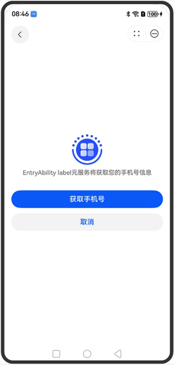
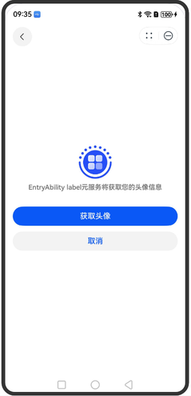
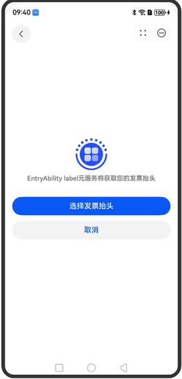
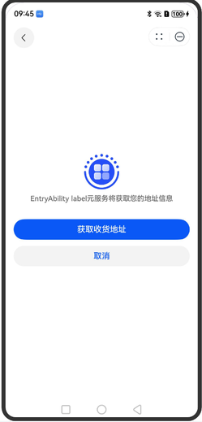
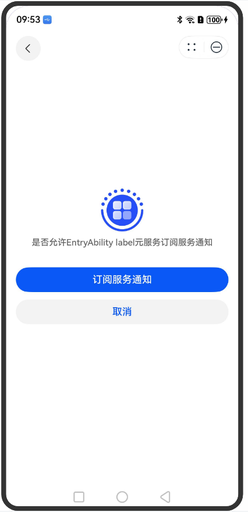

为开发者提供满足定制化诉求的Web高阶组件，屏蔽ArkWeb组件中无需关注的接口，并提供JS扩展能力。


示例效果请以真机运行为准，当前DevEco Studio预览器不支持。

## 约束与限制

使用AtomicServiceEnhancedWeb组件之前需要完成开发准备，具体请参照[开发AtomicServiceEnhancedWeb组件](https://developer.huawei.com/consumer/cn/doc/atomic-guides/develop-atomicserviceenhancedweb)。

## 模拟器支持情况

从1.0.17版本开始，支持模拟器运行。

## 需要权限

访问在线网页时需添加网络权限：ohos.permission.INTERNET，具体申请方式请参考[声明权限](https://developer.huawei.com/consumer/cn/doc/harmonyos-guides/declare-permissions)。

## AtomicServiceEnhancedWeb

```
AtomicServiceEnhancedWeb({
  src: ResourceStr,
  controller: AtomicServiceEnhancedWebControll,
  navPathStack?: NavPathStack,
  mixedMode?: MixedMode,
  darkMode?: WebDarkMode,
  forceDarkAccess?: boolean,
  bgColor?: ResourceColor,
  nestedScroll?: NestedScrollOptions | NestedScrollOptionsExt,
  expandSafeAreaTypes: [SafeAreaType.SYSTEM],
  expandSafeAreaEdges: [SafeAreaEdge.TOP,SafeAreaEdge.BOTTOM],
  onMessage?: Callback<OnMessageEvent>,
  onErrorReceive?: Callback<OnErrorReceiveEvent>,
  onHttpErrorReceive?: Callback<OnHttpErrorReceiveEvent>,
  onPageBegin?: Callback<OnPageBeginEvent>,
  onPageEnd?: Callback<OnPageEndEvent>,
  onControllerAttached?: Callback<void>,
  onLoadIntercept?: Callback<OnLoadInterceptEvent, boolean>,
  onProgressChange?: Callback<OnProgressChangeEvent>,
  onTitleReceive?: Callback<OnTitleReceiveEvent>
})
```

**起始版本：** 1.0.12

**装饰器类型：** @Component

**参数：**

| 名称 | 类型 | 默认值 | 必填 | 装饰器类型 | 说明 |
| --- | --- | --- | --- | --- | --- |
| src | [ResourceStr](https://developer.huawei.com/consumer/cn/doc/harmonyos-references/ts-types#resourcestr) | - | 是 | - | 网页资源地址，访问网络资源需要在AGC配置业务域名，访问本地资源仅支持包内文件（$rawfile）。不支持通过状态变量（例如@State）动态更新地址。加载的网页中支持通过JS SDK提供的接口调用系统能力，具体以JS SDK为准。 |
| controller | [AtomicServiceEnhancedWebController](#atomicserviceenhancedwebcontroller) | - | 是 | @ObjectLink | 通过AtomicServiceEnhancedWebController可以控制AtomicServiceEnhancedWeb组件各种行为。 |
| navPathStack | [NavPathStack](https://developer.huawei.com/consumer/cn/doc/harmonyos-references/ts-basic-components-navigation#navpathstack10) | - | 否 | - | 路由栈信息。当使用NavDestination作为页面的根容器时，需传入NavDestination容器对应的NavPathStack处理页面路由。 |
| mixedMode | [MixedMode](https://developer.huawei.com/consumer/cn/doc/harmonyos-references/arkts-basic-components-web-e#mixedmode) | - | 否 | @Prop | 设置是否允许加载超文本传输协议（HTTP）和超文本传输安全协议（HTTPS）混合内容，默认允许加载HTTP和HTTPS混合内容。 |
| darkMode | [WebDarkMode](https://developer.huawei.com/consumer/cn/doc/harmonyos-references/arkts-basic-components-web-e#webdarkmode9) | - | 否 | @Prop | 设置Web深色模式，默认关闭。 |
| forceDarkAccess | boolean | - | 否 | @Prop | 设置网页是否开启强制深色模式。默认关闭。该属性仅在darkMode开启深色模式时生效。 |
| bgColor | [ResourceColor](https://developer.huawei.com/consumer/cn/doc/harmonyos-references/ts-types#resourcecolor) | - | 否 | @Prop | 设置组件背景色。 |
| nestedScroll15+ | [NestedScrollOptions](https://developer.huawei.com/consumer/cn/doc/harmonyos-references/ts-container-scrollable-common#nestedscrolloptions10对象说明) | [NestedScrollOptionsExt](https://developer.huawei.com/consumer/cn/doc/harmonyos-references/arkts-basic-components-web-i#nestedscrolloptionsext14) | - | 否 | @Prop | 设置嵌套滚动选项。 |
| expandSafeAreaTypes | Array\&lt;[SafeAreaType](https://developer.huawei.com/consumer/cn/doc/harmonyos-references/ts-universal-attributes-expand-safe-area#safeareatype)\&gt; | [] | 否 | @Prop | 配置扩展安全区域的类型。未添加[Metadata](https://developer.huawei.com/consumer/cn/doc/harmonyos-references/js-apis-bundlemanager-metadata)配置项时，页面不避让挖孔，CUTOUT类型不生效。  非法值：按默认值处理。  **起始版本：** 1.0.23 |
| expandSafeAreaEdges | Array\&lt;[SafeAreaEdge](https://developer.huawei.com/consumer/cn/doc/harmonyos-references/ts-universal-attributes-expand-safe-area#safeareaedge)\&gt; | [] | 否 | @Prop | 配置扩展安全区域的边缘。  非法值：按默认值处理。  **起始版本：** 1.0.23 |
| onMessage | Callback\&lt;[OnMessageEvent](#onmessageevent)\&gt; | - | 否 | - | H5页面通过JS SDK的postMessage()发送消息后，Web组件对应的页面返回或销毁时，触发该回调。 |
| onErrorReceive | Callback\&lt;[OnErrorReceiveEvent](#onerrorreceiveevent)\&gt; | - | 否 | - | 网页加载遇到错误时触发该回调。出于性能考虑，建议此回调中尽量执行简单逻辑。在无网络的情况下，触发此回调。 |
| onHttpErrorReceive | Callback\&lt;[OnHttpErrorReceiveEvent](#onhttperrorreceiveevent)\&gt; | - | 否 | - | 网页加载资源遇到的HTTP错误（响应码\&gt;=400)时触发该回调。 |
| onPageBegin | Callback\&lt;[OnPageBeginEvent](#onpagebeginevent)\&gt; | - | 否 | - | 网页开始加载时触发该回调，且只在主frame触发，iframe或者frameset的内容加载时不会触发此回调。 |
| onPageEnd | Callback\&lt;[OnPageEndEvent](#onpageendevent)\&gt; | - | 否 | - | 网页加载完成时触发该回调，且只在主frame触发。 |
| onControllerAttached | Callback\&lt;void\&gt; | - | 否 | - | 当Controller成功绑定到Web组件时触发该回调。 |
| onLoadIntercept | [OnLoadInterceptCallback](#onloadinterceptcallback) | - | 否 | - | 当Web组件加载url之前触发该回调，用于判断是否阻止此次访问。默认允许加载。 |
| onProgressChange | Callback\&lt;[OnProgressChangeEvent](#onprogresschangeevent)\&gt; | - | 否 | - | 网页加载进度变化时触发该回调。 |
| onTitleReceive | Callback\&lt;[OnTitleReceiveEvent](#ontitlereceiveevent)\&gt; | - | 否 | - | 通知应用程序页面document标题已更改，如果加载的页面未设置\&lt;title\&gt;元素 指定的标题，AtomicServiceEnhancedWeb将基于URL生成标题并返回给应用程序。 |


expandSafeAreaTypes、expandSafeAreaEdges这两个参数需要组合使用，单个参数使用无法生效。

## AtomicServiceEnhancedWebController

通过AtomicServiceEnhancedWebController可以控制AtomicServiceEnhancedWeb组件各种行为。一个AtomicServiceEnhancedWebController对象只能控制一个AtomicServiceEnhancedWeb组件，且必须在AtomicServiceEnhancedWeb组件和AtomicServiceEnhancedWebController绑定后，才能调用AtomicServiceEnhancedWebController上的方法。

**起始版本：** 1.0.12

**装饰器类型：** @Observed

### getUserAgent

getUserAgent(): string

获取当前默认用户代理。

**起始版本：** 1.0.12

**返回值：**

| 类型 | 说明 |
| --- | --- |
| string | 默认用户代理。默认User-Agent定义与使用场景请参考[User-Agent开发指导](https://developer.huawei.com/consumer/cn/doc/harmonyos-guides/web-default-useragent)。 |

**错误码：**

以下错误码的详细介绍请参见[错误码](https://developer.huawei.com/consumer/cn/doc/harmonyos-references/errorcode-webview)。

| 错误码ID | 错误信息 |
| --- | --- |
| 17100001 | Init error. The AtomicServiceEnhancedWebController must be associated with a AtomicServiceEnhancedWeb component. |

### getCustomUserAgent

getCustomUserAgent(): string

获取自定义用户代理。

**起始版本：** 1.0.12

**返回值：**

| 类型 | 说明 |
| --- | --- |
| string | 用户自定义代理信息。 |

**错误码：**

以下错误码的详细介绍请参见[错误码](https://developer.huawei.com/consumer/cn/doc/harmonyos-references/errorcode-webview)。

| 错误码ID | 错误信息 |
| --- | --- |
| 17100001 | Init error. The AtomicServiceEnhancedWebController must be associated with a AtomicServiceEnhancedWeb component. |

### setCustomUserAgent

setCustomUserAgent(userAgent: string): void

设置自定义用户代理，会覆盖系统的用户代理。

建议在onControllerAttached回调事件中设置User-Agent，设置方式请参考示例。

不建议将User-Agent设置在onLoadIntercept回调事件中，会概率性出现设置失败。


当Web组件src设置了url，且未在onControllerAttached回调事件中设置User-Agent。再调用setCustomUserAgent方法时，可能会出现加载的页面与实际设置User-Agent不符的异常现象。

**起始版本：** 1.0.12

**参数：**

| 参数名 | 类型 | 必填 | 说明 |
| --- | --- | --- | --- |
| userAgent | string | 是 | 用户自定义代理信息。建议先使用[getUserAgent](#getuseragent)获取当前默认用户代理，在此基础上追加自定义用户代理信息。 |

**错误码：**

以下错误码的详细介绍请参见[错误码](https://developer.huawei.com/consumer/cn/doc/harmonyos-references/errorcode-webview)。

| 错误码ID | 错误信息 |
| --- | --- |
| 401 | Parameter error. Possible causes: 1. Mandatory parameters are left unspecified. 2. Incorrect parameter types. |
| 17100001 | Init error. The AtomicServiceEnhancedWebController must be associated with a AtomicServiceEnhancedWeb component. |

### refresh

refresh(): void

调用此接口通知AtomicServiceEnhancedWeb组件刷新网页。

**起始版本：** 1.0.12

**错误码：**

以下错误码的详细介绍请参见[错误码](https://developer.huawei.com/consumer/cn/doc/harmonyos-references/errorcode-webview)。

| 错误码ID | 错误信息 |
| --- | --- |
| 17100001 | Init error. The AtomicServiceEnhancedWebController must be associated with a AtomicServiceEnhancedWeb component. |

### forward

forward(): void

按照历史栈，前进一个页面。一般结合[accessForward](#accessforward)一起使用。

**起始版本：** 1.0.12

**错误码：**

以下错误码的详细介绍请参见[错误码](https://developer.huawei.com/consumer/cn/doc/harmonyos-references/errorcode-webview)。

| 错误码ID | 错误信息 |
| --- | --- |
| 17100001 | Init error. The AtomicServiceEnhancedWebController must be associated with a AtomicServiceEnhancedWeb component. |

### backward

backward(): void

按照历史栈，后退一个页面。一般结合[accessBackward](#accessbackward)一起使用。

**起始版本：** 1.0.12

**错误码：**

以下错误码的详细介绍请参见[错误码](https://developer.huawei.com/consumer/cn/doc/harmonyos-references/errorcode-webview)。

| 错误码ID | 错误信息 |
| --- | --- |
| 17100001 | Init error. The AtomicServiceEnhancedWebController must be associated with a AtomicServiceEnhancedWeb component. |

### accessForward

accessForward(): boolean

当前页面是否可前进，即当前页面是否有前进历史记录。

**起始版本：** 1.0.12

**返回值：**

| 类型 | 说明 |
| --- | --- |
| boolean | 可以前进返回true，否则返回false。 |

**错误码：**

以下错误码的详细介绍请参见[错误码](https://developer.huawei.com/consumer/cn/doc/harmonyos-references/errorcode-webview)。

| 错误码ID | 错误信息 |
| --- | --- |
| 17100001 | Init error. The AtomicServiceEnhancedWebController must be associated with a AtomicServiceEnhancedWeb component. |

### accessBackward

accessBackward(): boolean

当前页面是否可后退，即当前页面是否有返回历史记录。

**起始版本：** 1.0.12

**返回值：**

| 类型 | 说明 |
| --- | --- |
| boolean | 可以后退返回true，否则返回false。 |

**错误码：**

以下错误码的详细介绍请参见[错误码](https://developer.huawei.com/consumer/cn/doc/harmonyos-references/errorcode-webview)。

| 错误码ID | 错误信息 |
| --- | --- |
| 17100001 | Init error. The AtomicServiceEnhancedWebController must be associated with a AtomicServiceEnhancedWeb component. |

### accessStep

accessStep(step: number): boolean

当前页面是否可前进或者后退给定的step步。

**起始版本：** 1.0.12

**参数：**

| 参数名 | 类型 | 必填 | 说明 |
| --- | --- | --- | --- |
| step | number | 是 | 要跳转的步数，正数代表前进，负数代表后退。 |

**返回值：**

| 类型 | 说明 |
| --- | --- |
| boolean | 页面是否可前进或者后退给定的step步。 |

**错误码：**

以下错误码的详细介绍请参见[错误码](https://developer.huawei.com/consumer/cn/doc/harmonyos-references/errorcode-webview)。

| 错误码ID | 错误信息 |
| --- | --- |
| 401 | Parameter error. Possible causes: 1. Mandatory parameters are left unspecified. 2. Incorrect parameter types. 3.Parameter verification failed. |
| 17100001 | Init error. The AtomicServiceEnhancedWebController must be associated with a AtomicServiceEnhancedWeb component. |

### loadUrl

loadUrl(url: string | Resource, headers?: Array\&lt;WebHeader\&gt;): void

加载指定的URL。

**起始版本：** 1.0.12

**参数：**

| 参数名 | 类型 | 必填 | 说明 |
| --- | --- | --- | --- |
| url | string | [Resource](https://developer.huawei.com/consumer/cn/doc/harmonyos-references/ts-types#resource) | 是 | 需要加载的 URL。 |
| headers | Array\&lt;[WebHeader](#webheader)\&gt; | 否 | URL的附加HTTP请求头。 |

**错误码：**

以下错误码的详细介绍请参见[错误码](https://developer.huawei.com/consumer/cn/doc/harmonyos-references/errorcode-webview)。

| 错误码ID | 错误信息 |
| --- | --- |
| 401 | Parameter error. Possible causes: 1. Mandatory parameters are left unspecified. 2. Incorrect parameter types. 3.Parameter verification failed. |
| 17100001 | Init error. The AtomicServiceEnhancedWebController must be associated with a AtomicServiceEnhancedWeb component. |
| 17100002 | Invalid url. |
| 17100003 | Invalid resource path or file type. |

## WebHeader

Web组件返回的请求/响应头对象。

**起始版本：** 1.0.12

| 名称 | 类型 | 可读 | 可写 | 说明 |
| --- | --- | --- | --- | --- |
| headerKey | string | 是 | 是 | 请求/响应头的key。 |
| headerValue | string | 是 | 是 | 请求/响应头的value。 |

## OnMessageEvent

定义页面回退或销毁时触发该回调。

**起始版本：** 1.0.12

| 名称 | 类型 | 必填 | 说明 |
| --- | --- | --- | --- |
| data | object[] | 是 | 消息列表。 |

## OnErrorReceiveEvent

定义网页加载遇到错误时触发该回调。

**起始版本：** 1.0.12

| 名称 | 类型 | 必填 | 说明 |
| --- | --- | --- | --- |
| request | [WebResourceRequest](https://developer.huawei.com/consumer/cn/doc/harmonyos-references/arkts-basic-components-web-webresourcerequest) | 是 | 网页请求的封装信息。 |
| error | [WebResourceError](https://developer.huawei.com/consumer/cn/doc/harmonyos-references/arkts-basic-components-web-webresourceerror) | 是 | 网页加载资源错误的封装信息 。 |

## OnHttpErrorReceiveEvent

定义网页收到加载资源加载HTTP错误时触发。

**起始版本：** 1.0.12

| 名称 | 类型 | 必填 | 说明 |
| --- | --- | --- | --- |
| request | [WebResourceRequest](https://developer.huawei.com/consumer/cn/doc/harmonyos-references/arkts-basic-components-web-webresourcerequest) | 是 | 网页请求的封装信息。 |
| response | [WebResourceResponse](https://developer.huawei.com/consumer/cn/doc/harmonyos-references/arkts-basic-components-web-webresourceresponse) | 是 | 资源响应的封装信息。 |

## OnPageBeginEvent

定义网页加载开始时触发的函数。

**起始版本：** 1.0.12

| 名称 | 类型 | 必填 | 说明 |
| --- | --- | --- | --- |
| url | string | 是 | 页面的URL地址。 |

## OnPageEndEvent

定义网页加载结束时触发的函数。

**起始版本：** 1.0.12

| 名称 | 类型 | 必填 | 说明 |
| --- | --- | --- | --- |
| url | string | 是 | 页面的URL地址。 |

## OnLoadInterceptEvent

当资源加载被拦截时，加载拦截事件。

**起始版本：** 1.0.12

| 名称 | 类型 | 必填 | 说明 |
| --- | --- | --- | --- |
| data | [WebResourceRequest](https://developer.huawei.com/consumer/cn/doc/harmonyos-references/arkts-basic-components-web-webresourcerequest) | 是 | 网页请求的封装信息。 |

## OnProgressChangeEvent

定义网页加载进度变化时触发该回调。

**起始版本：** 1.0.12

| 名称 | 类型 | 必填 | 说明 |
| --- | --- | --- | --- |
| newProgress | number | 是 | 新的加载进度，取值范围为0到100的整数。 |

## OnTitleReceiveEvent

定义网页document标题更改时触发该回调。

**起始版本：** 1.0.12

| 名称 | 类型 | 必填 | 说明 |
| --- | --- | --- | --- |
| title | string | 是 | document标题内容。 |

## OnLoadInterceptCallback

type OnLoadInterceptCallback = (event: OnLoadInterceptEvent) =&gt; boolean

资源加载被拦截时触发该回调。

**起始版本：** 1.0.12

**参数：**

| 参数名 | 类型 | 必填 | 说明 |
| --- | --- | --- | --- |
| event | [OnLoadInterceptEvent](#onloadinterceptevent) | 是 | 当资源加载被拦截时，加载拦截事件。 |

**返回值：**

| 类型 | 说明 |
| --- | --- |
| boolean | 返回资源是否被拦截。 |

## 接口

### has.router.pushUrl

pushUrl(options: object): void

保留当前页面，跳转到目标页面。

**起始版本：** 1.0.12

**参数：**

| 名称 | 类型 | 必填 | 说明 |
| --- | --- | --- | --- |
| url | string | 是 | 目标页面的url。 |
| params | object | 否 | 传递给目标页面的参数。 |
| mode | string | 否 | 路由跳转模式。可选值：Standard、Single。默认值：Standard。  - Standard：多实例模式，也是默认情况下的跳转模式。目标页面会被添加到页面栈顶，无论栈中是否存在相同url的页面。  - Single：单实例模式。如果目标页面的url已经存在于页面栈中，则该url页面移动到栈顶。如果目标页面的url在页面栈中不存在同url页面，则按照默认的多实例模式进行跳转。 |
| callback | function | 否 | 回调方法，方法声明：(err, res) =\&gt; void。 |

**示例：**

```
has.router.pushUrl({
  url: 'pages/Index',
  params: { name: 'Peter' },
  mode: 'Single',
  callback: (err, res) => {
  }
});
```

### has.router.replaceUrl

replaceUrl(options: object): void

销毁当前页面，跳转到目标页面。

**起始版本：** 1.0.12

**参数：**

| 名称 | 类型 | 必填 | 说明 |
| --- | --- | --- | --- |
| url | string | 是 | 目标页面的url。 |
| params | object | 否 | 传递给目标页面的参数。 |
| mode | string | 否 | 路由跳转模式。可选值：Standard、Single。默认值：Standard。  - Standard：多实例模式，也是默认情况下的跳转模式。目标页面会被添加到页面栈顶，无论栈中是否存在相同url的页面。  - Single：单实例模式。如果目标页面的url已经存在于页面栈中，则该url页面移动到栈顶。如果目标页面的url在页面栈中不存在同url页面，则按照默认的多实例模式进行跳转。 |
| callback | function | 否 | 回调方法，方法声明：(err, res) =\&gt; void。 |

**示例：**

```
has.router.replaceUrl({
  url: 'pages/Index',
  params: { name: 'Peter' },
  mode: 'Standard',
  callback: (err, res) => {
  }
});
```

### has.router.back

back(options: object): void

返回到之前页面。

**起始版本：** 1.0.12

**参数：**


url、index、delta三个参数只有一个参数生效，优先级为：url &gt; index &gt; delta，都不传则返回上一页面。

| 名称 | 类型 | 必填 | 说明 |
| --- | --- | --- | --- |
| url | string | 否 | 返回页面的url。 |
| index | number | 否 | 返回页面的index，index根据页面打开顺序从1、2、3依次编号。 |
| delta | number | 否 | 返回的页面数，delta超出则返回到首页。 |
| params | object | 否 | 传递给返回页面的参数。 |
| callback | function | 否 | 回调方法，方法声明：(err, res) =\&gt; void。 |

**示例：**

```
has.router.back({
  delta: 2,
  params: { name: 'Peter' },
  callback: (err, res) => {
  }
});
```

### has.router.clear

clear(options: object): void

清空所有历史页面，仅保留当前页面。

**起始版本：** 1.0.12

**参数：**

| 名称 | 类型 | 必填 | 说明 |
| --- | --- | --- | --- |
| callback | function | 否 | 回调方法，方法声明：(err, res) =\&gt; void。 |

**示例：**

```
has.router.clear({
  callback: (err, res) => {
  }
});
```

### has.navPathStack.pushPath

pushPath(options: object): void

页面入栈，当前页面保留在栈中。

**起始版本：** 1.0.12

**参数：**

| 名称 | 类型 | 必填 | 说明 |
| --- | --- | --- | --- |
| name | string | 是 | 入栈页面的名称。 |
| param | object | 否 | 入栈页面的参数。 |
| animated | boolean | 否 | 是否支持转场动画，默认值：true。 |
| onPop | function | 否 | 入栈页面弹出时的回调方法，方法声明：(event: OnPopEvent) =\&gt; void。 |
| callback | function | 否 | 回调方法，方法声明：(err, res) =\&gt; void。 |

**OnPopEvent：**

| 名称 | 类型 | 说明 |
| --- | --- | --- |
| name | string | 弹出页面的名称。 |
| param | object | 弹出页面的参数。 |
| result | object | 弹出页面的返回结果。 |

**示例：**

```
has.navPathStack.pushPath({
  name: 'PageOne',
  param: { name: 'Peter' },
  animated: true,
  onPop: event => {
  },
  callback: (err, res) => {
  }
});
```

### has.navPathStack.replacePath

replacePath(options: object): void

页面入栈，当前栈顶页面退出并销毁。

**起始版本：** 1.0.12

**参数：**

| 名称 | 类型 | 必填 | 说明 |
| --- | --- | --- | --- |
| name | string | 是 | 入栈页面的名称。 |
| param | object | 否 | 入栈页面的参数。 |
| animated | boolean | 否 | 是否支持转场动画，默认值：true。 |
| onPop | function | 否 | 入栈页面弹出时的回调方法，方法声明：(event: OnPopEvent) =\&gt; void。 |
| callback | function | 否 | 回调方法，方法声明：(err, res) =\&gt; void。 |

**OnPopEvent：**

| 名称 | 类型 | 说明 |
| --- | --- | --- |
| name | string | 弹出页面的名称 |
| param | object | 弹出页面的参数 |
| result | object | 弹出页面的返回结果 |

**示例：**

```
has.navPathStack.replacePath({
  name: 'PageOne',
  param: { name: 'Peter' },
  animated: true,
  onPop: event => {
  },
  callback: (err, res) => {
  }
});
```

### has.navPathStack.pop

pop(options: object): void

回退到之前页面。

**起始版本：** 1.0.12

**参数：**


name、index、delta三个参数只有一个参数生效，优先级为：name &gt; index &gt; delta，都不传则返回上一页面。

| 名称 | 类型 | 必填 | 说明 |
| --- | --- | --- | --- |
| name | string | 否 | 返回页面的名称。 |
| index | number | 否 | 返回页面的index，index从-1开始向上取值，-1代表Navigation根页面，0代表打开的第一个NavDestination子页面，以此类推。 |
| delta | number | 否 | 返回的页面数。 |
| result | object | 否 | 页面返回的结果。 |
| animated | boolean | 否 | 是否支持转场动画，默认值：true。 |
| callback | function | 否 | 回调方法，方法声明：(err, res) =\&gt; void。 |

**返回值：**

| 名称 | 类型 | 说明 |
| --- | --- | --- |
| name | string | 弹出后栈顶页面的名称 |
| index | number | 弹出后栈顶页面的index |
| param | object | 弹出后栈顶页面的参数 |

**示例：**

```
has.navPathStack.pop({
  name: 'PageIndex',
  result: { name: 'Peter' },
  animated: true,
  callback: (err, res) => {
  }
});
```

### has.navPathStack.clear

clear(options: object): void

清空栈中所有页面，保留栈顶页面。

**起始版本：** 1.0.12

**参数：**

| 名称 | 类型 | 必填 | 说明 |
| --- | --- | --- | --- |
| animated | boolean | 否 | 是否支持转场动画，默认值：true。 |
| callback | function | 否 | 回调方法，方法声明：(err, res) =\&gt; void。 |

**示例：**

```
has.navPathStack.clear({
  animated: true,
  callback: (err, res) => {
  }
});
```

### has.asWeb.postMessage

postMessage(options: object): void

发送消息，在页面后退或销毁时，会触发AtomicServiceEnhancedWeb组件的onMessage()方法回调。

**起始版本：** 1.0.12

**参数：**

| 名称 | 类型 | 必填 | 说明 |
| --- | --- | --- | --- |
| data | object | 是 | 消息内容。 |
| callback | function | 否 | 回调方法，方法声明：(err, res) =\&gt; void。 |

**示例：**

```
has.asWeb.postMessage({
  data: { name: 'Peter' },
  callback: (err, res) => {
  }
});

// ArkTS页面
AtomicServiceEnhancedWeb({
  src: $rawfile("Index.html"),
  onMessage: (event) => {
    console.info('onMessage data: ', event.data);
  }
})
```

### has.asWeb.getEnv

getEnv(options: object): void

获取当前环境信息。

**起始版本：** 1.0.12

**参数：**

| 名称 | 类型 | 必填 | 说明 |
| --- | --- | --- | --- |
| callback | function | 否 | 回调方法，方法声明：(err, res) =\&gt; void。 |

**返回值：**

| 名称 | 类型 | 说明 |
| --- | --- | --- |
| deviceType | string | 设备类型。 |
| brand | string | 设备品牌名称。 |
| productModel | string | 认证型号。 |
| osFullName | string | 系统版本。 |

**示例：**

```
has.asWeb.getEnv({
  callback: (err, res) => {
  }
});
```

### has.asWeb.checkJsApi

checkJsApi(options: object): void

检查是否支持指定的js接口。

**起始版本：** 1.0.12

**参数：**

| 名称 | 类型 | 必填 | 说明 |
| --- | --- | --- | --- |
| jsApiList | string[] | 是 | js接口列表。 |
| callback | function | 否 | 回调方法，方法声明：(err, res) =\&gt; void。 |

**返回值：**

| 名称 | 类型 | 说明 |
| --- | --- | --- |
| checkResult | Map\&lt;string, boolean\&gt; | js接口的检查结果。 |

**示例：**

```
has.asWeb.checkJsApi({
  jsApiList: ['router.back', 'navPathStack.clear', 'postMessage'],
  callback: (err, res) => {
  }
});
```

### has.cameraPicker.pick

pick(options: object): void

拍照或录像。

**起始版本：** 1.0.12

**参数：**

| 名称 | 类型 | 必填 | 说明 |
| --- | --- | --- | --- |
| mediaTypes | string[] | 是 | 媒体类型列表，取值：photo、video。 |
| cameraPosition | number | 是 | 相机的位置，取值：  0-相机位置未指定。  1-后置相机。  2-前置相机。  3-折叠态相机。 |
| saveUri | string | 否 | 结果保存的uri。 |
| videoDuration | number | 否 | 录制的最大时长。 |
| callback | function | 否 | 回调方法，方法声明：(err, res) =\&gt; void。 |

**返回值：**

| 名称 | 类型 | 说明 |
| --- | --- | --- |
| resultCode | number | 处理的结果，成功返回0，失败返回-1。 |
| resultUri | string | 返回的uri地址。若saveUri为空，resultUri为公共媒体路径。若saveUri不为空且具备写权限，resultUri与saveUri相同。若saveUri不为空且不具备写权限，则无法获取到resultUri。 |
| mediaType | string | 返回的媒体类型，取值：photo、video。 |

**示例：**

```
has.cameraPicker.pick({
  mediaTypes: ['photo', 'video'],
  cameraPosition: 1,
  saveUri: '',
  videoDuration: 30,
  callback: (err, res) => {
  }
});
```

### has.photoViewPicker.select

select(options: object): void

拍照或选择图片。

**起始版本：** 1.0.12

**参数：**

| 名称 | 类型 | 必填 | 说明 |
| --- | --- | --- | --- |
| mimeType | string | 否 | 可选择的媒体文件类型，若无此参数，则默认为图片和视频类型，可选值：image/\*、video/\*、\*/\*。 |
| maxSelectNumber | number | 否 | 选择媒体文件数量的最大值(默认值为50，最大值为500)。 |
| isPhotoTakingSupported | boolean | 否 | 是否支持拍照。 |
| isEditSupported | boolean | 否 | 是否支持编辑照片。 |
| isSearchSupported | boolean | 否 | 是否支持搜索。 |
| recommendationType | number | 否 | 是否支持照片推荐。 |
| preselectedUris | string[] | 否 | 预选择图片的uri数据。 |
| callback | function | 否 | 回调方法，方法声明：(err, res) =\&gt; void。 |

**返回值：**

| 名称 | 类型 | 说明 |
| --- | --- | --- |
| photoUris | string[] | 返回图库选择后的媒体文件的uri数组，此uri数组只能通过临时授权的方式调用photoAccessHelper.getAssets接口去使用。 |
| isOriginalPhoto | boolean | 返回图库选择后的媒体文件是否为原图。 |

**示例：**

```
has.photoViewPicker.select({
  maxSelectNumber: 9,
  callback: (err, res) => {
  }
});
```

### has.getLocalImgData

getLocalImgData(options: object): void

获取本地图片。

**起始版本：** 1.0.12

**参数：**

| 名称 | 类型 | 必填 | 说明 |
| --- | --- | --- | --- |
| uri | string | 是 | 文件的uri。 |
| compressionRatio | number | 否 | 压缩比例，取值范围[0,1]，默认值0.3。 |
| success | function | 否 | 接口调用成功的回调函数。 |
| fail | function | 否 | 接口调用失败的回调函数。 |
| complete | function | 否 | 接口调用结束的回调函数（调用成功、失败都会执行）。 |

**返回值**

| 名称 | 类型 | 说明 |
| --- | --- | --- |
| localData | string | 图片的base64数据。 |

**示例：**

```
has.getLocalImgData({
  uri: '/data/storage/el2/base/haps/entry/cache/example.jpg',
  compressionRatio: 0.3,
  success: (res) => {
    let localData = res.localData;
  },
  fail: (err) => {
  },
  complete: (res) => {
  }
});
```

### has.filePreview.openPreview

openPreview(options: object): void

预览文件，只支持预览本地文件。

**起始版本：** 1.0.12

**参数：**

| 名称 | 类型 | 必填 | 说明 |
| --- | --- | --- | --- |
| title | string | 否 | 文件的标题名称。 |
| uri | string | 是 | 文件的uri。 |
| mimeType | string | 否 | 文件(夹)的媒体资源类型，如text/plain。 |
| callback | function | 否 | 回调方法，方法声明：(err, res) =\&gt; void。 |

**mimeType支持的类型如下：**

| 类型 | 文件后缀 | mimeType类型 |
| --- | --- | --- |
| 文本 | txt、cpp、c、h、java、xhtml、xml | text/plain、text/x-c++src、text/x-csrc、text/x-chdr、text/x-java、application/xhtml+xml、text/xml |
| 网页 | html、htm | text/html |
| 图片 | jpg、png、gif、webp、bmp、svg | image/jpeg、image/png、image/gif、image/webp、image/bmp、image/svg+xml |
| 音频 | m4a、aac、mp3、ogg、wav | audio/mp4a-latm、audio/aac、audio/mpeg、audio/ogg、audio/x-wav |
| 视频 | mp4、mkv、ts | video/mp4、video/x-matroska、video/mp2ts |
| 文件夹 | 无 | 无 |

**示例：**

```
has.filePreview.openPreview({
  title: '图片预览',
  uri: '/data/storage/el2/base/haps/entry/cache/example.jpg',
  mimeType: 'image/jpeg',
  callback: (err, res) => {
  }
});
```

### has.request.uploadFile

uploadFile(options: object): void

上传文件。

**起始版本：** 1.0.12

**需要权限：** 在module.json5中声明**ohos.permission.INTERNET**。

**注意事项**：在调用此接口前，需要先完成[配置服务器域名](https://developer.huawei.com/consumer/cn/doc/atomic-guides/agc-help-harmonyos-server-domain)。

**参数：**

| 名称 | 类型 | 必填 | 说明 |
| --- | --- | --- | --- |
| url | string | 是 | 上传文件的路径。 |
| header | object | 否 | 请求头。 |
| method | string | 否 | 请求方法，默认：POST。 |
| files | [UploadFile](#uploadfile)[] | 是 | 上传的文件。 |
| data | [UploadRequestData](#uploadrequestdata)[] | 否 | 请求的表单数据。 |
| callback | function | 否 | 回调方法，方法声明：(err, res) =\&gt; void。 |

**返回值：**

| 名称 | 类型 | 说明 |
| --- | --- | --- |
| taskStates | [UploadFileTaskState](#uploadfiletaskstate)[] | 文件上传任务的结果。 |
| headers | object | 响应头。 |
| body | object | 响应体。 |

**示例：**

```
has.request.uploadFile({
  url: 'https://www.example.com/upload',
  header: { 'Accept': '*/*' },
  method: 'POST',
  files: [{
    filename: 'example.jpg',
    name: 'file',
    uri: '/data/storage/el2/base/haps/entry/cache/example.jpg',
    type: 'jpg'
  }],
  data: [{
    name: 'key1',
    value: 'value1'
  }],
  callback: (err, res) => {
  }
});
```

### has.request.downloadFile

downloadFile(options: object): void

下载文件。

**起始版本：** 1.0.12

**需要权限：** 在module.json5中声明**ohos.permission.INTERNET**。

**注意事项**：在调用此接口前，需要先完成[配置服务器域名](https://developer.huawei.com/consumer/cn/doc/atomic-guides/agc-help-harmonyos-server-domain)。

**参数：**

| 名称 | 类型 | 必填 | 说明 |
| --- | --- | --- | --- |
| url | string | 是 | 下载文件的路径。 |
| header | object | 否 | 请求头。 |
| fileName | string | 否 | 下载保存的文件名。 |
| enableMetered | boolean | 否 | 设置是否允许在按流量计费的连接下下载，默认：false，Wi-Fi为非计费网络，数据流量为计费网络。 |
| enableRoaming | boolean | 否 | 设置是否允许在漫游网络中下载，默认：false。 |
| networkType | number | 否 | 设置允许下载的网络类型，默认：NETWORK\_MOBILE&NETWORK\_WIFI，可选值：NETWORK\_MOBILE（0x00000001）、NETWORK\_WIFI（0x00010000）。 |
| callback | function | 否 | 回调方法，方法声明：(err, res) =\&gt; void。 |

**返回值：**

| 名称 | 类型 | 说明 |
| --- | --- | --- |
| uri | uri | 文件保存的uri |

**示例：**

```
has.request.downloadFile({
  url: 'https://www.example.com/test.jpg',
  fileName: 'test.jpg',
  callback: (err, res) => {
  }
});
```

### has.connection.getNetworkType

getNetworkType(options: object): void

获取网络状态。

**起始版本：** 1.0.12

**需要权限：** 在module.json5中声明**ohos.permission.GET\_NETWORK\_INFO**。

**参数：**

| 名称 | 类型 | 必填 | 说明 |
| --- | --- | --- | --- |
| callback | function | 否 | 回调方法，方法声明：(err, res) =\&gt; void。 |

**返回值：**

| 名称 | 类型 | 说明 |
| --- | --- | --- |
| bearerTypes | number[] | 网络类型，0-蜂窝网络，1-Wifi网络，2-以太网网络。 |
| networkCap | number[] | 网络能力，0-网络可以访问运营商的MMSC发送和接收彩信，11-网络流量未被计费，12-该网络应具有访问Internet的能力，15-网络不使用VPN，16-该网络访问Internet的能力被网络管理成功验证。 |
| linkUpBandwidthKbps | number | 上行（设备到网络）带宽，单位(kb/s)，0表示无法评估当前网络带宽。 |
| linkDownBandwidthKbps | number | 下行（网络到设备）带宽，单位(kb/s)，0表示无法评估当前网络带宽。 |

**示例：**

```
has.connection.getNetworkType({
  callback: (err, res) => {
  }
});
```

### has.location.getLocation

getLocation(options: object): void

获取当前地理位置。

以下情况使用精确定位：priority传值0x201（精度优先）或scenario传值0x301（导航场景）、0x302（运动轨迹记录场景）、0x303（打车场景）或maxAccuracy传值小于50，其他情况使用模糊定位。

**起始版本：** 1.0.12

**需要权限：** 模糊定位需要在module.json5中声明**ohos.permission.APPROXIMATELY\_LOCATION**，精确定位需要在module.json5中声明**ohos.permission.LOCATION和ohos.permission.APPROXIMATELY\_LOCATION**。

**参数：**

| 名称 | 类型 | 必填 | 说明 |
| --- | --- | --- | --- |
| priority | number | 否 | 表示优先级信息。当scenario取值为UNSET时，priority参数生效，否则priority参数不生效；当scenario和priority均取值为UNSET时，无法发起定位请求。 |
| scenario | number | 否 | 表示场景信息。当scenario取值为UNSET时，priority参数生效，否则priority参数不生效；当scenario和priority均取值为UNSET时，无法发起定位请求。 |
| maxAccuracy | number | 否 | 表示精度信息，单位是米。 |
| timeoutMs | number | 否 | 表示超时时间，单位是毫秒，最小为1000毫秒。取值范围为大于等于1000。 |

priority取值：

| 值 | 说明 |
| --- | --- |
| 0x200 | 表示未设置优先级，表示priority无效。 |
| 0x201 | 表示精度优先。  定位精度优先策略主要以GNSS定位技术为主。我们会在GNSS提供稳定位置结果之前使用网络定位技术提供服务。在持续定位过程中，如果超过30秒无法获取GNSS定位结果则使用网络定位技术。对设备的硬件资源消耗较大，功耗较大。 |
| 0x202 | 表示低功耗优先。  低功耗定位优先策略仅使用网络定位技术，在室内和户外场景均可提供定位服务，因为其依赖周边基站、可见WLAN、蓝牙设备的分布情况，定位结果的精度波动范围较大，推荐在对定位结果精度要求不高的场景下使用该策略，可以有效节省设备功耗。 |
| 0x203 | 表示快速获取位置优先，如果应用希望快速拿到一个位置，可以将优先级设置为该字段。  快速定位优先策略会同时使用GNSS定位和网络定位技术，以便在室内和户外场景下均可以快速获取到位置结果；当各种定位技术都有提供位置结果时，系统会选择其中精度较好的结果返回给应用。因为对各种定位技术同时使用，对设备的硬件资源消耗较大，功耗也较大。 |

scenario取值：

| 值 | 说明 |
| --- | --- |
| 0x300 | 表示未设置场景信息，表示scenario无效。 |
| 0x301 | 表示导航场景。  适用于在户外获取设备实时位置的场景，如车载、步行导航。  主要使用GNSS定位技术提供定位服务，功耗较高。 |
| 0x302 | 表示运动轨迹记录场景。  适用于记录用户位置轨迹的场景，如运动类应用记录轨迹功能。  主要使用GNSS定位技术提供定位服务，功耗较高。 |
| 0x303 | 表示打车场景。  适用于用户出行打车时定位当前位置的场景，如网约车类应用。  主要使用GNSS定位技术提供定位服务，功耗较高。 |
| 0x304 | 表示日常服务使用场景。  适用于不需要定位用户精确位置的使用场景，如新闻资讯、网购、点餐类应用。  该场景仅使用网络定位技术提供定位服务，功耗较低。 |
| 0x305 | 表示无功耗功场景，这种场景下不会主动触发定位，会在其他应用定位时，才给当前应用返回位置。 |

**返回值：**

| 名称 | 类型 | 说明 |
| --- | --- | --- |
| latitude | number | 表示纬度信息，正值表示北纬，负值表示南纬。取值范围为-90到90。 |
| longitude | number | 表示经度信息，正值表示东经，负值表是西经。取值范围为-180到180。 |
| altitude | number | 表示高度信息，单位米。 |
| accuracy | number | 表示精度信息，单位米。 |
| speed | number | 表示速度信息，单位米每秒。 |
| timeStamp | number | 表示位置时间戳，UTC格式。 |
| direction | number | 表示航向信息。单位是“度”，取值范围为0到360。 |
| timeSinceBoot | number | 表示位置时间戳，开机时间格式。 |
| additions | string[] | 附加信息。 |
| additionSize | number | 附加信息数量。取值范围为大于等于0。 |

**示例：**

```
has.location.getLocation({
  priority: 0x203,
  scenario: 0x300,
  maxAccuracy: 0,
  timeoutMs: 5000,
  callback: (err, res) => {
  }
});
```

### has.authorize

has.authorize(Object object): void

提前向用户发起授权请求。调用后会立刻弹窗询问用户是否同意授权元服务使用某项功能或获取用户的某些数据，但不会实际调用对应接口。如果用户之前已经同意授权，则不会出现弹窗，直接返回成功。

**起始版本：** 1.0.23

**参数：**

参数为Object对象，包括以下字段。

| **属性** | **类型** | **必填** | **描述** |
| --- | --- | --- | --- |
| scope | string | 是 | 需要获取权限的scope，详见“[scope列表](https://developer.huawei.com/consumer/cn/doc/atomic-ascf/develop-authorization#scope-列表)”。  **注意：** 仅支持申请摄像头（scope.camera）和麦克风（scope.microphone）两种权限。 |
| success | function | 否 | 接口调用成功的回调函数。 |
| fail | function | 否 | 接口调用失败的回调函数。 |
| complete | function | 否 | 接口调用结束的回调函数（调用成功、失败都会执行）。 |


在申请权限时，需要在项目的配置文件中，逐个声明需要的权限，否则将无法获取授权。配置方式请参见[声明权限](https://developer.huawei.com/consumer/cn/doc/harmonyos-guides/declare-permissions)。

**示例：**

```
has.authorize({
  scope: 'scope.camera',
  success: () => {
    console.info('authorize success');
  },
  fail: (err) => {
    console.error('authorize fail', err);
  },
  complete: (res) => {
    console.info('authorize complete', res);
  }
});
```

### has.login

has.login(Object object): void

调用接口获取登录凭证（code）。使用该凭证进一步换取用户登录状态信息，包括用户在当前程序中的唯一标识（openid）、平台账号下的唯一标识（unionid）及本次登录的会话密钥（session\_key）等。用户数据的加密与解密通信需要依赖会话密钥来完成。

**起始版本：** 1.0.12

**参数：**

参数为Object对象，包括以下字段。

| **属性** | **类型** | **默认值** | **必填** | **描述** |
| --- | --- | --- | --- | --- |
| success | function | - | 否 | 接口调用成功的回调函数。 |
| fail | function | - | 否 | 接口调用失败的回调函数。 |
| complete | function | - | 否 | 接口调用结束的回调函数（调用成功、失败都会执行）。 |

**success返回值**：

| **属性** | **类型** | **描述** |
| --- | --- | --- |
| code | string | 用户登录凭证（有效期五分钟）。 |
| idToken | string | JWT格式的字符串，包含用户信息。 |
| openID | string | 华为账号用户在不同类型的产品的身份ID，同一个用户不同应用，OpenID值不同。 |
| unionID | string | 华为账号用户在同一个开发者账号下产品的身份ID，同一个用户，同一个开发者账号下管理的不同应用，UnionID值相同。 |

**示例：**

```
has.login({
  success: (res) => {
    console.info('login success', res);
  },
  fail: (err) => {
    console.error('login fail', err);
  },
  complete: (res) => {
    console.info('login complete', res);
  }
});
```

### has.requestSubscribeMessage

has.requestSubscribeMessage(Object object)

订阅消息。

**起始版本：** 1.0.12

**参数：**

参数为Object对象，包括以下字段。

| **参数** | **类型** | **默认值** | **必填** | **描述** |
| --- | --- | --- | --- | --- |
| tmplIds | Array\&lt;string\&gt; | - | 是 | 需要订阅的消息模板的id的集合，一次调用最多可订阅3条消息。 |
| success | function | - | 否 | 接口调用成功的回调函数。 |
| fail | function | - | 否 | 接口调用失败的回调函数。 |
| complete | function | - | 否 | 接口调用结束的回调函数（调用成功、失败都会执行）。 |

**success返回值：**

| **参数** | **类型** | **描述** |
| --- | --- | --- |
| errMsg | string | 接口调用成功时errMsg值为'requestSubscribeMessage:ok'。 |
| [TEMPLATE\_ID:string] | string | [TEMPLATE\_ID]是动态的键，即模板id，值包括'accept'、'reject'、'ban'、'filter'。  - 'accept'表示用户同意订阅该条id对应的模板消息。  - 'reject'表示用户拒绝订阅该条id对应的模板消息。  - 'ban'表示已被后台封禁。  - 'filter'表示该模板因为模板标题同名被后台过滤。 |

**示例：**

```
has.requestSubscribeMessage({
  tmplIds: [''],
  success: (res) => {
    console.info('requestSubscribeMessage success', res);
  },
  fail: (err) => {
    console.error('requestSubscribeMessage fail', err);
  },
  complete: (res) => {
    console.info('requestSubscribeMessage complete', res);
  }
});
```

### has.queryIapEnvStatus

has.queryIapEnvStatus(Object object)

查询用户登录的账号服务地是否在IAP Kit支持结算的国家/地区中。当前只支持中国大陆。

**需要权限：** 开发前需要配置[Client ID](https://developer.huawei.com/consumer/cn/doc/atomic-guides/account-atomic-client-id)、[配置签名证书指纹](https://developer.huawei.com/consumer/cn/doc/app/agc-help-signature-info-0000001628566748#section5181019153511)、[开通商户服务](https://developer.huawei.com/consumer/cn/doc/harmonyos-guides/iap-enable-merchant-service)、[开启和激活应用内购买服务](https://developer.huawei.com/consumer/cn/doc/harmonyos-guides/iap-enable-in-app-purchases)。

**起始版本：** 1.0.12

**参数：**

参数为Object对象，包括以下字段。

| **参数** | **类型** | **默认值** | **必填** | **描述** |
| --- | --- | --- | --- | --- |
| success | function | - | 否 | 接口调用成功的回调函数。 |
| fail | function | - | 否 | 接口调用失败的回调函数。 |
| complete | function | - | 否 | 接口调用结束的回调函数（调用成功、失败都会执行）。 |

**fail返回值：**

| 错误码 | 错误信息 |
| --- | --- |
| 401 | Parameter error. |
| 1001860000 | The operation was canceled by the user. |
| 1001860001 | System internal error. |
| 1001860004 | Too frequent API calls. |
| 1001860005 | Network connection error. |
| 1001860050 | The HUAWEI ID is not signed in. |
| 1001860054 | The country or region of the signed-in HUAWEI ID does not support IAP. |

**示例：**

```
has.queryIapEnvStatus({
  success: () => {
    console.info('queryIapEnvStatus success');
  },
  fail: (err) => {
    console.error('queryIapEnvStatus fail', err);
  },
  complete: (res) => {
    console.info('queryIapEnvStatus complete', res);
  }
});
```

### has.createIap

has.createIap(Object object)

发起购买，支持消耗型商品、非消耗型商品和自动续期订阅商品。在[AppGallery Connect](https://developer.huawei.com/consumer/cn/service/josp/agc/index.html#/)创建商品后，使用此接口拉起华为应用内支付收银台，显示商品名称、价格等信息。

**需要权限：** 开发前需要配置[Client ID](https://developer.huawei.com/consumer/cn/doc/atomic-guides/account-atomic-client-id)、[配置签名证书指纹](https://developer.huawei.com/consumer/cn/doc/app/agc-help-signature-info-0000001628566748#section5181019153511)、[开通商户服务](https://developer.huawei.com/consumer/cn/doc/harmonyos-guides/iap-enable-merchant-service)、[开启和激活应用内购买服务](https://developer.huawei.com/consumer/cn/doc/harmonyos-guides/iap-enable-in-app-purchases)。

**起始版本：** 1.0.12

**参数：**

参数为Object对象，包括以下字段。

| **参数** | **类型** | **默认值** | **必填** | **描述** |
| --- | --- | --- | --- | --- |
| productId | string | - | 是 | 待支付的商品ID。商品ID来源于开发者在[AppGallery Connect](https://developer.huawei.com/consumer/cn/service/josp/agc/index.html)中配置商品信息时设置的“商品ID”，具体请参见[配置商品信息](https://developer.huawei.com/consumer/cn/doc/harmonyos-guides/iap-config-product)。 |
| productType | number | - | 是 | 需要查询的商品类型。  - 0：消耗型商品  - 1：非消耗型商品  - 2：自动续期订阅商品  - 3：非续期订阅商品 |
| developerPayload | string | - | 否 | 商户侧保留信息。  若该字段有值，在支付成功后的回调结果中会原样返回给应用。  **说明：**  该参数长度限制为[0, 256]。 |
| reservedInfo | string | - | 否 | 要求JSON String格式，商户可以将额外需要传入的字段以key-value的形式设置在JSON String中，并通过该参数传入。  例如：  let reservedInfo = "\&#123;"key1":"value1","key2":"value2"\&#125;";  **说明：**  该字段为预留字段，可选传入，开发者暂时无需关注。 |
| promotionalOfferId | string | - | 否 | 优惠ID。优惠ID来源于开发者在[AppGallery Connect](https://developer.huawei.com/consumer/cn/service/josp/agc/index.html)中配置商品信息时设置的促销优惠标识符，具体请参见[设置促销价格](https://developer.huawei.com/consumer/cn/doc/app/promotion-renewal-0000001959074897)。传递该字段且要生效，需传递jwsRepresentation字段包含促销优惠信息。 |
| applicationUserName | string | - | 否 | 用户账户相关联的混淆字符串，唯一标识用户。传递优惠ID场景，可以传递该字段。 |
| jwsRepresentation | string | - | 否 | 包含购买参数信息的JWS格式签名数据。购买参数，如促销优惠等。详细说明见[生成订阅优惠签名购买参数](https://developer.huawei.com/consumer/cn/doc/harmonyos-references/iap-server-subscribe-offer-sign)。 |
| success | function | - | 否 | 接口调用成功的回调函数。 |
| fail | function | - | 否 | 接口调用失败的回调函数。 |
| complete | function | - | 否 | 接口调用结束的回调函数（调用成功、失败都会执行）。 |

**success返回值：**

| **参数** | **类型** | **描述** |
| --- | --- | --- |
| purchaseData | string | 包含支付结果的JSON字符串，包含的参数请参见[PurchaseData](#purchasedata)。 |

**fail返回值：**

| 错误码 | 错误信息 |
| --- | --- |
| 102 | Param error |
| 401 | Parameter error. |
| 1001860000 | The operation was canceled by the user. |
| 1001860001 | System internal error. |
| 1001860002 | The application is not authorized. |
| 1001860003 | Invalid product information. |
| 1001860004 | Too frequent API calls. |
| 1001860005 | Network connection error. |
| 1001860007 | The app to which the product belongs is not released in a specified location. |
| 1001860051 | Failed to purchase a product because the user already owns the product. |
| 1001860054 | The country or region of the signed-in HUAWEI ID does not support IAP. |
| 1001860056 | The user is not allowed to make purchase. |
| 1001860059 | Invalid promotional offer id. |
| 1001860060 | Invalid purchase signature. |

**示例：**

```
has.createIap({
  // 替换为实际的商品id。
  productId: 'product_id',
  productType: 0,
  developerPayload: '',
  reservedInfo: JSON.stringify({ key1: 'value1' }),
  promotionalOfferId: '',
  applicationUserName: '',
  jwsRepresentation: '',
  success: (res) => {
    console.info('createIap success', res);
  },
  fail: (err) => {
    console.error('createIap fail', err);
  },
  complete: (res) => {
    console.info('createIap complete', res);
  }
});
```

### has.finishIap

has.finishIap(Object object)

应用完成已购商品的发货后，调用此接口确认发货，指明此次购买流程结束。

**需要权限：** 开发前需要配置[Client ID](https://developer.huawei.com/consumer/cn/doc/atomic-guides/account-atomic-client-id)、[配置签名证书指纹](https://developer.huawei.com/consumer/cn/doc/app/agc-help-signature-info-0000001628566748#section5181019153511)、[开通商户服务](https://developer.huawei.com/consumer/cn/doc/harmonyos-guides/iap-enable-merchant-service)、[开启和激活应用内购买服务](https://developer.huawei.com/consumer/cn/doc/harmonyos-guides/iap-enable-in-app-purchases)。

**起始版本：** 1.0.12

**参数：**

参数为Object对象，包括以下字段。

| **参数** | **类型** | **默认值** | **必填** | **描述** |
| --- | --- | --- | --- | --- |
| productType | number | - | 是 | 需要查询的商品类型。  · 0：消耗型商品  · 1：非消耗型商品  · 2：自动续期订阅商品  · 3：非续期订阅商品 |
| purchaseToken | string | - | 是 | 购买订单中返回的购买token。  单次购买中与具体购买订单一一对应；订阅购买中与订阅Id一一对应。  对应请求[has.createIap](#hascreateiap)或[has.queryIap](#hasqueryiap)接口返回。 |
| purchaseOrderId | string | - | 是 | 购买订单中返回的购买订单ID。  对应[has.createIap](#hascreateiap)或[has.queryIap](#hasqueryiap)接口返回。 |
| success | function | - | 否 | 接口调用成功的回调函数。 |
| fail | function | - | 否 | 接口调用失败的回调函数。 |
| complete | function | - | 否 | 接口调用结束的回调函数（调用成功、失败都会执行）。 |

**fail返回值：**

| 错误码 | 错误信息 |
| --- | --- |
| 102 | Param error |
| 401 | Parameter error. |
| 1001860001 | System internal error. |
| 1001860002 | The application is not authorized. |
| 1001860004 | Too frequent API calls. |
| 1001860005 | Network connection error. |
| 1001860050 | The HUAWEI ID is not signed in. |
| 1001860052 | The purchase cannot be finished because the user has not paid for it. |
| 1001860053 | The purchase has been finished and cannot be finished again. |
| 1001860054 | The country or region of the signed-in HUAWEI ID does not support IAP. |

**示例：**

```
has.finishIap({
  productType: 0,
  // 替换为实际的purchaseToken。
  purchaseToken: '***',
  // 替换为实际的purchaseOrderId。
  purchaseOrderId: '***',
  success: () => {
    console.info('finishIap success');
  },
  fail: (err) => {
    console.error('finishIap fail', err);
  },
  complete: (res) => {
    console.info('finishIap complete', res);
  }
});
```

### has.queryIap

has.queryIap(Object object)

查询用户已订购商品的购买数据，包括消耗型商品和非消耗型商品，一次请求只能查询一种类型的商品。

* 若查询消耗型商品，IAP仅返回用户已购未消耗的购买数据。若有购买数据返回，说明可能存在因某些异常而导致未进行发货的情况，需要应用判断是否已发货，未发货则需要进行补发货处理。
* 若查询非消耗型商品，IAP返回用户所有已订购商品的购买数据。

**需要权限：** 开发前需要配置[Client ID](https://developer.huawei.com/consumer/cn/doc/atomic-guides/account-atomic-client-id)、[配置签名证书指纹](https://developer.huawei.com/consumer/cn/doc/app/agc-help-signature-info-0000001628566748#section5181019153511)、[开通商户服务](https://developer.huawei.com/consumer/cn/doc/harmonyos-guides/iap-enable-merchant-service)、[开启和激活应用内购买服务](https://developer.huawei.com/consumer/cn/doc/harmonyos-guides/iap-enable-in-app-purchases)。

**起始版本：** 1.0.12

**参数：**

参数为Object对象，包括以下字段。

| **参数** | **类型** | **默认值** | **必填** | **描述** |
| --- | --- | --- | --- | --- |
| productType | number | - | 是 | 需要查询的商品类型。  · 0：消耗型商品  · 1：非消耗型商品  · 2：自动续期订阅商品  · 3：非续期订阅商品 |
| continuationToken | string | - | 否 | 支持分页查询的数据定位标志。  第1次查询时可以不传该参数。如果用户拥有的商品数量非常大，当响应中存在continuationToken时，应用必须对当前方法发起另一个调用，并传入本次接收到的continuationToken。如果商品仍未查完，仍需要继续发起调用，直到不再返回continuationToken，表示已经返回全部商品。 |
| queryType | number | 1 | 否 | 查询类型。默认值为1。  · 0：消耗型商品、非消耗型商品或自动续期订阅商品的所有购买记录。  · 1：已购买但未交付的消耗型商品、非消耗型商品或自动续期订阅商品。  · 2：购买的非消耗型商品或当前有效的自动续期订阅商品。  在沙盒环境下：  · productType为1时，只返回已购买未确认发货的非消耗型商品。  · productType为2时，只返回当前生效的自动续期订阅商品。 |
| success | function | - | 否 | 接口调用成功的回调函数。 |
| fail | function | - | 否 | 接口调用失败的回调函数。 |
| complete | function | - | 否 | 接口调用结束的回调函数（调用成功、失败都会执行）。 |

**success返回值：**

| **参数** | **类型** | **描述** |
| --- | --- | --- |
| purchaseDataList | string[] | [PurchaseData](#purchasedata)字符串的数组。 |
| continuationToken | string | 支持分页查询的数据定位标志。  如果用户拥有的商品数量非常大，当响应中存在continuationToken时，应用必须对当前方法发起另一个调用，并传入本次接收到的continuationToken。如果商品仍未查完，仍需要继续发起调用，直到不再返回continuationToken，表示已经返回全部商品。 |

**fail返回值：**

| 错误码 | 错误信息 |
| --- | --- |
| 102 | Param error |
| 401 | Parameter error. |
| 1001860001 | System internal error. |
| 1001860002 | The application is not authorized. |
| 1001860004 | Too frequent API calls. |
| 1001860005 | Network connection error. |
| 1001860050 | The HUAWEI ID is not signed in. |
| 1001860054 | The country or region of the signed-in HUAWEI ID does not support IAP. |

**示例：**

```
has.queryIap({
  productType: 0,
  queryType: 1,
  success: (res) => {
    console.info('queryIap success', res);
  },
  fail: (err) => {
    console.error('queryIap fail', err);
  },
  complete: (res) => {
    console.info('queryIap complete', res);
  }
});
```

### has.queryIapProducts

has.queryIapProducts(Object object)

获取在[AppGallery Connect](https://developer.huawei.com/consumer/cn/service/josp/agc/index.html#/)上配置的商品的详情信息。

**需要权限：** 开发前需要配置[Client ID](https://developer.huawei.com/consumer/cn/doc/atomic-guides/account-atomic-client-id)、[配置签名证书指纹](https://developer.huawei.com/consumer/cn/doc/app/agc-help-signature-info-0000001628566748#section5181019153511)、[开通商户服务](https://developer.huawei.com/consumer/cn/doc/harmonyos-guides/iap-enable-merchant-service)、[开启和激活应用内购买服务](https://developer.huawei.com/consumer/cn/doc/harmonyos-guides/iap-enable-in-app-purchases)。

**起始版本：** 1.0.12

**参数：**

参数为Object对象，包括以下字段。

| **参数** | **类型** | **默认值** | **必填** | **描述** |
| --- | --- | --- | --- | --- |
| productType | number | - | 是 | 需要查询的商品类型。  - 0：消耗型商品  - 1：非消耗型商品  - 2：自动续期订阅商品  - 3：非续期订阅商品 |
| productIds | string[] | - | 是 | 待查询商品ID列表。  商品ID必须已经在当前应用中创建且唯一。  商品ID来源于开发者在[AppGallery Connect](https://developer.huawei.com/consumer/cn/service/josp/agc/index.html#/)中配置商品信息时设置的商品ID，请参见[配置商品信息](https://developer.huawei.com/consumer/cn/doc/harmonyos-guides/iap-config-product)。  **说明：**  一次查询最多支持200个商品，商品数量较多时建议分批查询。 |
| success | function | - | 否 | 接口调用成功的回调函数。 |
| fail | function | - | 否 | 接口调用失败的回调函数。 |
| complete | function | - | 否 | 接口调用结束的回调函数（调用成功、失败都会执行）。 |

**success返回值：**

返回[Product](#product)数组。

**fail返回值：**

| 错误码 | 错误信息 |
| --- | --- |
| 102 | Param error |
| 401 | Parameter error. |
| 1001860001 | System internal error. |
| 1001860002 | The application is not authorized. |
| 1001860003 | Invalid product information. |
| 1001860004 | Too frequent API calls. |
| 1001860005 | Network connection error. |
| 1001860007 | The app to which the product belongs is not released in a specified location. |
| 1001860050 | The HUAWEI ID is not signed in. |
| 1001860054 | The country or region of the signed-in HUAWEI ID does not support IAP. |

**示例：**

```
has.queryIapProducts({
  productType: 0,
  productIds: ['xxx-1', 'xxx-2'],
  success: (res) => {
    console.info('queryIapProducts success', res);
  },
  fail: (err) => {
    console.error('queryIapProducts fail', err);
  },
  complete: (res) => {
    console.info('queryIapProducts complete', res);
  }
});
```

### has.isIapSandboxActivated

has.isIapSandboxActivated(Object object)

检查沙盒测试能力是否生效。

**需要权限：** 开发前需要配置[Client ID](https://developer.huawei.com/consumer/cn/doc/atomic-guides/account-atomic-client-id)、[配置签名证书指纹](https://developer.huawei.com/consumer/cn/doc/app/agc-help-signature-info-0000001628566748#section5181019153511)、[开通商户服务](https://developer.huawei.com/consumer/cn/doc/harmonyos-guides/iap-enable-merchant-service)、[开启和激活应用内购买服务](https://developer.huawei.com/consumer/cn/doc/harmonyos-guides/iap-enable-in-app-purchases)。

**起始版本：** 1.0.12

**参数：**

参数为Object对象，包括以下字段。

| **参数** | **类型** | **默认值** | **必填** | **描述** |
| --- | --- | --- | --- | --- |
| success | function | - | 否 | 接口调用成功的回调函数。 |
| fail | function | - | 否 | 接口调用失败的回调函数。 |
| complete | function | - | 否 | 接口调用结束的回调函数（调用成功、失败都会执行）。 |

**success返回值：**

返回boolean，代表沙盒测试能力是否生效。

**fail返回值：**

| 错误码 | 错误信息 |
| --- | --- |
| 401 | Parameter error. |
| 1001860001 | System internal error. |
| 1001860002 | The application is not authorized. |
| 1001860004 | Too frequent API calls. |
| 1001860005 | Network connection error. |
| 1001860050 | The HUAWEI ID is not signed in. |
| 1001860054 | The country or region of the signed-in HUAWEI ID does not support IAP. |
| 1001860057 | The app provision type is not debug. |
| 1001860058 | The HUAWEI ID is not test account. |

**示例：**

```
has.isIapSandboxActivated({
  success: (res) => {
    console.info('isIapSandboxActivated success', res);
  },
  fail: (err) => {
    console.error('isIapSandboxActivated fail', err);
  },
  complete: (res) => {
    console.info('isIapSandboxActivated complete', res);
  }
});
```

### has.showIapManagedSubscriptions

has.showIapManagedSubscriptions(Object object)

跳转到订阅页或订阅详情页。

**需要权限：** 开发前需要配置[Client ID](https://developer.huawei.com/consumer/cn/doc/atomic-guides/account-atomic-client-id)、[配置签名证书指纹](https://developer.huawei.com/consumer/cn/doc/app/agc-help-signature-info-0000001628566748#section5181019153511)、[开通商户服务](https://developer.huawei.com/consumer/cn/doc/harmonyos-guides/iap-enable-merchant-service)、[开启和激活应用内购买服务](https://developer.huawei.com/consumer/cn/doc/harmonyos-guides/iap-enable-in-app-purchases)。

**起始版本：** 1.0.12

**参数：**

参数为Object对象，包括以下字段。

| **参数** | **类型** | **默认值** | **必填** | **描述** |
| --- | --- | --- | --- | --- |
| uiParameter | [UIWindowParameter](#uiwindowparameter) | - | 是 | 包含界面窗口模式的[UIWindowParameter](#uiwindowparameter)对象。 |
| groupId | string | - | 否 | 订阅组ID，来源于开发者在[AppGallery Connect](https://developer.huawei.com/consumer/cn/service/josp/agc/index.html#/)中配置管理的订阅组，请参见[新增订阅组](https://developer.huawei.com/consumer/cn/doc/harmonyos-guides/iap-config-product)。  **说明：**  传递groupId，跳转到订阅详情页。  不传递groupId，跳转到订阅页。如果用户在应用只有一条订阅数据，此时会跳转到此条订阅的订阅详情页。 |
| success | function | - | 否 | 接口调用成功的回调函数。 |
| fail | function | - | 否 | 接口调用失败的回调函数。 |
| complete | function | - | 否 | 接口调用结束的回调函数（调用成功、失败都会执行）。 |

**fail返回值：**

| 错误码 | 错误信息 |
| --- | --- |
| 102 | Param error |
| 401 | Parameter error. |
| 1001860001 | System internal error. |
| 1001860002 | The application is not authorized. |
| 1001860004 | Too frequent API calls. |
| 1001860005 | Network connection error. |
| 1001860050 | The HUAWEI ID is not signed in. |
| 1001860054 | The country or region of the signed-in HUAWEI ID does not support IAP. |

**示例：**

```
has.showIapManagedSubscriptions({
  uiParameter: {
    windowScreenMode: 1
  },
  groupId: 'xxx',
  success: () => {
    console.info('showIapManagedSubscriptions success');
  },
  fail: (err) => {
    console.error('showIapManagedSubscriptions fail', err);
  },
  complete: (res) => {
    console.info('showIapManagedSubscriptions complete', res);
  }
});
```

### has.getPhoneNumber

has.getPhoneNumber(Object object):void

拉起获取手机号的功能页。使用前请参考[开发前提-获取手机号](https://developer.huawei.com/consumer/cn/doc/harmonyos-guides/account-preparations)。

**起始版本：** 1.0.12

**参数：**

参数为Object对象，包括以下字段。

| **参数** | **类型** | **默认值** | **必填** | **描述** |
| --- | --- | --- | --- | --- |
| success | function | - | 否 | 接口调用成功的回调函数。 |
| fail | function | - | 否 | 接口调用失败的回调函数。 |
| complete | function | - | 否 | 接口调用结束的回调函数（调用成功、失败都会执行）。 |

**success返回值**：

| **属性** | **类型** | **描述** |
| --- | --- | --- |
| code | string | 用户手机号。 |

**示例：**

```
has.getPhoneNumber({
  success: (res) => {
    console.info('getPhoneNumber success', res);
  },
  fail: (err) => {
    console.error('getPhoneNumber fail', err);
  },
  complete: (res) => {
    console.info('getPhoneNumber complete', res);
  }
});
```

体验示意图如下：



### has.getAvatarInfo

has.getAvatarInfo(Object object): void

拉起获取用户头像的功能页。使用前请参考[配置Client-id](https://developer.huawei.com/consumer/cn/doc/harmonyos-guides/account-client-id)。

**起始版本：** 1.0.12

**参数：**

参数为Object对象，包括以下字段。

| **参数** | **类型** | **默认值** | **必填** | **描述** |
| --- | --- | --- | --- | --- |
| success | function | - | 否 | 接口调用成功的回调函数。 |
| fail | function | - | 否 | 接口调用失败的回调函数。 |
| complete | function | - | 否 | 接口调用结束的回调函数（调用成功、失败都会执行）。 |

**success返回值**：

| **属性** | **类型** | **描述** |
| --- | --- | --- |
| avatarUri | string | 用户头像本地文件路径。 |

**示例：**

```
has.getAvatarInfo({
  success: (res) => {
    console.info('getAvatarInfo success', res);
  },
  fail: (err) => {
    console.error('getAvatarInfo fail', err);
  },
  complete: (res) => {
    console.info('getAvatarInfo complete', res);
  }
});
```

体验示意图如下：



### has.getInvoiceTitle

has.getInvoiceTitle(Object object): void

拉起获取发票抬头的功能页。使用前请参考[配置Client-id](https://developer.huawei.com/consumer/cn/doc/harmonyos-guides/account-client-id)。

**起始版本：** 1.0.12

**参数：**

参数为Object对象，包括以下字段。

| **参数** | **类型** | **默认值** | **必填** | **描述** |
| --- | --- | --- | --- | --- |
| success | function | - | 否 | 接口调用成功的回调函数。 |
| fail | function | - | 否 | 接口调用失败的回调函数。 |
| complete | function | - | 否 | 接口调用结束的回调函数（调用成功、失败都会执行）。 |

**success返回值**：

| **属性** | **类型** | **描述** |
| --- | --- | --- |
| type | string | 发票抬头类型。 |
| title | string | 发票抬头名称。 |
| taxNumber | string | 纳税人识别号。 |
| companyAddress | string | 公司地址。 |
| telephone | string | 公司电话。 |
| bankName | string | 公司银行名称。 |
| bankAccount | string | 公司银行账户。 |

**示例：**

```
has.getInvoiceTitle({
  success: () => {
    console.info('getInvoiceTitle success');
  },
  fail: (err) => {
    console.error('getInvoiceTitle fail', err);
  },
  complete: (res) => {
    console.info('getInvoiceTitle complete', res);
  }
});
```

体验示意图如下：



### has.getDeliveryAddress

has.getDeliveryAddress(Object object): void

拉起获取收货地址的功能页。使用前请参考[配置Client-id](https://developer.huawei.com/consumer/cn/doc/harmonyos-guides/account-client-id)。

**起始版本：** 1.0.12

**参数：**

参数为Object对象，包括以下字段。

| **参数** | **类型** | **默认值** | **必填** | **描述** |
| --- | --- | --- | --- | --- |
| success | function | - | 否 | 接口调用成功的回调函数。 |
| fail | function | - | 否 | 接口调用失败的回调函数。 |
| complete | function | - | 否 | 接口调用结束的回调函数（调用成功、失败都会执行）。 |

**success返回值**：

| **属性** | **类型** | **描述** |
| --- | --- | --- |
| userName | string | 收货人姓名。 |
| telNumber | string | 收货人手机号。 |
| postalCode | string | 邮政编码。 |
| nationalCode | string | 国家码。 |
| provinceName | string | 省份名称。 |
| cityName | string | 城市名称。 |
| countyName | string | 地区名称。 |
| streetName | string | 街道名称。 |
| detailInfo | string | 详细地址。 |

**示例：**

```
has.getDeliveryAddress({
  success: (res) => {
    console.info('getDeliveryAddress success', res);
  },
  fail: (err) => {
    console.error('getDeliveryAddress fail', err);
  },
  complete: (res) => {
    console.info('getDeliveryAddress complete', res);
  }
});
```

体验示意图如下：



### has.getServiceSubscription

has.getServiceSubscription(Object object): void

拉起订阅服务的功能页。使用前请参考[开通推送服务](https://developer.huawei.com/consumer/cn/doc/harmonyos-guides/push-config-setting#section13206419341)。

**起始版本：** 1.0.12

**参数：**

参数为Object对象，包括以下字段。

| **参数** | **类型** | **默认值** | **必填** | **描述** |
| --- | --- | --- | --- | --- |
| tmplIds | Array\&lt;string\&gt; | - | 是 | 需要订阅的消息模板的id的集合，一次调用最多可订阅3条消息。 |
| success | function | - | 否 | 接口调用成功的回调函数。 |
| fail | function | - | 否 | 接口调用失败的回调函数。 |
| complete | function | - | 否 | 接口调用结束的回调函数（调用成功、失败都会执行）。 |

**success返回值**：

| **属性** | **类型** | **描述** |
| --- | --- | --- |
| errMsg | string | 调用结果信息，调用成功返回'requestSubscribeMessage:ok'。 |

**示例：**

```
has.getServiceSubscription({
  tmplIds: [''],
  success: (res) => {
    console.info('getServiceSubscription success', res);
  },
  fail: (err) => {
    console.error('getServiceSubscription fail', err);
  },
  complete: (res) => {
    console.info('getServiceSubscription complete', res);
  }
});
```

体验示意图如下：



## UploadFile

上传的文件信息。

**起始版本：** 1.0.12

| 名称 | 类型 | 必填 | 说明 |
| --- | --- | --- | --- |
| filename | string | 是 | multipart提交时，请求头中的文件名。 |
| name | string | 是 | multipart提交时，表单项目的名称，缺省为file。 |
| uri | string | 是 | 文件路径，支持用户目录文件和应用目录文件。 |
| type | string | 是 | 文件的内容类型，默认根据文件名或路径的后缀获取。 |

## UploadRequestData

上传的表单数据。

**起始版本：** 1.0.12

| 名称 | 类型 | 必填 | 说明 |
| --- | --- | --- | --- |
| name | string | 是 | 表单元素的名称。 |
| value | string | 是 | 表单元素的值。 |

## UploadFileTaskState

上传任务的任务信息。

**起始版本：** 1.0.12

| 名称 | 类型 | 必填 | 说明 |
| --- | --- | --- | --- |
| path | string | 是 | 上传的文件路径。 |
| responseCode | number | 是 | 上传任务返回码，返回码参考[TaskState](https://developer.huawei.com/consumer/cn/doc/harmonyos-references/js-apis-request#taskstate9)。 |
| message | string | 是 | 上传任务结果描述信息。 |

## PurchaseData

包含jws格式的订单信息、订阅状态信息。

**起始版本：** 1.0.12

| 名称 | **类型** | **必填** | 描述 |
| --- | --- | --- | --- |
| type | number | 是 | 商品类型。  · 0：消耗型商品  · 1：非消耗型商品  · 2：自动续期订阅商品  · 3：非续期订阅商品 |
| jwsPurchaseOrder | string | 否 | 包含订单信息的JWS格式数据。可参见[对返回结果验签](https://developer.huawei.com/consumer/cn/doc/harmonyos-references/iap-verifying-signature)解码验签获取相关购买数据的JSON字符串，其包含的参数请参见[PurchaseOrderPayload](#purchaseorderpayload)。 |
| jwsSubscriptionStatus | string | 否 | 包含订阅状态信息的JWS格式数据。可参见[对返回结果验签](https://developer.huawei.com/consumer/cn/doc/harmonyos-references/iap-verifying-signature)解码验签获取相关订阅状态信息的JSON字符串 |

## PurchaseOrderPayload

订单信息模型，支持消耗型商品、非消耗型商品和自动续期订阅商品。

**起始版本：** 1.0.12

| 名称 | **类型** | **必填** | 描述 |
| --- | --- | --- | --- |
| environment | string | 是 | 环境类型。  - NORMAL：生产环境  - SANDBOX：沙盒环境 |
| purchaseOrderId | string | 是 | 具体一笔订单中对应的购买订单号ID。 |
| purchaseToken | string | 是 | 购买token，在购买消耗型/非消耗型商品场景中与具体购买订单一一对应，在自动续期订阅商品场景中与订阅ID一一对应。 |
| applicationId | string | 是 | 应用ID。 |
| productId | string | 是 | 商品ID。 |
| productType | string | 是 | 商品类型。具体取值如下：  - 0：消耗型商品  - 1：非消耗型商品  - 2：自动续期订阅商品  - 3：非续期订阅商品 |
| purchaseTime | number | 是 | 购买时间，UTC时间戳，以毫秒为单位。  如果没有完成购买，则没有值。 |
| finishStatus | string | 否 | 发货状态。具体取值如下：  - 1：已发货  - 2：未发货 |
| needFinish | boolean | 否 | 是否需要确认发货，完成购买。具体取值如下：  - true：必须确认发货，完成购买  - false：可选确认发货，完成购买 |
| price | number | 是 | 价格，单位：分。 |
| currency | string | 是 | 币种，请参见[ISO 4217](https://www.iso.org/iso-4217-currency-codes.html)标准。例如CNY、USD、MYR。 |
| developerPayload | string | 否 | 商户侧保留信息，由开发者在调用支付接口时传入。 |
| purchaseOrderRevocationReasonCode | string | 否 | 购买订单撤销原因。  - 0：其他  - 1：用户遇到问题退款 |
| revocationTime | number | 否 | 购买订单撤销时间，UTC时间戳，以毫秒为单位。 |
| offerTypeCode | string | 否 | 优惠类型。  - 1：推介促销  - 2：优惠促销 |
| offerId | string | 否 | 优惠ID。 |
| countryCode | string | 是 | 国家/地区码，用于区分国家/地区信息，请参见[ISO 3166](https://www.iso.org/iso-3166-country-codes.html)标准。 |
| signedTime | number | 是 | 签名时间，UTC时间戳，以毫秒为单位。 |

## SubGroupStatusPayload

订阅组相关的订阅状态信息。

**起始版本：** 1.0.12

| 名称 | **类型** | **必填** | 描述 |
| --- | --- | --- | --- |
| environment | string | 是 | 环境类型。  - NORMAL：生产环境  - SANDBOX：沙盒环境 |
| applicationId | string | 是 | 应用ID。 |
| packageName | string | 是 | 应用包名。 |
| subGroupId | string | 是 | 订阅组ID。 |
| lastSubscriptionStatus | object | 否 | 订阅组中最后生效的订阅状态[SubscriptionStatus](#subscriptionstatus)，比如A切换B，B切换C，此处是C的订阅状态。 |
| historySubscriptionStatusList | object[] | 否 | 订阅组最近生效的历史订阅状态[SubscriptionStatus](#subscriptionstatus)的列表，比如A切换B，B切换C，这里包含C，B，A三个订阅状态信息。 |

## SubscriptionStatus

订阅状态信息。

**起始版本：** 1.0.12

| 名称 | **类型** | **必填** | 描述 |
| --- | --- | --- | --- |
| subGroupGenerationId | string | 是 | 订阅组的代ID。  - 用户切换订阅商品时，此ID不会改变。  - 订阅失效且超出[保留期](https://developer.huawei.com/consumer/cn/doc/harmonyos-guides/iap-subscription-functions#section1656191811315)后，用户重新购买商品时，此ID会改变。 |
| subscriptionId | string | 是 | 商品的订阅ID。以下场景，此ID会发生改变：  - 用户切换订阅商品时。  - 订阅失效且超出[保留期](https://developer.huawei.com/consumer/cn/doc/harmonyos-guides/iap-subscription-functions#section1656191811315)后，用户重新购买商品时。 |
| purchaseToken | string | 是 | 购买token，在购买消耗型/非消耗型商品场景中与具体购买订单一一对应，在订阅型商品场景中与订阅ID一一对应。 |
| status | string | 是 | 订阅状态。  - 1：生效中  - 2：已到期  - 3：尝试扣费  - 5：撤销 |
| expiresTime | number | 是 | 自动续期订阅商品的过期时间，UTC时间戳，以毫秒为单位。 |
| lastPurchaseOrder | object | 否 | 当前订阅最新的一笔购买订单。购买订单包含的参数请参见[PurchaseOrderPayload](#purchaseorderpayload)。 |
| recentPurchaseOrderList | object[] | 否 | 当前订阅最新的购买订单列表，包含续期、折算等产生的购买订单。购买订单包含的参数请参见[PurchaseOrderPayload](#purchaseorderpayload)。 |
| renewalInfo | object | 否 | 当前订阅最新的未来扣费计划，包含的参数请参见[SubRenewalInfo](#subrenewalinfo)。 |

## SubRenewalInfo

订阅的扣费计划信息。

**起始版本：** 1.0.12

| 名称 | **类型** | **必填** | 描述 |
| --- | --- | --- | --- |
| environment | string | 是 | 环境类型。  - NORMAL：生产环境  - SANDBOX：沙盒环境 |
| subGroupGenerationId | string | 是 | 订阅组的代ID。  - 用户切换订阅商品时，此ID不会改变。  - 订阅失效且超出[保留期](https://developer.huawei.com/consumer/cn/doc/harmonyos-guides/iap-subscription-functions#section1656191811315)后，用户重新购买商品时，此ID会改变。 |
| nextRenewPeriodProductId | string | 否 | 下一个计费周期续订的商品ID。 |
| productId | string | 是 | 当前生效的商品ID。 |
| autoRenewStatusCode | string | 是 | 自动续期状态。  - 0：关闭  - 1：打开 |
| hasInBillingRetryPeriod | boolean | 是 | 系统是否还在尝试扣费。  - true：是  - false：否 |
| priceIncreaseStatusCode | string | 否 | 目前涨价状态码。  - 1：用户暂未同意涨价  - 2：用户已同意涨价 |
| offerTypeCode | string | 否 | 优惠类型。  - 1：推介促销  - 2：优惠促销 |
| offerId | string | 否 | 优惠ID。 |
| renewalPrice | number | 否 | 下期续费价格，取消订阅场景下不返回，单位：分。 |
| currency | string | 否 | 币种，请参见[ISO 4217](https://www.iso.org/iso-4217-currency-codes.html)标准。例如CNY、USD、MYR。 |
| renewalTime | number | 否 | 续期时间，UTC时间戳，以毫秒为单位。 |
| expirationIntent | string | 否 | 订阅续期失败的原因。  - 1：用户取消  - 2：商品无效  - 3：签约无效  - 4：扣费异常  - 5：用户不同意涨价  - 6：未知 |

## UIWindowParameter

界面窗口参数。

**起始版本：** 1.0.12

| 名称 | **类型** | **必填** | 描述 |
| --- | --- | --- | --- |
| windowScreenMode | number | 是 | 界面窗口模式。  - 1：界面窗口弹窗模式  - 2：界面窗口全屏模式 |

## Product

包含单个商品详细信息。

**起始版本：** 1.0.12

| 名称 | **类型** | **必填** | 描述 |
| --- | --- | --- | --- |
| id | string | 是 | 商品ID。 |
| type | number | 是 | 商品类型。  - 0：消耗型商品  - 1：非消耗型商品  - 2：自动续期订阅商品  - 3：非续期订阅商品 |
| name | string | 是 | 商品名称，为配置商品信息时配置的名称。  用于显示在应用内支付收银台。 |
| description | string | 是 | 商品描述，即配置商品信息时配置的描述信息。 |
| price | string | 是 | 商品的展示价格，包含商品币种和价格，格式为“币种+商品价格”，例如 EUR 0.15。  部分国家/地区会返回“货币符号+商品价格”，例如中国大陆返回“￥0.15”。  此价格含税。  - 当商品为消耗型/非消耗型商品时，若[设置促销价格](https://developer.huawei.com/consumer/cn/doc/harmonyos-guides/iap-config-product)，该字段为商品的促销价格，未设置则为商品原价。  - 当商品为自动续期订阅商品时，该字段为商品的原价。  **说明：**  该字段已废弃，建议使用localPrice替代。 |
| localPrice | string | 否 | 商品的展示价格，包含商品币种和价格，格式为“币种+商品价格”，例如 EUR 0.15。  部分国家/地区会返回“货币符号+商品价格”，例如中国大陆返回“￥0.15”。  此价格含税。  - 当商品为消耗型/非消耗型商品时，若[设置促销价格](https://developer.huawei.com/consumer/cn/doc/harmonyos-guides/iap-config-product)，该字段为商品的促销价格，未设置则为商品原价。  - 当商品为自动续期订阅商品时，该字段为商品的原价。 |
| microPrice | number | 是 | 商品实际价格乘以1,000,000后的微单位价格。  例如某个商品实际价格是1.99美元，则该商品对应的微单位价格为：1.99\*1000000=1990000。  - 当商品为消耗型/非消耗型商品或者非续期订阅商品，若[设置促销价格](https://developer.huawei.com/consumer/cn/doc/harmonyos-guides/iap-config-product)，该字段为商品微单位促销价格，未设置则为商品微单位原价。  - 当商品为自动续期订阅商品时，该字段为商品微单位原价。 |
| originalLocalPrice | string | 是 | 商品的原价，包含商品币种和价格，格式为“币种+商品价格”，例如 EUR 0.15。  部分国家/地区会返回“货币符号+商品价格”，例如中国大陆返回“￥0.15”。  此价格含税。  - 当商品为消耗型/非消耗型商品或者非续期订阅商品，无论是否[设置促销价格](https://developer.huawei.com/consumer/cn/doc/harmonyos-guides/iap-config-product)，该字段均为商品原价。  - 当商品为自动续期订阅商品时，无此字段返回，开发者无需关注。 |
| originalMicroPrice | number | 是 | 商品原价的微单位价格。  商品原价乘以1,000,000后的微单位价格。  例如某个商品原价是1.99美元，则该商品对应的微单位价格为：1.99\*1000000=1990000。  - 当商品为消耗型/非消耗型商品或者非续期订阅商品，无论是否[设置促销价格](https://developer.huawei.com/consumer/cn/doc/harmonyos-guides/iap-config-product)，该字段均为商品微单位原价。  - 当商品为自动续期订阅商品时，无此字段返回，开发者无需关注。 |
| currency | string | 是 | 用于支付该商品的币种，例如CNY。 |
| status | number | 否 | 商品状态。  - 0：有效状态  - 1：取消状态，即删除。此状态的商品不可续订，也不可订阅  - 3：下线状态，不能订阅，但老用户仍可续订 |
| subscriptionInfo | [SubscriptionInfo](#subscriptioninfo) | 否 | 自动续期订阅商品相关的信息。 |
| promotionalOffers | [PromotionalOffer](#promotionaloffer)[] | 否 | 订阅商品支持的优惠信息列表。 |
| jsonRepresentation | string | 否 | 商品详细信息的原始JSON字符串。 |

## SubscriptionInfo

订阅信息。

**起始版本：** 1.0.12

| 名称 | **类型** | **必填** | 描述 |
| --- | --- | --- | --- |
| periodUnit | number | 是 | 订阅周期单位。  - 0：天  - 1：周  - 2：月  - 3：年  - 4：分（预留参数，暂未支持） |
| periodCount | number | 是 | 订阅周期数量。 |
| groupId | string | 是 | 订阅组ID。 |
| groupLevel | number | 是 | 商品等级。 |
| hasEligibilityForIntroOffer | boolean | 否 | 用户是否享受过同组订阅的促销。取值如下：  - true：已享受过  - false：未享受过  - 其他：未获取到状态 |
| introductoryOffer | [SubscriptionOffer](#subscriptionoffer) | 否 | 促销信息 |

## SubscriptionOffer

促销信息。

**起始版本：** 1.0.12

| 名称 | **类型** | **必填** | 描述 |
| --- | --- | --- | --- |
| paymentMode | number | 是 | 促销的付费方式。  - 1：免费试用  - 2：随用随付  - 3：提前支付 |
| periodUnit | number | 是 | 订阅周期单位。  - 0：天  - 1：周  - 2：月  - 3：年  - 4：分（预留参数，暂未支持） |
| periodCount | number | 是 | 促销期数。 |
| localPrice | string | 是 | 促销价格，包含商品币种和价格，格式为“币种+商品价格”，例如 EUR 0.15。  部分国家/地区会返回“货币符号+商品价格”，例如中国大陆返回“￥0.15”。 |
| microPrice | number | 是 | 促销价格的微单位价格。  促销价格乘以1,000,000后的微单位价格。 |
| offerType | number | 是 | 促销类型。  - 0：推介促销  - 1：优惠促销 |

## PromotionalOffer

订阅商品支持的自定义优惠信息。

**起始版本：** 1.0.12

| 名称 | **类型** | **必填** | 描述 |
| --- | --- | --- | --- |
| offerId | string | 是 | 优惠ID。 |
| paymentMode | number | 是 | 促销的付费方式。  - 1：免费试用  - 2：随用随付  - 3：提前支付 |
| periodUnit | number | 否 | 订阅周期单位。  - 0：天  - 1：周  - 2：月  - 3：年  - 4：分（预留参数，暂未支持） |
| periodCount | number | 否 | 订阅周期数量。 |
| localPrice | string | 是 | 显示的优惠商品价格，包含商品币种和价格，格式为“币种+商品价格”，例如 EUR 0.15。  部分国家/地区会返回“货币符号+商品价格”，例如中国大陆返回“￥0.15”。 |
| microPrice | number | 是 | 显示的优惠商品实际价格乘以1,000,000后的微单位价格。例如某个商品实际价格是1.99美元，则该商品对应的微单位价格为：1.99\*1000000=1990000。 |

## 示例

### 示例1

加载本地网页。

```
// xxx.ets
import { AtomicServiceEnhancedWeb, AtomicServiceEnhancedWebController } from '@atomicservice/ascfapi';
@Entry
@Component
struct WebComponent {
  @State controller: AtomicServiceEnhancedWebController = new AtomicServiceEnhancedWebController();
  build() {
    Column() {
      AtomicServiceEnhancedWeb({ src: $rawfile("index.html"), controller: this.controller })
    }
  }
}
```

### 示例2

加载在线网页。

```
// xxx.ets
import { AtomicServiceEnhancedWeb, AtomicServiceEnhancedWebController } from '@atomicservice/ascfapi';
@Entry
@Component
struct WebComponent {
  @State controller: AtomicServiceEnhancedWebController = new AtomicServiceEnhancedWebController();
  build() {
    Column() {
      AtomicServiceEnhancedWeb({ src: 'https://www.example.com', controller: this.controller })
    }
  }
}
```

### 示例3

NavDestination容器中加载网页。

```
// xxx.ets
import { AtomicServiceEnhancedWeb, AtomicServiceEnhancedWebController } from '@atomicservice/ascfapi';
@Builder
export function WebComponentBuilder(name: string, param: Object) {
  WebComponent()
}
@Component
struct WebComponent {
  navPathStack: NavPathStack = new NavPathStack();
  @State controller: AtomicServiceEnhancedWebController = new AtomicServiceEnhancedWebController();
  build() {
    NavDestination() {
      AtomicServiceEnhancedWeb({
        src: $rawfile("index.html"),
        controller: this.controller,
        navPathStack: this.navPathStack
      })
    }
    .onReady((context: NavDestinationContext) => {
      this.navPathStack = context.pathStack;
    })
  }
}
```

### 示例4

设置onMessage()事件回调。

```
// xxx.ets
import { AtomicServiceEnhancedWeb, AtomicServiceEnhancedWebController, OnMessageEvent } from '@atomicservice/ascfapi';
@Entry
@Component
struct WebComponent {
  @State controller: AtomicServiceEnhancedWebController = new AtomicServiceEnhancedWebController();
  build() {
    Column() {
      AtomicServiceEnhancedWeb({
        src: $rawfile("index.html"),
        controller: this.controller,
        // H5页面点击“发送消息”后，再点击“返回上一页”，触发该回调
        onMessage: (event: OnMessageEvent) => {
          console.info(`onMessage data = ${JSON.stringify(event.data)}`);
        }
      })
    }
  }
}
```

```
<!-- index.html -->
<!DOCTYPE html>
<html>
<meta charset="utf-8">
<!-- 引入JS SDK文件 -->
<script src="../js/aseweb-sdk.umd.js" type="text/javascript"></script>
<body>
<h1>JS SDK - postMessage()</h1>
<br/>
<button type="button" onclick="postMessage({ name: 'Jerry', age: 18 });">发送消息</button>
<br/>
<button type="button" onclick="back();">返回上一页</button>
</body>
<script type="text/javascript">
    function postMessage(data) {
        // JS SDK提供的发送消息接口
        has.asWeb.postMessage({
            data: data,
            callback: (err, res) => {
                if (err) {
                    console.error(`postMessage error err. Code: ${err.code}, message: ${err.message}`);
                } else {
                    console.info(`postMessage success res = ${JSON.stringify(res)}`);
                }
            }
        });
    }
    function back() {
        // JS SDK提供的Router路由回退接口
        has.router.back({
            delta: 1
        });
    }
</script>
</html>
```

### 示例5

设置网页加载事件回调。

```
// xxx.ets
import {
  AtomicServiceEnhancedWeb,
  AtomicServiceEnhancedWebController,
  OnErrorReceiveEvent,
  OnHttpErrorReceiveEvent,
  OnPageBeginEvent,
  OnPageEndEvent
} from '@atomicservice/ascfapi';
@Entry
@Component
struct WebComponent {
  @State controller: AtomicServiceEnhancedWebController = new AtomicServiceEnhancedWebController();
  build() {
    Column() {
      AtomicServiceEnhancedWeb({
        src: $rawfile('index.html'),
        controller: this.controller,
        // 网页加载遇到错误时触发该回调
        onErrorReceive: (event: OnErrorReceiveEvent) => {
          console.info(`onErrorReceive event=${JSON.stringify({
            requestUrl: event.request?.getRequestUrl(),
            requestMethod: event.request?.getRequestMethod(),
            errorCode: event.error?.getErrorCode(),
            errorInfo: event.error?.getErrorInfo()
          })}`);
        },
        // 网页加载遇到HTTP资源加载错误时触发该回调
        onHttpErrorReceive: (event: OnHttpErrorReceiveEvent) => {
          console.info(`onHttpErrorReceive event=${JSON.stringify({
            requestUrl: event.request?.getRequestUrl(),
            requestMethod: event.request?.getRequestMethod(),
            responseCode: event.response?.getResponseCode(),
            responseData: event.response?.getResponseData(),
          })}`);
        },
        // 页面开始加载，触发该回调
        onPageBegin: (event: OnPageBeginEvent) => {
          console.info(`onPageBegin event=${JSON.stringify({
            url: event.url
          })}`);
        },
        // 页面加载完成，触发该回调
        onPageEnd: (event: OnPageEndEvent) => {
          console.info(`onPageEnd event=${JSON.stringify({
            url: event.url
          })}`);
        }
      })
    }
  }
}
```

### 示例6

AtomicServiceEnhancedWeb跟AtomicServiceEnhancedWebController的使用示例。

```
// xxx.ets
import {
  AtomicServiceEnhancedWeb,
  AtomicServiceEnhancedWebController,
  OnErrorReceiveEvent,
  OnHttpErrorReceiveEvent,
  OnPageBeginEvent,
  OnPageEndEvent,
  OnMessageEvent,
  OnLoadInterceptEvent,
  OnProgressChangeEvent
} from '@atomicservice/ascfapi';
@Entry
@Component
struct WebComponent {
  @State darkMode: WebDarkMode = WebDarkMode.On;
  @State forceDarkAccess: boolean = true;
  @State mixedMode: MixedMode = MixedMode.None;
  @State controller: AtomicServiceEnhancedWebController = new AtomicServiceEnhancedWebController();
  @State num: number = 1;
  build() {
    Column() {
      Button('accessForward').onClick(() => {
        console.info(`accessForward = ${this.controller.accessForward()}`);
      })
      Button('accessBackward').onClick(() => {
        console.info(`accessBackward = ${this.controller.accessBackward()}`);
      })
      Button('accessStep').onClick(() => {
        console.info(`accessStep = ${this.controller.accessStep(1)}`);
      })
      Button('forward').onClick(() => {
        console.info(`forward = ${this.controller.forward()}`);
      })
      Button('backward').onClick(() => {
        console.info(`backward = ${this.controller.backward()}`);
      })
      Button('refresh').onClick(() => {
        console.info(`refresh = ${this.controller.refresh()}`);
      })
      Button('loadUrl').onClick(() => {
        console.info(`loadUrl = ${this.controller.loadUrl('https://www.baidu.com/')}`);
      })
      Button('深色模式').onClick(() => {
        this.forceDarkAccess = !this.forceDarkAccess;
      })
      Button('mixedMode').onClick(() => {
        this.mixedMode = this.mixedMode == MixedMode.None ? MixedMode.All : MixedMode.None;
      })
      Button('点击').onClick(() => {
        console.info(`getUserAgent = ${this.controller.getUserAgent()}`);
        console.info(`getCustomUserAgent = ${this.controller.getCustomUserAgent()}`);
        this.controller.setCustomUserAgent('test' + this.num++);
        console.info(`getUserAgent after set = ${this.controller.getUserAgent()}`);
        console.info(`getCustomUserAgent after set = ${this.controller.getCustomUserAgent()}`);
      })
      AtomicServiceEnhancedWeb({
        src: 'https://www.example.com',
        mixedMode: this.mixedMode,
        darkMode: this.darkMode,
        forceDarkAccess: this.forceDarkAccess,
        controller: this.controller,
        onControllerAttached: () => {
          console.info("onControllerAttached call back success");
        },
        onLoadIntercept: (event: OnLoadInterceptEvent) => {
          console.info("onLoadIntercept call back success " + JSON.stringify({
            getRequestUrl: event.data.getRequestUrl(),
            getRequestMethod: event.data.getRequestMethod(),
            getRequestHeader: event.data.getRequestHeader(),
            isRequestGesture: event.data.isRequestGesture(),
            isMainFrame: event.data.isMainFrame(),
            isRedirect: event.data.isRedirect(),
          }))
          return false;
        },
        onProgressChange: (event: OnProgressChangeEvent) => {
          console.info("onProgressChange call back success " + JSON.stringify(event));
        },
        onMessage: (event: OnMessageEvent) => {
          console.info("onMessage call back success " + JSON.stringify(event));
        },
        onPageBegin: (event: OnPageBeginEvent) => {
          console.info("onPageBegin call back success " + JSON.stringify(event));
        },
        onPageEnd: (event: OnPageEndEvent) => {
          console.info("onPageEnd call back success " + JSON.stringify(event));
        },
        onHttpErrorReceive: (event: OnHttpErrorReceiveEvent) => {
          console.info("onHttpErrorReceive call back success " + JSON.stringify(event));
        },
        onErrorReceive: (event: OnErrorReceiveEvent) => {
          console.info("onErrorReceive call back success " + JSON.stringify(event));
        }
      })
    }
  }
}
```

### 示例7

设置嵌套滚动。

```
import { AtomicServiceEnhancedWeb, AtomicServiceEnhancedWebController } from '@atomicservice/ascfapi';
@Entry
@Component
struct AtomicServiceNestedScroll {
  @State controller: AtomicServiceEnhancedWebController = new AtomicServiceEnhancedWebController();
  @State mode: string = 'PARALLEL模式（点击切换）';
  @State nestedScroll: NestedScrollOptions | NestedScrollOptionsExt = {
    scrollForward: NestedScrollMode.PARALLEL,
    scrollBackward: NestedScrollMode.PARALLEL
  };
  build() {
    Scroll() {
      Column() {
        Text("嵌套AsWeb-头部")
          .height("15%")
          .width("100%")
          .fontSize(30)
          .backgroundColor(Color.Yellow)
        Button(this.mode)
          .margin({ top: 10, bottom: 10 })
          .onClick(() => {
            if (!(this.nestedScroll as NestedScrollOptions).scrollForward) {
              this.mode = 'SELF_FIRST模式（点击切换）';
              this.nestedScroll = {
                scrollForward: NestedScrollMode.SELF_FIRST,
                scrollBackward: NestedScrollMode.SELF_FIRST
              }
            } else {
              this.mode = 'PARENT_FIRST模式（点击切换）';
              this.nestedScroll = {
                scrollUp: NestedScrollMode.PARENT_FIRST,
                scrollDown: NestedScrollMode.PARENT_FIRST
              }
            }
          })
        AtomicServiceEnhancedWeb({
          src: 'https://www.example.com',
          controller: this.controller,
          nestedScroll: this.nestedScroll
        })
        Text("嵌套AsWeb-尾部")
          .height("15%")
          .width("100%")
          .fontSize(30)
          .backgroundColor(Color.Yellow)
      }
    }
  }
}
```
