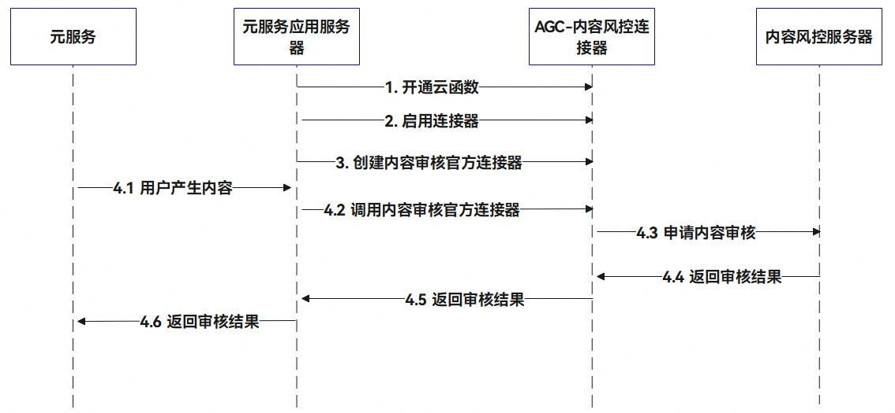

内容风控服务用于对终端用户提交的文本或图片内容进行合规性检查的服务，如识别暴力、色情等违法的信息，有效协助用户进行风险预警和违法内容拦截。

该功能基于百万级样本库和多个文本、图片风控模型，结合多种文本、图片对抗方案等，通过分类模型、安全大模型等技术，高效识别违法违规内容；同时系统基于海量语料训练与实时误报纠偏体系，构建动态优化闭环，持续提升风险防控精度与模型鲁棒性。

## 常见使用场景

消费者在云服务提交的评论、账号昵称、账号头像等。

## 约束与限制

1. 内容风控服务接口流量控制策略：≤5 TPS。

2. 文本风控接口单次提交的文本上限500个字，需使用UTF-8编码。

3. 图片审核接口支持imageBase64/imageUrl，其中base64之后最大支持1M Bytes，最小边50px，最长边4096px，建议：640px\*640px，支持的格式PNG、JPG、JPEG、BMP、GIF。

**功能使用限制**

1. 当前仅支持通过元服务的服务端进行开通和对接。

2. 当前仅只支持中国境内（不包含中国香港、中国澳门、中国台湾）。

## 业务流程

