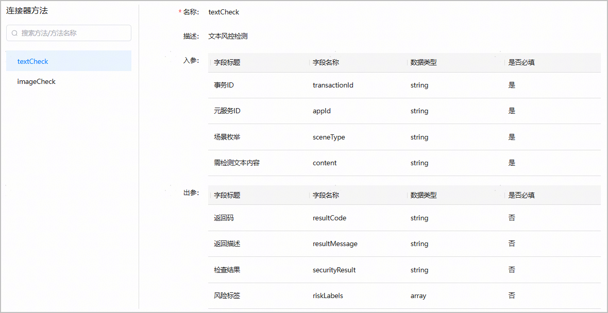
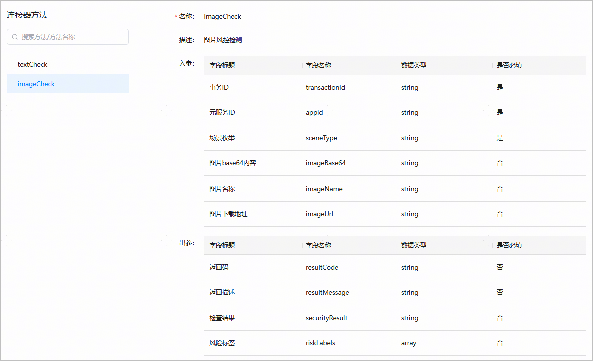

1. 请参照指导[创建官方连接器](https://developer.huawei.com/consumer/cn/doc/AppGallery-connect-Guides/cloud-function-official-connector-0000002219452452)，创建内容风控服务连接器

   连接器创建完成，系统将自动添加连接器方法textCheck（文本风控检测）和imageCheck（图片风控检测），2个连接器方法对应的入参和出参如下。

   * textCheck

     | 参数类型 | 字段标题 | 字段名称 | 数据类型 | 是否必填 | 说明 |
     | --- | --- | --- | --- | --- | --- |
     | 入参 | 事务ID | transactionId | string | 是 | 此次任务执行的事件ID，全局唯—。 |
     | 元服务ID | appId | string | 是 | 业务传入元服务注册的APPID，须与AGC控制台创建元服务时生成的“APP ID”保持一致。 |
     | 场景枚举 | sceneType | string | 是 | 包含如下三种场景：  + 1：账号类（用户资料信息内容） + 2：UGC（用户生成内容） + 3：搜索类（用户搜索输入内容） |
     | 需检测文本内容 | content | string | 是 | 需检测的文本内容。文本需使用UTF-8编码，且最大不超过500个字符。 |
     | 出参 | 返回码 | resultCode | string | 否 | 事件处理状态码。取值范围：  + 0：成功 + 1：请求参数校验错误（例如参数缺失、格式错误、长度超过限制等） + 2：风险识别异常 + 3：请求频次超过限制 + 4：请求参数值无效 + 5：调用失败，错误原因未知 + 6：未找到被审资源 + 7：第三方服务内部错误 + 8：第三方服务不可用 + 9：审核失败，未加载SDK敏感词库 + 10：系统不支持被审资源的类型 + 11：被审资源解析失败 + 13：审核结果写NSP失败 + 14：被审资源大小异常 + 15：被审资源下载失败 + 16：元服务未开通内容风控服务 |
     | 返回描述 | resultMessage | string | 否 | 事件状态消息。 |
     | 检查结果 | securityResult | string | 否 | 决策结果和处理建议。  + ACCEPT：接受。低风险，机审未发现风险，建议业务按照一定比例抽查。 + VALIDATE：疑似。中风险，建议业务设置人工审核进一步验证。 + REJECT：不合规。高风险，建议业务拒绝用户请求或编辑复审。 |
     | 风险标签 | riskLabels | string | 否 | 命中标签。  + 001：时政 + 002：色情低俗 + 003：违禁品（包括违禁品、赌博等） + 099：其他 说明：  一段文本可能会有多个标签列，例如：["001","002"] |

     
   * imageCheck

     | 参数类型 | 字段标题 | 字段名称 | 数据类型 | 是否必填 | 说明 |
     | --- | --- | --- | --- | --- | --- |
     | 入参 | 事务ID | transactionId | string | 是 | 此次任务执行的事件ID，全局唯—。 |
     | 元服务ID | appId | string | 是 | 业务传入元服务注册的APPID，须与AGC控制台创建元服务时生成的“APP ID”保持一致。 |
     | 场景枚举 | sceneType | string | 是 | 包含如下三种场景：  + 1：账号类（用户资料信息内容） + 2：UGC（用户生成内容） + 3：搜索类（用户搜索输入内容） |
     | 图片base64内容 | imageBase64 | string | 否 | 待检测图片的Base64编码。编码后的字符串大小最大支持1MB，最短边长50px，最长边长4096px，建议尺寸为640\*640。  支持的图片格式包括：PNG、JPG、JPEG、BMP、GIF。 |
     | 图片名称 | imageName | string | 否 | 待检测图片的名称。图片需使用UTF-8编码，且最大不超过128个字符。 |
     | 图片下载地址 | imageUrl | string | 否 | 待检测图片的下载地址。长度不超过4096个字符。  说明：  imageBase64和imageUrl，任选其一即可。 |
     | 出参 | 返回码 | resultCode | string | 否 | 事件处理状态码。取值范围：  + 0：成功 + 1：请求参数校验错误（例如参数缺失、格式错误、长度超过限制等） + 2：风险识别异常 + 3：请求频次超过限制 + 4：请求参数值无效 + 5：调用失败，错误原因未知 + 6：未找到被审资源 + 7：第三方服务内部错误 + 8：第三方服务不可用 + 9：审核失败，未加载SDK敏感词库 + 10：系统不支持被审资源的类型 + 11：被审资源解析失败 + 13：审核结果写NSP失败 + 14：被审资源大小异常 + 15：被审资源下载失败 + 16：元服务未开通内容风控服务 |
     | 返回描述 | resultMessage | string | 否 | 事件状态消息。 |
     | 检查结果 | securityResult | string | 否 | 决策结果和处理建议。  + ACCEPT：接受。低风险，机审未发现风险，建议业务按照一定比例抽查。 + VALIDATE：疑似。中风险，建议业务设置人工审核进一步验证。 + REJECT：不合规。高风险，建议业务拒绝用户请求或编辑复审。 |
     | 风险标签 | riskLabels | string | 否 | 命中标签。  + 001：时政 + 002：色情低俗 + 003：违禁品（包括违禁品、赌博等） + 099：其他 说明：  一张图片可能会有多个标签列，例如：["001","002"] |

     
2. 调用内容风控服务连接器

   请参照指导[调用官方连接器](https://developer.huawei.com/consumer/cn/doc/AppGallery-connect-Guides/call-official-connector-0000002240913702)，按照自己的编程语言选择合适的方式，调用内容风控服务连接器。
