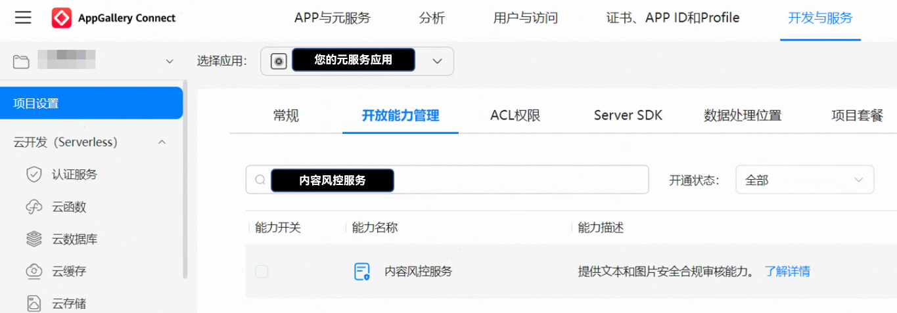
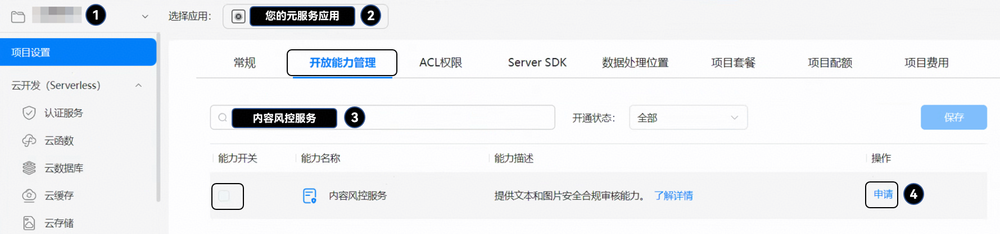
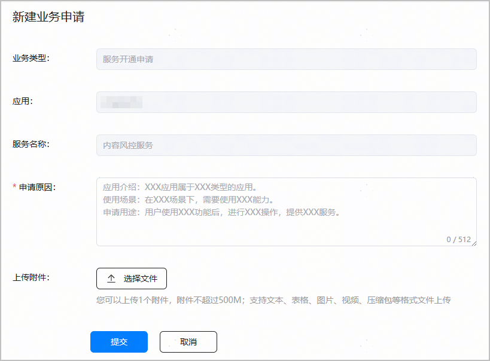

如果您未开通内容风控服务，将无法使用该服务对文本和图片进行安全合规审核。因此，在创建内容风控服务官方连接器之前，您需要先开通内容风控服务。如果已经开通，可跳过本步骤。

您可在创建元服务的过程中开通元服务内容风控服务，也可在元服务创建完成后，按照下文的步骤申请接入。

1. 登录[AppGallery Connect](https://developer.huawei.com/consumer/cn/service/josp/agc/index.html)，点击“开发与服务”。
2. 在项目列表中点击您的项目，并选择需要开通内容风控服务的元服务名称。

   

   1. 在“项目设置”的“开放能力管理”页签，搜索框输入“内容风控服务”，然后点击“内容风控服务”右侧的“申请”。

      
   2. 在“新建业务申请”窗口填写申请信息，填写完成后点击“提交”。
      * 申请原因：必填，不超过512个字符。请按照界面提示的申请模板填写。
      * 上传附件：选填，仅可上传1个附件。请按照界面提示的文件大小和格式上传。

      
   3. 返回“开放能力管理”页面，原“申请”按钮变为“申请中”。

      

      申请审批通过后，互动中心会发送通知消息给您。“申请中”按钮会变为置灰显示的“申请”，内容风控服务会为您自动开启。

      
