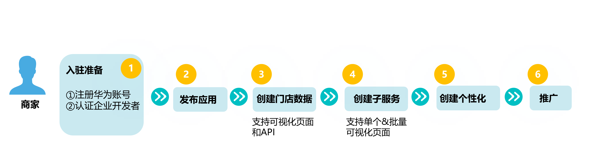
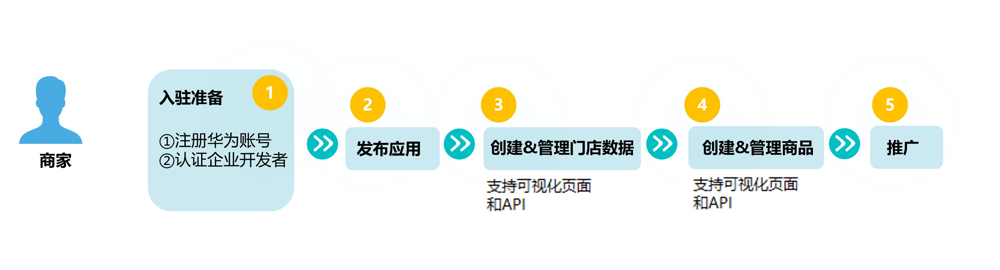

为了更好地帮助应用商家做好服务生态的经营，平台构建了子服务、商品、门店等一系列场景，帮助商家在HarmonyOS公域流量场进行分发和引流。

* 子服务：子服务无需开发，基于开发者上传的宣传图片和跳转链接等素材渲染生成的卡片，在推广阶段展示该卡片的宣传素材，并提供一键添卡的能力，用户可将该卡片添加至负一屏。该卡片以元服务或应用内某个落地页为载体，能够独立满足用户完整需求的一项服务。如寄快递、营销活动、品牌营销、新闻栏目、购物频道、专栏节目等。
* 商品：商家通过API或界面接入服务直达，按照标准化的字段模板补充商品信息并提交至服务货仓审核，审核通过后，用户即可在HarmonyOS系统的部分流量入口，看到推荐的商品信息。用户一次点击，直达商品详细页面，进行快速查看和购买。商品信息一般包括商品名称、价格、商品图等。商品类型有实物商品（如服饰、饮食、生活用品等）和虚拟商品（会员服务、视频、电子图书等）。
* 门店：本地生活类商家，提交门店信息至服务货仓并审核后，用户可以在HarmonyOS系统上通过地址搜索、基于地理位置推荐等方式，获取到推荐的门店信息。用户点击门店信息，可一键直达门店的介绍页面，或直达与指定门店相关的服务展示页面。

如果商家还需要基于指定门店，专项推广相关商品，从而提升商品推荐的精准度，则可以在创建商品的时候，建立商品与门店的关联关系。

## 典型案例

商家提交子服务至服务货仓，用户点击此子服务卡，可一步直达应用的服务落地页,，实现服务的一步直达。

下图为子服务直达的效果。

商家提审商品、子服务、门店等信息后，平台将对提交的内容进行审核，审核成功后商品的状态将修改为“已上架”。在HarmonyOS公域流量推广期间，平台将持续对商品、子服务、门店信息进行巡检，如发现违规或页面异常的情况，平台将冻结商品、子服务、门店等信息的显示。

## 子服务管理运营流程

为了更加精准的推广，本地生活商家需上传门店信息至平台。非本地生活商家无需上传门店数据。

### 准入条件

* **支持账号类型**：企业开发者账号。
* **支持的子服务类目**：子服务的类目必须归属于“已发布应用”的标签，开发者需在“[AppGallery Connect](https://developer.huawei.com/consumer/cn/service/josp/agc/index.html) &gt; APP与元服务”，选择“已发布的应用”，并选择“应用信息”查看已发布应用的标签，然后选择与子服务相关的标签。

## 商品管理运营流程

### 准入条件

* **支持账号类型**：企业开发者账号。
* **支持的商品类目**：商品的类目必须归属于“已发布应用”的标签，开发者需在“[AppGallery Connect](https://developer.huawei.com/consumer/cn/service/josp/agc/index.html) &gt; APP与元服务”，选择“已发布的应用”，并选择“应用信息”查看已发布应用的标签，然后选择与商品相关的标签。

  

  + 企业开发者可通过[界面](https://developer.huawei.com/consumer/cn/doc/atomic-guides/instant-service-gui)录入商品信息及门店信息；
  + 为了更加精准的推广，本地生活类商家需上传门店信息至平台。非本地生活商家无需上传门店数据。
